# DOCS 01 : conceptual stuffs

---
---

## Doc links

Documentation page links:
* [**[docs 00 : overview]**](./docs_00_overview.md#docs-01--concepts-and-some-throwing-around-ideas)
* [***[docs 01 : conceptual]***](./docs_01_conceptual.md)
* [**[docs 02 : requirements]**](./docs_02_requirements.md)
* [**[docs 03 : designables]**](./docs_03_designables.md)
* [**[docs 04 : developments]**](./docs_04_developments.md)

---

## About

* initial research and thoughtables
* can be actor identifying and the use case stuffs
* will be the use case diagrams and sequence diagrams too
* include the context model
* mah haps the architecture

| 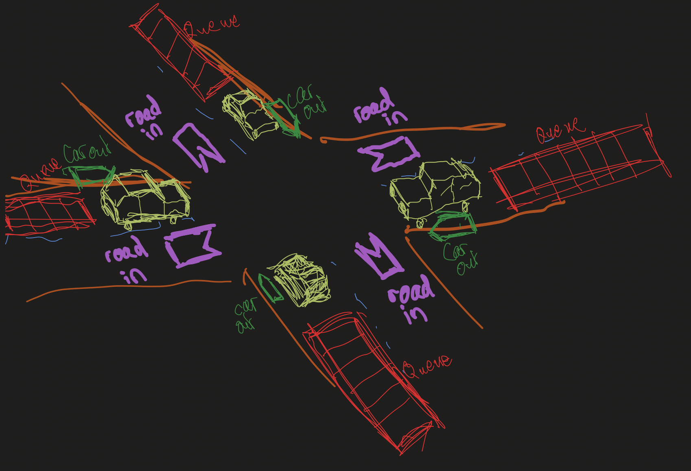 |
| :---: |
| *an early conceptual diagram of the project* - `12/06/2024` |

---

## Contents

* [**[Previous conceptual information]**](#previous-conceptual-information)
* [**[Actor Identification]**](#actor-identification)
    * [*[Concept identification listing [draft 01]]*](#concept-identification-listing-draft-01)
    * [*[Concept identification listing [draft 02]]*](#concept-identification-listing-draft-02)
    * [*[Concept identification listing [draft 03]]*](#concept-identification-listing-draft-03)
* [**[Use cases]**](#use-cases)
    * [*[Use cases [draft 01]]*](#use-cases-draft-01)
    * [*[Use cases [draft 02]]*](#use-cases-draft-02)
* [**[Concept-Domain models]**](#concept-domain-models)
    * [*[Concept-Domain model [draft 01]]*](#concept-domain-model-draft-01)
    * [*[Concept-Domain model [draft 02]]*](#concept-domain-model-draft-02)
    * [*[Concept-Domain model [draft 03]]*](#concept-domain-model-draft-03)
* [**[Sequence diagrams]**](#sequence-diagrams)
    * [*[Sequence diagram [draft 01]]*](#sequence-diagram-draft-01)
        * [*Sequence diagram [draft 01] : `Sky box`*](#sequence-diagram-draft-01--sky-box)
        * [*Sequence diagram [draft 01] : `Terrain`*](#sequence-diagram-draft-01--terrain)
        * [*Sequence diagram [draft 01] : `Traffic Controller`*](#sequence-diagram-draft-01--traffic-controller)
        * [*Sequence diagram [draft 01] : `Car`*](#sequence-diagram-draft-01--car)
            * [*Sequence diagram [draft 01] : `Car.init()`*](#sequence-diagram-draft-01--carinit)
            * [*Sequence diagram [draft 01] : `Car.update()` and `Car.draw()`*](#sequence-diagram-draft-01--carupdate-and-cardraw)
* [**[State Diagrams]**](#state-diagrams)
    * [*[State diagram [draft 01]]*](#state-diagram-draft-01)
* [**[Architecture]**](#architecture)
    * [*Server-Client relationship [draft 01]*](#server-client-relationship-draft-01)
    * [*Server-Client relationship [draft 02]*](#server-client-relationship-draft-02)
* [**[Context Models]**](#context-models)
    * [*[Context Model [draft 01]]*](#context-model-draft-01)
* [**[Concept Diagrams]**](#concept-diagrams)
* [**[Experimentation details]**](#experimentation-details)

---

## previous conceptual information

[**[Back to Contents]**](#contents)

* [[Suppliment 01]](./docs_01_conceptual_suppliment_01.md) - the previous conceptual documentation

---

## Actor identification

### Concept identification listing [draft 01]

[**[Back to Contents]**](#contents)

* car
* traffic light
* traffic controller
* traffic control diagnostic system
* road
* lane
* light
* sky
* cloud
* building
* wheel
* sun
* moon
* wheel

### Concept identification listing [draft 02]

[**[Back to Contents]**](#contents)

* [`Scene`](#scene-draft-01)
* [`Sky day`](#sky-day-draft-01)
* [`Sky night`](#sky-night-draft-01)
* [`Sun`](#concept-identification-listing-draft-02)
* [`Clouds`](#clouds-draft-01)
* [`Moon`](#concept-identification-listing-draft-02)
* [`Car`](#car-draft-01)
* [`Car Lights`](#concept-identification-listing-draft-02)
* [`Wheel`](#concept-identification-listing-draft-02)
* [`Diagnostic Screen`](#traffic-diagnostics-screen-draft-01)
* [`Traffic Controller`](#traffic-controller-draft-01)
* [`Lane`](#lane-draft-01)
* [`Traffic Light`](#traffic-light-draft-01)
* [`Intersection`](#intersection-draft-01)
* [`Terrain`](#concept-identification-listing-draft-02)
* [`Building`](#concept-identification-listing-draft-02)
* [`Mesh`](#concept-identification-listing-draft-02)

### Concept identification listing [draft 03]

[**[Back to Contents]**](#contents)

* [`WindowsDeveloper`](#use-cases-draft-02--windowsdeveloper)
* [`MacOSDeveloper`](#use-cases-draft-02--macosdeveloper)
* [`WindowsUser`](#use-cases-draft-02--windowsuser)
* [`MacOSUser`](#use-cases-draft-02--macosuser)
* [`MainThread`](#use-cases-draft-02--mainthread)
* [`TrafficThread`](#use-cases-draft-02--trafficthread)
* [`CarThread`](#use-cases-draft-02--carthread)
* [`App`](#use-cases-draft-02--app)
* [`Scene`](#use-cases-draft-02--scene)
* [`Skybox`](#use-cases-draft-02--skybox)
* [`SkyDay`](#use-cases-draft-02--skyday)
* [`SkyNight`](#use-cases-draft-02--skynight)
* [`Clouds`](#use-cases-draft-02--clouds)
* [`Sun`](#use-cases-draft-02--sun)
* [`Moon`](#use-cases-draft-02--moon)
* [`Terrain`](#use-cases-draft-02--terrain)
* [`Building`](#use-cases-draft-02--building)
* [`Intersection`](#use-cases-draft-02--intersection)
* [`DiagnosticScreen`](#use-cases-draft-02--diagnosticscreen)
* [`TrafficLight`](#use-cases-draft-02--trafficLight)
* [`Lane`](#use-cases-draft-02--lane)
* [`Car`](#use-cases-draft-02--car)
* [`Wheel`](#use-cases-draft-02--wheel)
* [`CarLights`](#use-cases-draft-02--carlights)
* [`Mesh`](#use-cases-draft-02--mesh)

### Concept identification listing [draft 04]

[**[Back to Contents]**](#contents)

* ***smells like complexity demon! begone foul creature!***

* stakeholders
    * [`WindowsDeveloper`]()
    * [`MacOSDeveloper`]()
    * [`WindowsUser`]()
    * [`MacOSUser`]()
* threads
    * [`MainThread`]()
    * [`DiagnosticsThread`]()
    * [`ControllerThread`]()
    * [`LightThread`]()
    * [`CarThread`]()
* containers
    * [`App`]()
    * [`Scene`]()
    * [`Skybox`]()
    * [`Lane`]()
* containers with models/shaders
    * [`SkyDay`]()
    * [`SkyNight`]()
    * [`Terrain`]()
    * [`Intersection`]()
    * [`DiagnosticScreen`]()
    * [`Car`]()
* models/shaders
    * [`Clouds`]()
    * [`Sun`]()
    * [`Moon`]()
    * [`Building`]()
    * [`TrafficLight`]()
    * [`Wheel`]()
    * [`CarLights`]()
    * [`Mesh`]()

## Use cases

### Use cases [draft 01]

[**[Back to Contents]**](#contents)

#### `Car` [draft 01]

* as a `Car` i want to ***travel straight*** through `Intersection`
* as a `Car` i want to ***turn left***
* as a `Car` i want to **turn right**
* as a `Car` queued in `Lane`, i want to ***move*** up to the `Intersection`
* as a `Car` at the start of the queue, i want to ***begin moving*** through the `Intersection`
* as a `Car` i want to ***generate*** a `Mesh` to use
* as a `Car` i want to ***move forward*** when it's *safe to move*
* as a `Car` i want to ***stop*** when it's *not safe to move*
* as a `Car` i want to ***rotate*** my `Wheel`s when i *move*
* as a `Car` i want to ***update*** my `Car lights` to show my *behaviour*

#### `Clouds` [draft 01]

* as the `Clouds` i want to ***move*** with the *wind*

#### `Lane` [draft 01]

* as a `Lane` i want to have a `Traffic Light` ***state*** holder

#### `Scene` [draft 01]

* as a `Scene` i want to ***generate*** a `Sky Day`
* as a `Scene` i want to ***generate*** a `Sky Night`
* as a `Scene` i want to ***generate*** a `Car`
* as a `Scene` i want to ***generate*** an `Intersection`
* as a `Scene` i want to ***generate*** a `Building`
* as a `Scene` i want to ***generate*** the `Terrain`
* as a `Scene` i want to ***generate*** the `Clouds`

#### `Sky Day` [draft 01]

* as a `Sky Day` i want to ***check*** the `time of day`
* as a `Sky Day` i want to ***display*** the `Clouds`
* as a `Sky Day` i want to ***display*** the `Sun`
* as a `Sky Day` i want to ***display*** the `Atmosphere colour`

#### `Sky Night` [draft 01]

* as a `Sky Night` i want to ***check*** the `time of day`
* as a `Sky Night` i want to ***display*** the `Clouds`
* as a `Sky Night` i want to ***display*** the `Moon`
* as a `Sky Night` i want to ***display*** the `Stars`

#### `Traffic Controller` [draft 01]

* as a `Traffic Controller` i want to ***change*** the `Lane` which can *move*

#### `Traffic diagnostics screen` [draft 01]

* as a `Traffic diagnostics screen` i want to ***check*** the ***state*** of the `Traffic Controller`
* as a `Traffic diagnostics screen` i want to ***check*** the *number* of `Car`s in a `Lane`

#### `Traffic Light` [draft 01]

* as a `Traffic Light` i want to ***update*** my ***state***
* as a `Traffic Light` ***state*** holder i want to ***generate*** my `Mesh`

#### `Intersection` [draft 01]

* as an `Intersection` i want to ***generate*** the `Intersection` `Mesh`
* as an `Intersection` i want to ***generate*** the `Lane` objects

### Use cases [draft 02]

* [**[Back to Contents]**](#contents)
* [**Use cases [draft 02]**](#use-cases-draft-02)
    * [*Use cases [draft 02] : `WindowsDeveloper`*](#use-cases-draft-02--windowsdeveloper)
    * [*Use cases [draft 02] : `MacOSDeveloper`*](#use-cases-draft-02--macosdeveloper)
    * [*Use cases [draft 02] : `WindowsUser`*](#use-cases-draft-02--windowsuser)
    * [*Use cases [draft 02] : `MacOSUser`*](#use-cases-draft-02--macosuser)
    * [*Use cases [draft 02] : `MainThread`*](#use-cases-draft-02--mainthread)
    * [*Use cases [draft 02] : `TrafficThread`*](#use-cases-draft-02--trafficthread)
    * [*Use cases [draft 02] : `CarThread`*](#use-cases-draft-02--carthread)
    * [*Use cases [draft 02] : `App`*](#use-cases-draft-02--app)
    * [*Use cases [draft 02] : `Scene`*](#use-cases-draft-02--scene)
    * [*Use cases [draft 02] : `Skybox`*](#use-cases-draft-02--skybox)
    * [*Use cases [draft 02] : `SkyDay`*](#use-cases-draft-02--skyday)
    * [*Use cases [draft 02] : `SkyNight`*](#use-cases-draft-02--skynight)
    * [*Use cases [draft 02] : `Clouds`*](#use-cases-draft-02--clouds)
    * [*Use cases [draft 02] : `Sun`*](#use-cases-draft-02--sun)
    * [*Use cases [draft 02] : `Moon`*](#use-cases-draft-02--moon)
    * [*Use cases [draft 02] : `Terrain`*](#use-cases-draft-02--terrain)
    * [*Use cases [draft 02] : `Building`*](#use-cases-draft-02--building)
    * [*Use cases [draft 02] : `Intersection`*](#use-cases-draft-02--intersection)
    * [*Use cases [draft 02] : `DiagnosticScreen`*](#use-cases-draft-02--diagnosticscreen)
    * [*Use cases [draft 02] : `TrafficLight`*](#use-cases-draft-02--trafficLight)
    * [*Use cases [draft 02] : `Lane`*](#use-cases-draft-02--lane)
    * [*Use cases [draft 02] : `Car`*](#use-cases-draft-02--car)
    * [*Use cases [draft 02] : `Wheel`*](#use-cases-draft-02--wheel)
    * [*Use cases [draft 02] : `CarLights`*](#use-cases-draft-02--carlights)
    * [*Use cases [draft 02] : `Mesh`*](#use-cases-draft-02--mesh)

#### Use cases [draft 02] : `WindowsDeveloper`

[***click to return to subheading [Use cases [draft 02]]***](#use-cases-draft-02)

* as a windows developer I want to compile and run the code on windows

#### Use cases [draft 02] : `MacOSDeveloper`

[***click to return to subheading [Use cases [draft 02]]***](#use-cases-draft-02)

* as a MacOS developer, I want to compile and run the code on MacOS

#### Use cases [draft 02] : `WindowsUser`

[***click to return to subheading [Use cases [draft 02]]***](#use-cases-draft-02)

* as a windows user, I want to run the program on windows

#### Use cases [draft 02] : `MacOSUser`

[***click to return to subheading [Use cases [draft 02]]***](#use-cases-draft-02)

* as a MacOS user, I want to run the program on MacOS

#### Use cases [draft 02] : `MainThread`

[***click to return to subheading [Use cases [draft 02]]***](#use-cases-draft-02)

* as the Main thread, I want to initialise the App
* as the Main thread, I want to create the Traffic thread
* as the Main thread, I want to create the Car thread
* as the Main thread, I want to draw the scene each frame

#### Use cases [draft 02] : `TrafficThread`

[***click to return to subheading [Use cases [draft 02]]***](#use-cases-draft-02)

* as the traffic thread, I want to access lane information to update lane states
* as the traffic thread, I want to stop a lane from moving so that another may start
* as the traffic thread i want to change the traffic light object state information
* as the traffic thread i want to connect to my traffic light objects
    * are we server -> client model?
    * perhaps we should

#### Use cases [draft 02] : `CarThread`

[***click to return to subheading [Use cases [draft 02]]***](#use-cases-draft-02)

* as the car thread, I want to generate a car to use when I am created
* as the car thread, I want to access and update my specific car object
* as the car thread, I want to access and use information in the lane to change my car object
* as the car thread, I want to know about the car in front of me, so that I can avoid crashing
* as the car thread, I want to check where I am in lane, to know if I should be looking at the traffic lights
* as the car thread, I want to observe the traffic lights when I am at the start of the queue, to know if I should enter the intersection
* as the car thread, I want to finish moving through the intersection when I have entered it.

#### Use cases [draft 02] : `App`

[***click to return to subheading [Use cases [draft 02]]***](#use-cases-draft-02)

* As the app, I want to create the scene
* As the app, I want to start the draw calls
* As the app, I want to handle input events
* As the app, I want to handle closing the window
* As the app, I want to handle cleaning up the objects

#### Use cases [draft 02] : `Scene`

[***click to return to subheading [Use cases [draft 02]]***](#use-cases-draft-02)

* as the scene i want to create the skybox
* as the scene i want to create the terrain
* as the scene i want to tell the skybox about the time of day
* as the scene i want to get the clouds to move
* as the scene i want to update the buildings

#### Use cases [draft 02] : `Skybox`

[***click to return to subheading [Use cases [draft 02]]***](#use-cases-draft-02)

* as the skybox i want to determine which sky do use by time of day
* as the skybox i want to manage the clouds and their movement
* as the skybox i want to not move in camera space

#### Use cases [draft 02] : `SkyDay`

[***click to return to subheading [Use cases [draft 02]]***](#use-cases-draft-02)

* as the sky day, i want to change colour with the time of day

#### Use cases [draft 02] : `SkyNight`

[***click to return to subheading [Use cases [draft 02]]***](#use-cases-draft-02)

* as the sky night, i want to show the stars move with the time of nights

#### Use cases [draft 02] : `Clouds`

[***click to return to subheading [Use cases [draft 02]]***](#use-cases-draft-02)

* as the clouds, i want to change over time using perlin noise

#### Use cases [draft 02] : `Sun`

[***click to return to subheading [Use cases [draft 02]]***](#use-cases-draft-02)

* as the sun i want to always face the camera
* as the sun i want to move with the time of day

#### Use cases [draft 02] : `Moon`

[***click to return to subheading [Use cases [draft 02]]***](#use-cases-draft-02)

* as the moon i want to always face the camera
* as the moon i want to move with the time of day
* as the moon i want to show the current moon phase

#### Use cases [draft 02] : `Terrain`

[***click to return to subheading [Use cases [draft 02]]***](#use-cases-draft-02)

* as the terrain i want to generate a height map to use for my mesh
* as the terrain i want to generate the road map to use for creating intersections
* as the terrain i want to create an intersection object where roads intersect
* as the terrain i want to generate a mesh based on the height map i made
* as the terrain i want to generate a normal map for my mesh
* as the terrain i want to generate a bump map for my mesh
* as the terrain i want to generate buildings around the intersection

#### Use cases [draft 02] : `Building`

[***click to return to subheading [Use cases [draft 02]]***](#use-cases-draft-02)

* as a building i want to roll for the number of floors i have
* as a building i want to generate a mesh based on how many floors i should have
* as a building i want to generate a normal map for fragments
* as a building i want to generate a bump map for my window distortion
* as a building i want to reflect the scene from my windows

#### Use cases [draft 02] : `Intersection`

[***click to return to subheading [Use cases [draft 02]]***](#use-cases-draft-02)

* as the intersection i want to generate the lanes that exist for the intersection
* as the intersection i want to generate the traffic light objects for the intersection
* as the intersection i want to generate the road mesh that is used in the intersection
* as the intersection i want to generate the generate the normal mapping for the road mesh
* as the intersection i want to generate the generate the bump mapping for the road mesh

#### Use cases [draft 02] : `DiagnosticScreen`

[***click to return to subheading [Use cases [draft 02]]***](#use-cases-draft-02)

* as the diagnostic screen i want to show the status of all lanes
* as the diagnostic screen i want to show how long before the next state change
* as the diagnostic screen i want to show my planned change in state
* as the diagnostic screen i want to show my sensor information
* as the diagnostic screen i want to show my connection to traffic lights information
* as the diagnostic screen i want to read the traffic light object state information
* as the diagnostic screen i want to render my data to a screen
* as the diagnostic screen i want to only render my data to the screen when in view

#### Use cases [draft 02] : `TrafficLight`

[***click to return to subheading [Use cases [draft 02]]***](#use-cases-draft-02)

* as a traffic light i want to generate a mesh based on the lanes i service
* as a traffic light i want to update my state based on what the traffic controller tells me
* as a traffic light i want to generate a normal map for my model
* as a traffic light i want to use my state information to display the lights

#### Use cases [draft 02] : `Lane`

[***click to return to subheading [Use cases [draft 02]]***](#use-cases-draft-02)

* as a lane, i want to let cars queue for the intersection
* as a lane, i want to observe the traffic lights for when my cars can move
    * *lane threads instead of car threads?????*
* *as a lane, i want to hold a queue of the cars currently in my lane*
* *as a lane, i want to allow the first car to move when it is save*
* *as a lane, i want to move the other cars when they're allowed to??*

#### Use cases [draft 02] : `Car`

[***click to return to subheading [Use cases [draft 02]]***](#use-cases-draft-02)

* as a car i want to update my wheel models as i move
* as a car i want to generate a mesh to use
* as a car i want to generate a normal map for my mesh
* as a car i want to generate a specularity map for my mesh
* as a car i want to know when it's safe to move
* as a car i want to know which lane i am in
* as a car i want to know which lane i want to travel to

#### Use cases [draft 02] : `Wheel`

[***click to return to subheading [Use cases [draft 02]]***](#use-cases-draft-02)

* as a wheel i want to turn when my car moves
* as a wheel i want to generate a wheel mesh
* as a wheel i want to generate a normal map
* as a wheel i want to generate a specularity map to make my rims shiny

#### Use cases [draft 02] : `CarLights`

[***click to return to subheading [Use cases [draft 02]]***](#use-cases-draft-02)

* as car lights i want to display the behaviour state of my owner car
* as car lights i want to create light for the scene to use
* as car lights i want to tell the scene about my light
* as car lights i want to update my blinkers to blink when im using them
* as car lights i want to light up the brakelights when my owner car is slowing down or stopped

#### Use cases [draft 02] : `Mesh`

[***click to return to subheading [Use cases [draft 02]]***](#use-cases-draft-02)

* as a mesh i want to have vertex information for my owner object
* as a mesh i want to have shader information for my owner
* as a mesh i want to have uv mapping for my owner
* as a mesh i want to be able to be drawn by my owner
* as a mesh i want to be able to be transformed by my owner

---

## Concept-Domain models

* mermaid chart [[flow chart syntax reference]](https://mermaid.js.org/syntax/flowchart.html)
* mermaid chart [[class diagram syntax reference]](https://mermaid.js.org/syntax/classDiagram.html)
* the need for the model didnt really fit fully within either model so we made our own kind.
* a proper domain model will be made later

### Concept-Domain model [draft 01]

[**[Back to Contents]**](#contents)

* kinda context model of the things, rly simple flow

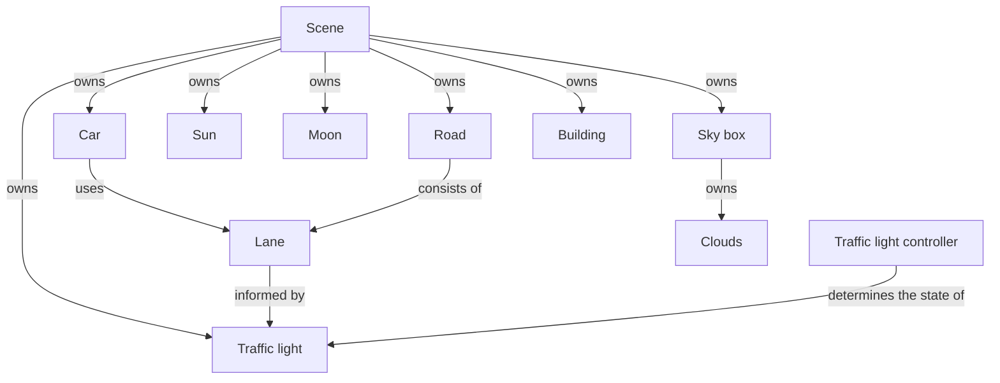

### Concept-Domain model [draft 02]

[**[Back to Contents]**](#contents)

* second attempt after doing the use cases
* `Atmosphere` was a suggestion to deal with some wackiness for cloud access
    * currently commented out in the diagram
* part way through making it we discovered that this doesnt fully fall within context or domain model
    * context loses the shapes to highlight the types of actors/objects
    * domain loses the shapes and current structure.
    * will need a simple domain model later to show number of items in their interactions
* `Scene` / `Terrain` / `Lane`
    * are controllers and high level concepts for their child nodes
    * warehouses for information
* `Sky day` / `Sky night` / `Car` / `Diagnostic Screen` / `Intersection`
    * are objects that hold behaviour and child nodes
    * these could be separate threads
* `Sun` / `Clouds` / `Moon` / `Car Lights` / `Traffic Light` / `Building`
    * these are mostly meshes and shaders, with some information
* `Traffic Controller`
    * 100% seperate thread to the rest of the system
    * controls the `Lane` child nodes
* `Mesh`
    * interface / object type to hold model information
    * will be very about the handling the model and texturing
* after completing the diagram we found the being able to send things more layers by using `-->` / `--->` / `---->` / `----->` 
    * will do this in next draft may haps

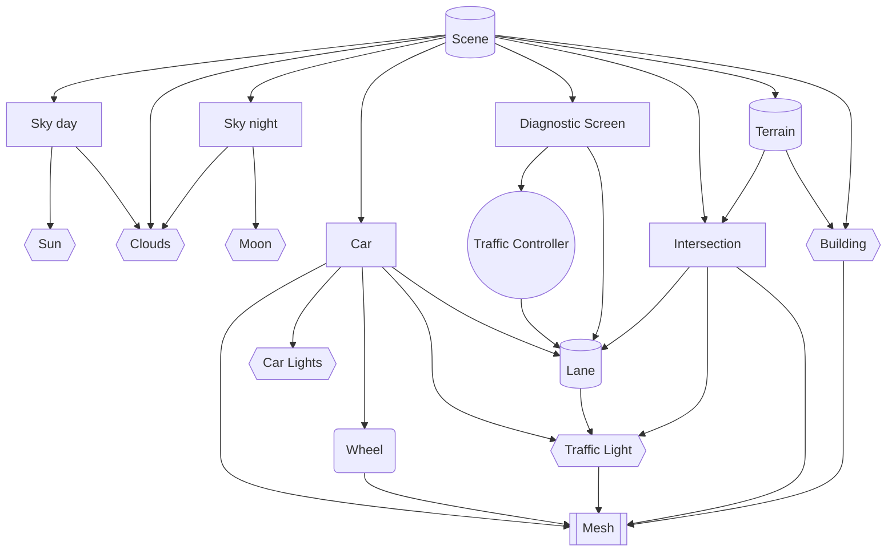

### Concept-Domain model [draft 03]

[**[Back to Contents]**](#contents)

* mild changes to reflect discoveries in the sequence diagram draft 1

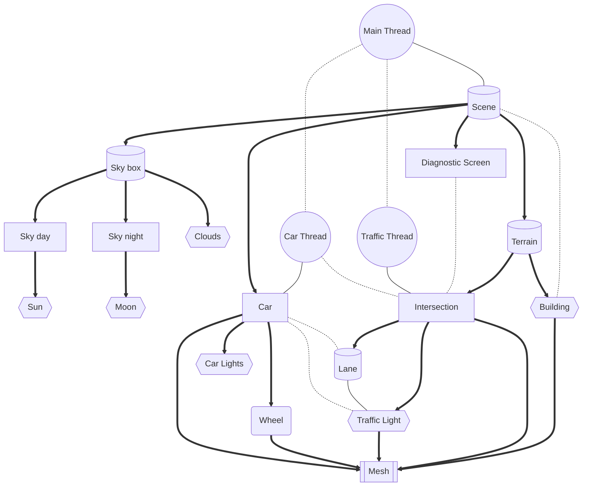

---

## Sequence diagrams

* mermaid chart [[sequence diagrams syntax reference]](https://mermaid.js.org/syntax/sequenceDiagram.html)
* will probably need to redo after we fully confirm the things with a proper domain model

### Sequence diagram [draft 01]

[**[Back to Contents]**](#contents)

* will be based on [***[Concept-Domain model [draft 02]]***](#concept-domain-model-draft-02)
* sub heading links:
    * [***[`Sky box`]***](#sequence-diagram-draft-01--sky-box)
    * [***[`Terrain`]***](#sequence-diagram-draft-01--terrain)
    * [***[`Traffic Controller`]***](#sequence-diagram-draft-01--traffic-controller)
    * [***[`Car`]***](#sequence-diagram-draft-01--car)

#### Sequence diagram [draft 01] : `Sky box`

* [*[return to sequence diagram sub heading]*](#sequence-diagram-draft-01)

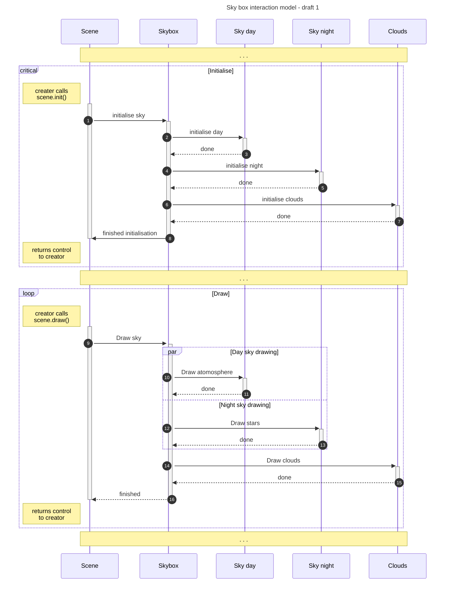

#### Sequence diagram [draft 01] : `Terrain`

* [*[return to sequence diagram sub heading]*](#sequence-diagram-draft-01)

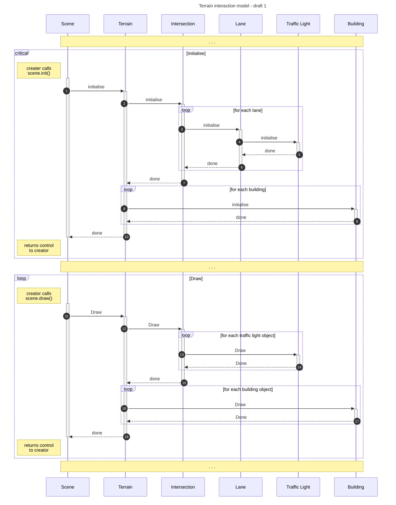
 
#### Sequence diagram [draft 01] : `Traffic Controller`

* [*[return to sequence diagram sub heading]*](#sequence-diagram-draft-01)

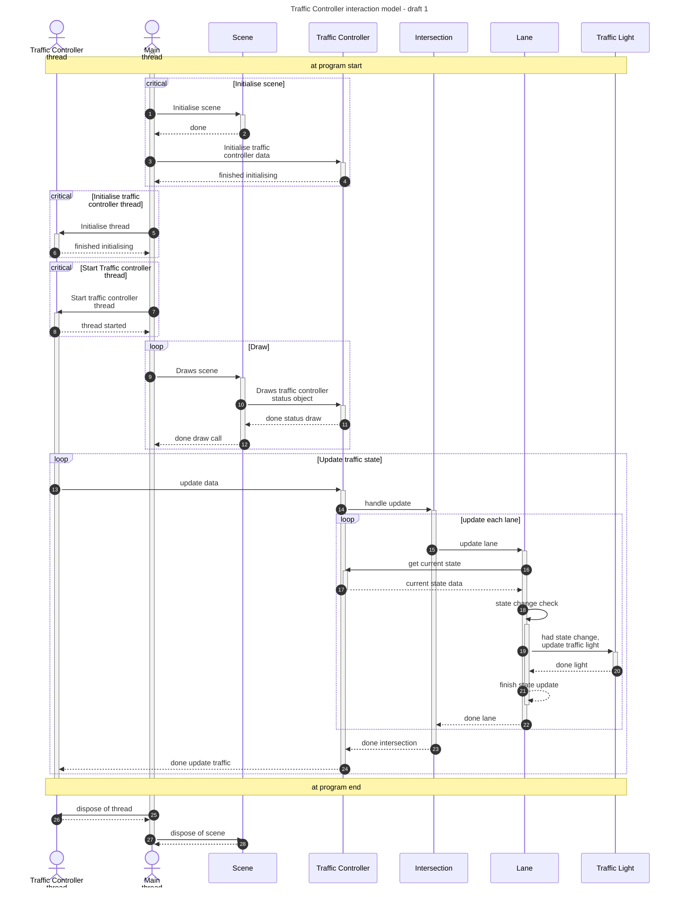
 
#### Sequence diagram [draft 01] : `Car`

* [*[return to sequence diagram sub heading]*](#sequence-diagram-draft-01)
* [`init()`](#sequence-diagram-draft-01--carinit)
* [`update()` and `draw()`](#sequence-diagram-draft-01--carupdate-and-cardraw)

##### Sequence diagram [draft 01] : `Car.init()`

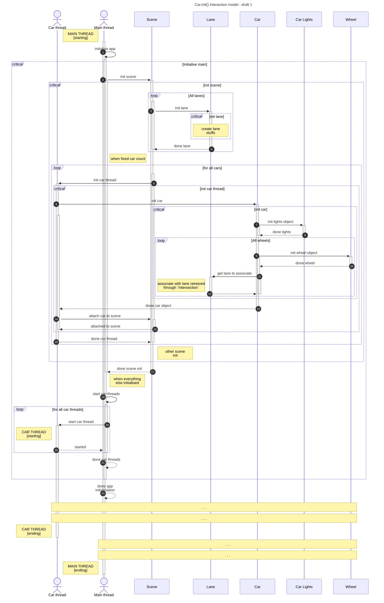

##### Sequence diagram [draft 01] : `Car.update()` and `Car.draw()`

* [***return to `Car`***](#sequence-diagram-draft-01--car)

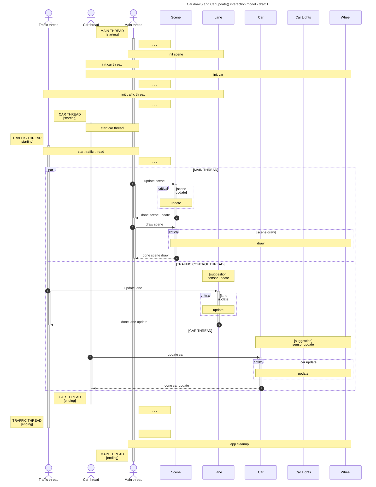
 

---

## State diagrams

### State diagram [draft 01]

[**[Back to Contents]**](#contents)

* simple car state diagram

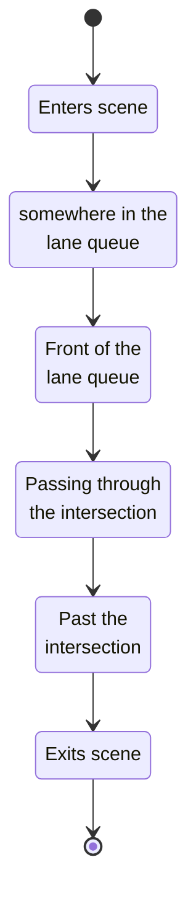

---

## Architecture

### Server-Client relationship [draft 01]

[**[Back to Contents]**](#contents)

#### Server-Client relationship [draft 01] : Table

* table A

| client for | thread | server for | 
| ---: | :---: | :--- |
| n/a | **traffic control system** | *traffic light* |
| *traffic control system* | **traffic light** | *car at front* |
| *traffic light* | **car at front** | *car in queue* |
| *car at front* | **car in queue** | *car in queue* |

* table B

| client for | thread | server for | 
| ---: | :---: | :--- |
| n/a | **traffic control system** | *traffic light* |
| *traffic control system* | **traffic light** | *car at front* |
| *traffic light* | **car at front** | *car* |
| *traffic light* | **only car** | *n/a* |
| *car* | **car in queue** | *car* |
| *car* | **last car in queue** | *n/a* |

#### Server-Client relationship [draft 01] : Diagram

* suddenly forgotten how the cardinality works
* ***smells like complexity demon! begone foul creature!***

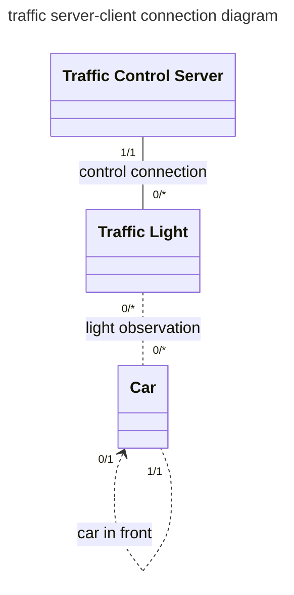

### Server-Client relationship [draft 02]

[**[Back to Contents]**](#contents)

#### Server-Client relationship [draft 02] : Table

| client for | thread | server for | 
| ---: | :---: | :--- |
| n/a | **traffic control system** | *traffic light* |
| *traffic control system* | **traffic light** | *lane* |
| *traffic light* | **lane** | n/a |

#### Server-Client relationship [draft 02] : Diagram

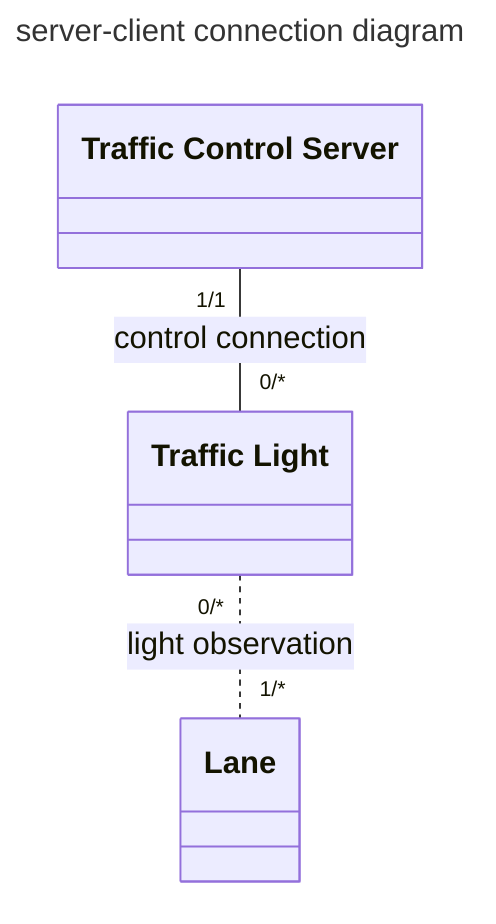

## Context Models

### Context Model [draft 01]

[**[Back to Contents]**](#contents)

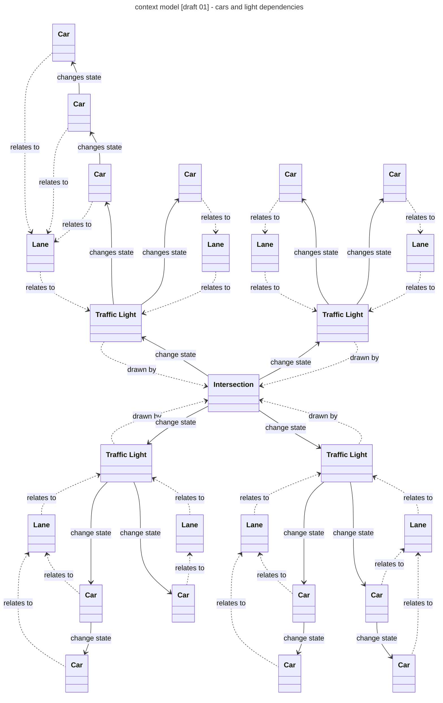

---

## Concept Diagrams

[**[Back to Contents]**](#contents)

| 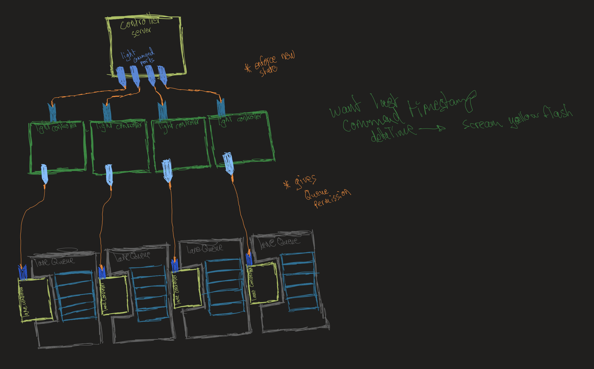 |
| :---: |
| *A simple model of the system somewhere between architecture and data flow models* - `12/06/2024` |

---

| 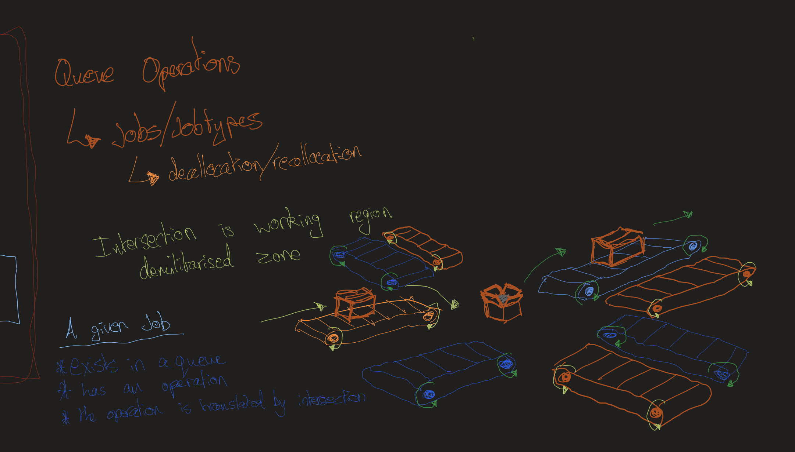 |
| :---: |
| *An artistic abstraction of the lanes as conveyor belts with notes on queues and client-server model design* - `12/06/2024` |

---

|  |
| :---: |
| 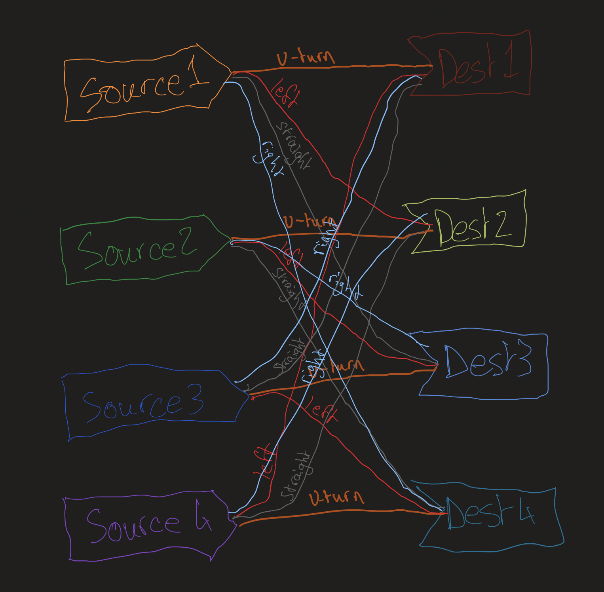 |
| *An artistic abstraction of the lanes as conveyor belts with notes on queues and client-server model design* - `12/06/2024` |

---

## Experimentation details

### Misc

[***[back to Contents]***](#contents)

* `20/06/2024` - another project reminded us of the power of getting things to work with 1 instance before moving onto working with multiple.

### Render textures

[***[back to Contents]***](#contents)

* `19/06/2024` - managed to get render buffers to work in another repo, but still need to experiment more with vertex attributes

---
