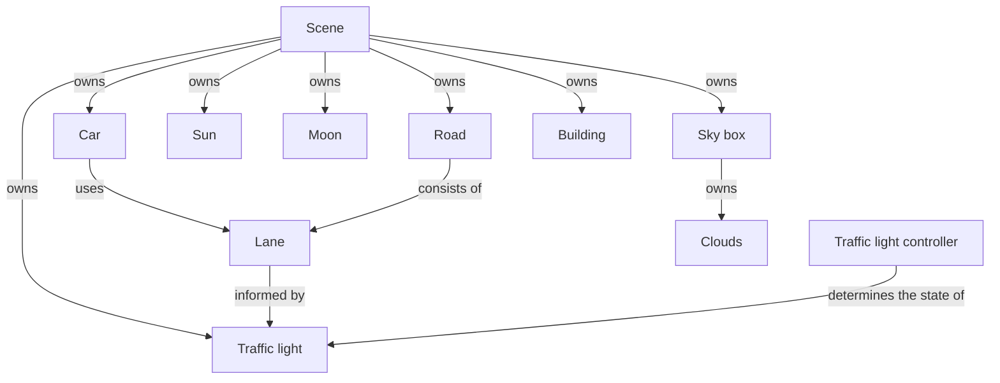

# DOCS 01 : conceptual stuffs

---
---

## About

[**[return to overview]**](./docs_00_overview.md#docs-01--concepts-and-some-throwing-around-ideas)

* initial research and thoughtables
* can be actor identifying and the use case stuffs
* will be the use case diagrams and sequence diagrams too
* include the context model
* mah haps the architecture

|  |
| :---: |
| *an early conceptual diagram of the project* - `12/06/2024` |

---

## Contents

* [**[Previous conceptual information]**](#previous-conceptual-information)
* [**[Actor Identification]**](#actor-identification)
    * [*[Concept identification listing [draft 01]]*](#concept-identification-listing-draft-01)
    * [*[Context model [draft 01]]*](#context-model-draft-01)
* [**[Use cases]**](#use-cases)
    * [*[Simple use cases]*](#simple-use-cases)
* [**[Concept Diagrams]**](#concept-diagrams)

---

## previous conceptual information

[**[Back to Contents]**](#contents)

* [[Suppliment 01]](./docs_01_conceptual_suppliment_01.md) - the previous conceptual documentation

---

## Actor identification

[**[Back to Contents]**](#contents)

### Concept identification listing [draft 01]

* car
* traffic light
* traffic controller
* traffic control diagnostic system
* road
* lane
* light
* sky
* cloud
* building
* wheel
* sun
* moon
* wheel

### Context model [draft 01]

* kinda context model of the things, rly simple flow

---

## Use cases

[**[Back to Contents]**](#contents)

### simple use cases

#### `Car`

* as a `Car` i want to ***travel straight*** through `Intersection`
* as a `Car` i want to ***turn left***
* as a `Car` i want to **turn right**
* as a `Car` queued in `Lane`, i want to ***move*** up to the `Intersection`
* as a `Car` at the start of the queue, i want to ***begin moving*** through the `Intersection`
* as a `Car` i want to ***generate*** a `Mesh` to use
* as a `Car` i want to ***move forward*** when it's *safe to move*
* as a `Car` i want to ***stop*** when it's *not safe to move*
* as a `Car` i want to ***rotate*** my `Wheel`s when i *move*
* as a `Car` i want to ***update*** my `Car lights` to show my *behaviour*

#### `Clouds`

* as the `Clouds` i want to ***move*** with the *wind*

#### `Lane`

* as a `Lane` i want to have a `Traffic Light` ***state*** holder

#### `Scene`

* as a `Scene` i want to ***generate*** a `Sky Day`
* as a `Scene` i want to ***generate*** a `Sky Night`
* as a `Scene` i want to ***generate*** a `Car`
* as a `Scene` i want to ***generate*** an `Intersection`
* as a `Scene` i want to ***generate*** a `Building`
* as a `Scene` i want to ***generate*** the `Terrain`
* as a `Scene` i want to ***generate*** the `Clouds`

#### `Sky Day`

* as a `Sky Day` i want to ***check*** the `time of day`
* as a `Sky Day` i want to ***display*** the `Clouds`
* as a `Sky Day` i want to ***display*** the `Sun`
* as a `Sky Day` i want to ***display*** the `Atmosphere colour`

#### `Sky Night`

* as a `Sky Night` i want to ***check*** the `time of day`
* as a `Sky Night` i want to ***display*** the `Clouds`
* as a `Sky Night` i want to ***display*** the `Moon`
* as a `Sky Night` i want to ***display*** the `Stars`

#### `Traffic Controller`

* as a `Traffic Controller` i want to ***change*** the `Lane` which can *move*

#### `Traffic diagnostics screen`

* as a `Traffic diagnostics screen` i want to ***check*** the ***state*** of the `Traffic Controller`
* as a `Traffic diagnostics screen` i want to ***check*** the *number* of `Car`s in a `Lane`

#### `Traffic Light`

* as a `Traffic Light` i want to ***update*** my ***state***
* as a `Traffic Light` ***state*** holder i want to ***generate*** my `Mesh`

#### `Intersection`

* as an `Intersection` i want to ***generate*** the `Intersection` `Mesh`
* as an `Intersection` i want to ***generate*** the `Lane` objects

---

## Concept Diagrams

[**[Back to Contents]**](#contents)

|  |
| :---: |
| *A simple model of the system somewhere between architecture and data flow models* - `12/06/2024` |

---

|  |
| :---: |
| *An artistic abstraction of the lanes as conveyor belts with notes on queues and client-server model design* - `12/06/2024` |

---

|  |
| :---: |
|  |
| *An artistic abstraction of the lanes as conveyor belts with notes on queues and client-server model design* - `12/06/2024` |

---

