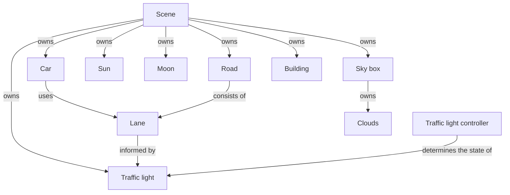
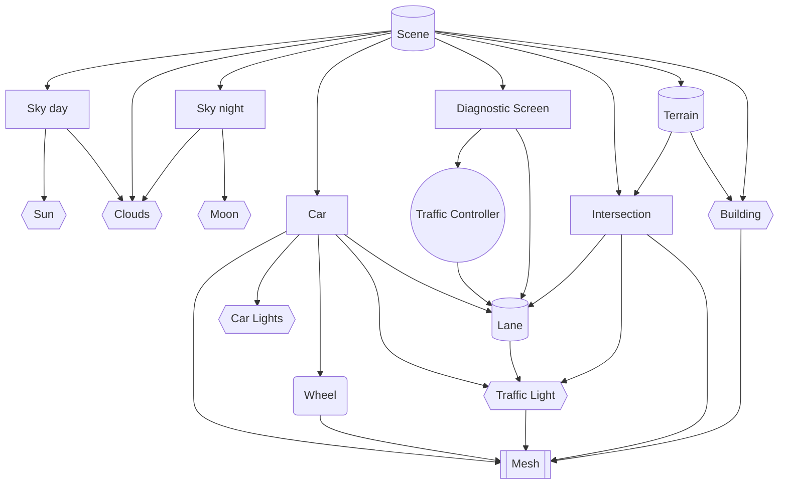

# DOCS 01 : conceptual stuffs

---
---

## About

[**[return to overview]**](./docs_00_overview.md#docs-01--concepts-and-some-throwing-around-ideas)

* initial research and thoughtables
* can be actor identifying and the use case stuffs
* will be the use case diagrams and sequence diagrams too
* include the context model
* mah haps the architecture

|  |
| :---: |
| *an early conceptual diagram of the project* - `12/06/2024` |

---

## Contents

* [**[Previous conceptual information]**](#previous-conceptual-information)
* [**[Actor Identification]**](#actor-identification)
    * [*[Concept identification listing [draft 01]]*](#concept-identification-listing-draft-01)
    * [*[Concept identification listing [draft 02]]*](#concept-identification-listing-draft-02)
* [**[Use cases]**](#use-cases)
    * [*[Simple use cases]*](#simple-use-cases)
* [**[Concept-Domain models]**](#concept-domain-models)
    * [*[Concept-Domain model [draft 01]]*](#concept-domain-model-draft-01)
    * [*[Concept-Domain model [draft 02]]*](#concept-domain-model-draft-02)
* [**[Sequence diagrams]**](#sequence-diagrams)
    * [*[Sequence diagram [draft 01]]*](#sequence-diagram-draft-01)
* [**[Concept Diagrams]**](#concept-diagrams)

---

## previous conceptual information

[**[Back to Contents]**](#contents)

* [[Suppliment 01]](./docs_01_conceptual_suppliment_01.md) - the previous conceptual documentation

---

## Actor identification

### Concept identification listing [draft 01]

[**[Back to Contents]**](#contents)

* car
* traffic light
* traffic controller
* traffic control diagnostic system
* road
* lane
* light
* sky
* cloud
* building
* wheel
* sun
* moon
* wheel

### Concept identification listing [draft 02]

[**[Back to Contents]**](#contents)

* todo

## Use cases

### simple use cases

[**[Back to Contents]**](#contents)

#### `Car`

* as a `Car` i want to ***travel straight*** through `Intersection`
* as a `Car` i want to ***turn left***
* as a `Car` i want to **turn right**
* as a `Car` queued in `Lane`, i want to ***move*** up to the `Intersection`
* as a `Car` at the start of the queue, i want to ***begin moving*** through the `Intersection`
* as a `Car` i want to ***generate*** a `Mesh` to use
* as a `Car` i want to ***move forward*** when it's *safe to move*
* as a `Car` i want to ***stop*** when it's *not safe to move*
* as a `Car` i want to ***rotate*** my `Wheel`s when i *move*
* as a `Car` i want to ***update*** my `Car lights` to show my *behaviour*

#### `Clouds`

* as the `Clouds` i want to ***move*** with the *wind*

#### `Lane`

* as a `Lane` i want to have a `Traffic Light` ***state*** holder

#### `Scene`

* as a `Scene` i want to ***generate*** a `Sky Day`
* as a `Scene` i want to ***generate*** a `Sky Night`
* as a `Scene` i want to ***generate*** a `Car`
* as a `Scene` i want to ***generate*** an `Intersection`
* as a `Scene` i want to ***generate*** a `Building`
* as a `Scene` i want to ***generate*** the `Terrain`
* as a `Scene` i want to ***generate*** the `Clouds`

#### `Sky Day`

* as a `Sky Day` i want to ***check*** the `time of day`
* as a `Sky Day` i want to ***display*** the `Clouds`
* as a `Sky Day` i want to ***display*** the `Sun`
* as a `Sky Day` i want to ***display*** the `Atmosphere colour`

#### `Sky Night`

* as a `Sky Night` i want to ***check*** the `time of day`
* as a `Sky Night` i want to ***display*** the `Clouds`
* as a `Sky Night` i want to ***display*** the `Moon`
* as a `Sky Night` i want to ***display*** the `Stars`

#### `Traffic Controller`

* as a `Traffic Controller` i want to ***change*** the `Lane` which can *move*

#### `Traffic diagnostics screen`

* as a `Traffic diagnostics screen` i want to ***check*** the ***state*** of the `Traffic Controller`
* as a `Traffic diagnostics screen` i want to ***check*** the *number* of `Car`s in a `Lane`

#### `Traffic Light`

* as a `Traffic Light` i want to ***update*** my ***state***
* as a `Traffic Light` ***state*** holder i want to ***generate*** my `Mesh`

#### `Intersection`

* as an `Intersection` i want to ***generate*** the `Intersection` `Mesh`
* as an `Intersection` i want to ***generate*** the `Lane` objects

---

## Concept-Domain models

* mermaid chart [[flow chart syntax reference]](https://mermaid.js.org/syntax/flowchart.html)
* mermaid chart [[class diagram syntax reference]](https://mermaid.js.org/syntax/classDiagram.html)
* the need for the model didnt really fit fully within either model so we made our own kind.
* a proper domain model will be made later

### Concept-Domain model [draft 01]

[**[Back to Contents]**](#contents)

* kinda context model of the things, rly simple flow

### Concept-Domain model [draft 02]

[**[Back to Contents]**](#contents)

* second attempt after doing the use cases
* `Atmosphere` was a suggestion to deal with some wackiness for cloud access
    * currently commented out in the diagram
* part way through making it we discovered that this doesnt fully fall within context or domain model
    * context loses the shapes to highlight the types of actors/objects
    * domain loses the shapes and current structure.
    * will need a simple domain model later to show number of items in their interactions
* `Scene` / `Terrain` / `Lane`
    * are controllers and high level concepts for their child nodes
    * warehouses for information
* `Sky day` / `Sky night` / `Car` / `Diagnostic Screen` / `Intersection`
    * are objects that hold behaviour and child nodes
    * these could be separate threads
* `Sun` / `Clouds` / `Moon` / `Car Lights` / `Traffic Light` / `Building`
    * these are mostly meshes and shaders, with some information
* `Traffic Controller`
    * 100% seperate thread to the rest of the system
    * controls the `Lane` child nodes
* `Mesh`
    * interface / object type to hold model information
    * will be very about the handling the model and texturing
* after completing the diagram we found the being able to send things more layers by using `-->` / `--->` / `---->` / `----->` 
    * will do this in next draft may haps

---

## Sequence diagrams

### Sequence diagram [draft 01]

[**[Back to Contents]**](#contents)

* todo

---

## Concept Diagrams

[**[Back to Contents]**](#contents)

|  |
| :---: |
| *A simple model of the system somewhere between architecture and data flow models* - `12/06/2024` |

---

|  |
| :---: |
| *An artistic abstraction of the lanes as conveyor belts with notes on queues and client-server model design* - `12/06/2024` |

---

|  |
| :---: |
|  |
| *An artistic abstraction of the lanes as conveyor belts with notes on queues and client-server model design* - `12/06/2024` |

---

