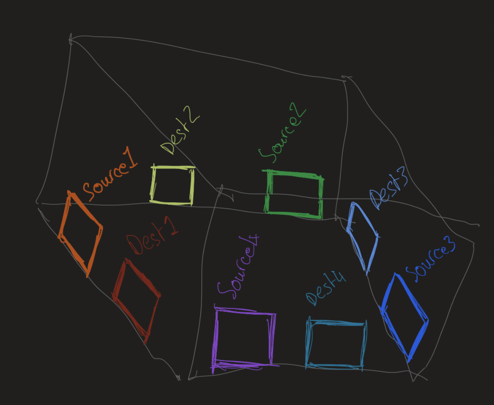

# DOCS 01 : conceptual stuffs

---
---

## About

[**[return to overview]**](./docs_00_overview.md#docs-01--concepts-and-some-throwing-around-ideas)

* initial research and thoughtables
* can be actor identifying and the use case stuffs
* will be the use case diagrams and sequence diagrams too
* include the context model
* mah haps the architecture

|  |
| :---: |
| *an early conceptual diagram of the project* - `12/06/2024` |

---

## Contents

* [**[Previous conceptual information]**](#previous-conceptual-information)
* [**[Actor Identification]**](#actor-identification)
    * [*[Concept identification listing [draft]]*](#concept-identification-listing-draft)
* [**[Concept Diagrams]**](#concept-diagrams)

---

## previous conceptual information

[**[Back to Contents]**](#contents)

* [[Suppliment 01]](./docs_01_conceptual_suppliment_01.md) - the previous conceptual documentation

---

## Actor identification

### Concept identification listing [draft]

* car
* traffic light
* traffic light controller
* road
* lane
* light
* sky
* cloud
* building
* wheel
* sun
* moon

### Context model?

* kinda context model of the things, rly simple flow

---

## Concept Diagrams

[**[Back to Contents]**](#contents)

|  |
| :---: |
| *A simple model of the system somewhere between architecture and data flow models* - `12/06/2024` |

---

|  |
| :---: |
| *An artistic abstraction of the lanes as conveyor belts with notes on queues and client-server model design* - `12/06/2024` |

---

|  |
| :---: |
|  |
| *An artistic abstraction of the lanes as conveyor belts with notes on queues and client-server model design* - `12/06/2024` |

---

