# DOCS 02: requirements etc stuffs

---
---

## Doc links

Documentation page links:
* [**[readme]**](./readme.md)
* [**[docs 00 : overview]**](./docs_00_overview.md#docs-02--requirements-building-the-things-and-interactions)
* [**[docs 01 : conceptual]**](./docs_01_conceptual.md)
* [***[docs 02 : requirements]***](./docs_02_requirements.md)
* [**[docs 03 : designables]**](./docs_03_designables.md)
* [**[docs 04 : developments]**](./docs_04_developments.md)

---

## About

* this is the requirements mappings page and will be for all the what does the huh where??
* also will do the domain model

---

## Contents

* [***[Requirement listing]***](#requirement-listing)
    * [*[Nonfunctional requirements]*](#nonfunctional-requirements)
        * [*[Nonfunctional - development environment]*](#nonfunctional---development-environment)
        * [*[Nonfunctional - miscellaneous]*](#nonfunctional---miscellaneous)
        * [*[Nonfunctional - procedural generation]*](#nonfunctional---procedural-generation)
    * [*[Functional requirements]*](#functional-requirements)
    * [*[The requirements that are hard to place]*](#the-requirements-that-are-hard-to-place)
    * [*[Pre-design documentation requirements]*](#pre-design-documentation-requirements)
    * [*[Design documentation required components]*](#design-documentation-required-components)
* [***[Domain models]***](#domain-models)
    * [*[Domain model [draft 01]]*](#domain-model-draft-01)
    * [*[Domain model [draft 02]]*](#domain-model-draft-02)
* [***[Design pattern ideas for Concepts]***](#design-pattern-ideas-for-concepts)
    * [Design pattern ideas : Shaders](#design-pattern-ideas--shaders)
    * [Design pattern ideas : Mesh](#design-pattern-ideas--mesh)
    * [Design pattern ideas : Traffic controller](#design-pattern-ideas--traffic-controller)
    * [Design pattern ideas : Cars](#design-pattern-ideas--cars)
    * [Design pattern ideas : Traffic light](#design-pattern-ideas--traffic-light)
* [***[Notes on design path]***](#notes-on-design-path)
* [***[Required data for actors/objects]***](#required-data-for-actorsobjects)
    * [*[Required data fields [draft 01] : `MainThread`]*](#required-data-fields-draft-01--mainthread)
    * [*[Required data fields [draft 01] : `DiagnosticsThread`]*](#required-data-fields-draft-01--diagnosticsthread)
    * [*[Required data fields [draft 01] : `ControllerThread`]*](#required-data-fields-draft-01--controllerthread)
    * [*[Required data fields [draft 01] : `LightThread`]*](#required-data-fields-draft-01--lightthread)
    * [*[Required data fields [draft 01] : `CarThread`]*](#required-data-fields-draft-01--carthread)
    * [*[Required data fields [draft 01] : `App`]*](#required-data-fields-draft-01--app)
    * [*[Required data fields [draft 01] : `Scene`]*](#required-data-fields-draft-01--scene)
    * [*[Required data fields [draft 01] : `SkyBox`]*](#required-data-fields-draft-01--skybox)
    * [*[Required data fields [draft 01] : `Lane`]*](#required-data-fields-draft-01--lane)
    * [*[Required data fields [draft 01] : `SkyDay`]*](#required-data-fields-draft-01--skyday)
    * [*[Required data fields [draft 01] : `SkyNight`]*](#required-data-fields-draft-01--skynight)
    * [*[Required data fields [draft 01] : `Intersection`]*](#required-data-fields-draft-01--intersection)
    * [*[Required data fields [draft 01] : `DiagnosticScreen`]*](#required-data-fields-draft-01--diagnosticscreen)
    * [*[Required data fields [draft 01] : `Car`]*](#required-data-fields-draft-01--car)
    * [*[Required data fields [draft 01] : `Clouds`]*](#required-data-fields-draft-01--clouds)
    * [*[Required data fields [draft 01] : `Sun`]*](#required-data-fields-draft-01--sun)
    * [*[Required data fields [draft 01] : `Moon`]*](#required-data-fields-draft-01--moon)
    * [*[Required data fields [draft 01] : `Building`]*](#required-data-fields-draft-01--building)
    * [*[Required data fields [draft 01] : `TrafficLight`]*](#required-data-fields-draft-01--trafficlight)
    * [*[Required data fields [draft 01] : `Wheel`]*](#required-data-fields-draft-01--wheel)
    * [*[Required data fields [draft 01] : `CarLights`]*](#required-data-fields-draft-01--carlights)
    * [*[Required data fields [draft 01] : `Mesh`]*](#required-data-fields-draft-01--mesh)
* [***[Requirements mapping]***](#requirement-mapping)
    * [*[Requirements mapping [draft 01]]*](#requirement-mapping-draft-01)
    * [*[Documentation requirement mapping [draft 01]]*](#documentation-requirement-mapping-draft-01)

---

## Requirement listing

### nonfunctional requirements

#### nonfunctional - development environment

[**[Back to Contents]**](#contents)

| requirement ID | requirement | description |
| ---: | :---: | :--- |
| `NFR_DE_01` | developed on `MacOS` | because we are using macOS |
| `NFR_DE_02` | developed with `VSCODE` | we need the keybinds and extensions |
| `NFR_DE_03` | developed using `OpenGL` | because what's the hemkn point otherwise |
| `NFR_DE_04` | `C++` programming language | main language that the project is written in, to use objects and learn |
| `NFR_DE_05` | `GLAD` library | OpenGL function pointer wrapper |
| `NFR_DE_06` | `GLFW` library | window event handle wrapper because we dont want to cry over metals yet |
| `NFR_DE_07` | `GLM` library | maths for vectors/matrices so it's less painful to usue |
| `NFR_DE_08` | `opengl_project_structurings` as template | to reduce starting and initial setup time |

#### nonfunctional - miscellaneous 

[**[Back to Contents]**](#contents)

| requirement ID | requirement | description |
| ---: | :---: | :--- |
| `NFR_M_01` | `Left-handed traffic` | because we live in australia, we drive on the left side of the road |
| `NFR_M_02` | uses the `Concurrency` for the lights and cars | concurrency is being used to manage the car positioning and movement and the lights |
| `NFR_M_03` | traffic control system state display | display shows the state of traffic lights for the different lanes |
| `NFR_M_04` | day night cycles  | day night cycles exist in the scene with shaders for both  |
| `NFR_M_05` | moon phases  | the moon displays different phases  |

#### nonfunctional - procedural generation

[**[Back to Contents]**](#contents)

| requirement ID | requirement | description |
| ---: | :---: | :--- |
| `NFR_PG_01` | cars are procedurally generated | car models are procedurally generated through settings and from a catalogue of options |
| `NFR_PG_02` | clouds are procedurally generated | procedurally generated clouds exist in the skybox |
| `NFR_PG_03` | stars are procedurally generated | procedurally generated stars exist in the skybox |
| `NFR_PG_04` | buildings are procedurally generated | procedurally generated buildings in the scene exist |
| `NFR_PG_05` | terrain is procedurally generated | procedurally generated terrain including road/intersection generation |

---

### functional requirements

[**[Back to Contents]**](#contents)

| requirement ID | requirement | description |
| ---: | :---: | :--- |
| `FR_01` | cars only travel when their lane's light is green | that the cars check they have a green light to travel |
| `FR_02` | cars wait to travel when their lane has a red light | that the cars wait for their turn when their lane has a red light  |
| `FR_03` | cars queue in a line for their lane | that they dont overlap or try to occupy the same space  |
| `FR_04` | cars move when the car in front moves in lane | that they dont overlap or try to occupy the same space  |

---

### the requirements that are hard to place

[**[Back to Contents]**](#contents)

| requirement ID | requirement | description |
| ---: | :---: | :--- |
| `IDK_01` | ... | ... |

---

### Pre-Design documentation requirements

* things needed in requirements documentation before we can move on to design

| requirement ID | requirement | description |
| ---: | :---: | :--- |
| `PDDR_01` | Required fields | Required data held by our objects |
| `PDDR_02` | suggested design patterns for actors/objects | proposed design patterns |
| `PDDR_03` | listing deadlock avoidance methods | a list of the deadlock avoidance methods that work for our system |
| `PDDR_04` | simple architectural diagrams for our system | to show how the actors/object connect to each other and make sure we're not doing spooky design choices sooner rather than later |
| `PDDR_05` | reorganise documentation | putting things in the correct documentation files |
| `PDDR_06` | requirement dependency map | mapped out requirement dependencies |
| `PDDR_07` | importance of requirements | importance of each requirement |
| `PDDR_08` | risk mapping | risk assessment for work required for a thing to function (and how likely to get it working first try) in relation to importance |
| `PDDR_09` | checklist table for all the requirements | somewhere having a checklist for our requirements so we can tick off what's complete |
| `PDDR_10` | concept diagrams of models in documentation | adding the various model concept diagram drafts to the documentation |
| `PDDR_11` | ... | ... |

---

### Design documentation required components

* things needed in the design documentation to move onto development stage

| requirement ID | requirement | description |
| ---: | :---: | :--- |
| `DDR_01` | C++ Compilation/linking | the process of compiling and linking in C++ |
| `DDR_02` | OpenGL render pipeline | to explain the stages |
| `DDR_03` | *[semi-optional]* Library pipeline | pipeline of the libraries we use. This is more important if we use extra libraries |
| `DDR_04` | Base template control flow | explaination of the base project structure we're using for OpenGL |
| `DDR_05` | Development pathway | the pathway we plan to take for iterations in development *[hopefully with predicted workload/timeframes]* |
| `DDR_06` | Model diagrams | diagrams of proposed models and model generation |
| `DDR_07` | Actor/Object fields and methods diagrams | listing the required data in our Actors/Objects |
| `DDR_08` | Detailed iteration diagrams | detailed iteration diagrams |
| `DDR_09` | Detailed deadlock avoidance method | details about how we'll avoid deadlock |
| `DDR_10` | detailed combined UML diagram | for reference while we work to make sure we're not making something wonky |
| `DDR_11` | shader behaviour diagrams | diagrams for diffuse/specularity and difference between phong/blinn-phong models |
| `DDR_12` | ... | ... |

## Domain models

### Domain model [draft 01]

[**[Back to Contents]**](#contents)

* lazy draft, half way through we stopped putting the relationships in properly


### Domain model [draft 02]

[**[Back to Contents]**](#contents)

* todo

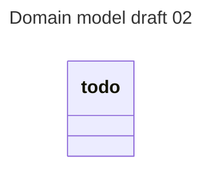

---

## Design pattern ideas for concepts

### Design pattern ideas : Shaders

[***[back to Contents]***](#contents)

* [facade pattern](https://refactoring.guru/design-patterns/facade)

### Design pattern ideas : Mesh

[***[back to Contents]***](#contents)

* [facade pattern](https://refactoring.guru/design-patterns/facade) possibly

### Design pattern ideas : Traffic controller

[***[back to Contents]***](#contents)

* almost certainly [mediator pattern](https://refactoring.guru/design-patterns/mediator)

### Design pattern ideas : Cars

[***[back to Contents]***](#contents)

* [strategy pattern](https://refactoring.guru/design-patterns/strategy) for behaviour and travel desire
* [adapter pattern](https://refactoring.guru/design-patterns/adapter) for the different cars?
* [observer pattern](https://refactoring.guru/design-patterns/observer) for looking at the light from car or next car

### Design pattern ideas : Traffic light

[***[back to Contents]***](#contents)

* likely also [mediator pattern](https://refactoring.guru/design-patterns/mediator) with lanes
* [state pattern](https://refactoring.guru/design-patterns/state) for the state of the lights
* [command pattern](https://refactoring.guru/design-patterns/command) for handling the changes from controllers?
* [adapter pattern](https://refactoring.guru/design-patterns/adapter) for between the command/state and the multi/single light array itself?
* [observer pattern](https://refactoring.guru/design-patterns/observer) for looking at the light from car


---

## Notes on design path

* prone to change in order depending on how the requirements mapping goes
    * that is if we map that
* doesnt specify when non procedural textures happen, likely with [***[sixth-iteration : improved modes]***](#design-pathway-notes--sixth-iteration--improved-models)

#### Subheading links:

* [***[initial-prototype]***](#design-pathway-notes--initial-prototype)
* [***[first-iteration : diagnostic-system]***](#design-pathway-notes--first-iteration--diagnostic-system)
* [***[second-iteration : concurrency-system]***](#design-pathway-notes--second-iteration--concurrency-system)
* [***[third-iteration : debugging-draw-modes-part-1]***](#design-pathway-notes--third-iteration--debugging-draw-modes-part-1)
* [***[fourth-iteration : simple-static-models]***](#design-pathway-notes--fourth-iteration--simple-static-models)
* [***[fifth-iteration : debugging-draw-modes-part-2]***](#design-pathway-notes--fifth-iteration--debugging-draw-modes-part-2)
* [***[sixth-iteration : improved-models]***](#design-pathway-notes--sixth-iteration--improved-models)
* [***[seventh-iteration : directional-sunlight]***](#design-pathway-notes--seventh-iteration--directional-sunlight)
* [***[eighth-iteration : simple-diffuse--specular-lighting]***](#design-pathway-notes--eighth-iteration--simple-diffuse--specular-lighting)
* [***[ninth-iteration : simple-buildings]***](#design-pathway-notes--ninth-iteration--simple-buildings)
* [***[tenth-iteration : cube-map-sky]***](#design-pathway-notes--tenth-iteration--cube-map-sky)
* [***[eleventh-iteration : perlin-noise-generation]***](#design-pathway-notes--eleventh-iteration--perlin-noise-generation)
* [***[twelfth-iteration : procedural-cars]***](#design-pathway-notes--twelfth-iteration--procedural-cars)
* [***[thirteenth-iteration : procedural-traffic-lights]***](#design-pathway-notes--thirteenth-iteration--procedural-traffic-lights)
* [***[fourteenth-iteration : light-cones]***](#design-pathway-notes--fourteenth-iteration--light-cones)
* [***[fifteenth-iteration : procedural-light-cones]***](#design-pathway-notes--fifteenth-iteration--procedural-light-cones)
* [***[sixteenth-iteration : procedural-buildings]***](#design-pathway-notes--sixteenth-iteration--procedural-buildings)
* [***[seventeenth-iteration : procedural-intersections]***](#design-pathway-notes--seventeenth-iteration--procedural-intersections)

### Design pathway notes : Initial prototype

* will mostly be iteratively building proof of concepts for each sub system as a rough draft, then merging into a semi-functional prototype
* likely using a lot of hard coding which will be refactored afterwards

### Design pathway notes : First iteration : Diagnostic system

* will be the focus on getting the diagnostic system working at minimum using a second view port
* once working, it'll be with a very simple model for the render texture

### Design pathway notes : Second iteration : Concurrency system

* once diagnostic system is working, it'll be a focus on concurrency

### Design pathway notes : Third iteration : Debugging draw modes part 1

* after the concurrency, we'll make the debugging draw modes so that we can start working on the models
* keeping them as simple as possible, wire/point

### Design pathway notes : Fourth iteration : simple static models

* simple static models for everything, ignoring procedural generation, traffic lights can be multiple draw calls each
* fixed height terrain

### Design pathway notes : Fifth iteration : Debugging draw modes part 2

* normal / uv mapping
    * can be per mesh shader to start with and always refactor later
* optional binding mapping, but this may not be a simple option. do not spend too much time on this, move on if it's spooky

### Design pathway notes : Sixth iteration : improved models

* some really basic, but medium tier models so we can start working on shaders
    * no buildings yet, only: { cars, flat terrain, lights, diagnostic screen, sun, moon }
* cars have very simple "lights", which do not light up their surroundings

### Design pathway notes : Seventh iteration : directional sunlight

* implementing the sun for light shaders
* can also do the billboard, and the moon as well
* hard transition between night and day

### Design pathway notes : Eighth iteration : simple diffuse / specular lighting

* as this is necessary before we can make models with anymore detail
* using phong specularity
    * can improve with blinn-phong if the regular phong isnt making sense
* gamma correction is part of this step as well shhhh sneaky sneaky

### Design pathway notes : Ninth iteration : simple buildings

* simple building generation, can just be random floor count for now, all the same kind of building

### Design pathway notes : Tenth iteration : Cube map sky

* can just be fixed sky cubemap
* may complete this earlier if we do textures earlier than this stage. depends if they make sense a lot earlier or not

### Design pathway notes : Eleventh iteration : perlin noise generation

* adding in perlin noise generation
* and using it for clouds

### Design pathway notes : Twelfth iteration : procedural cars

* procedural cars

### Design pathway notes : Thirteenth iteration : procedural traffic lights

* procedural traffic lights

### Design pathway notes : Fourteenth iteration : light cones

* light cones, very simple, all fixed

### Design pathway notes : fifteenth iteration : procedural light cones

* light cones are generated based on car model and randomness
* xenon etc

### Design pathway notes : Sixteenth iteration : procedural buildings

* procedural buildings buildings

### Design pathway notes : Seventeenth iteration : procedural intersections

* heightmap for terrain, procedural roads, building the intersection mesh, and the buildings

---

## Required data for actors/objects

* the required data of our actors and models

### Required data fields [draft 01] : `MainThread`

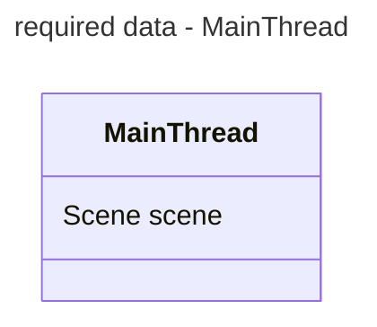

### Required data fields [draft 01] : `DiagnosticsThread`

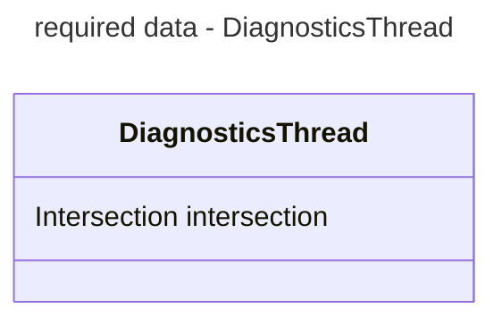

### Required data fields [draft 01] : `ControllerThread`

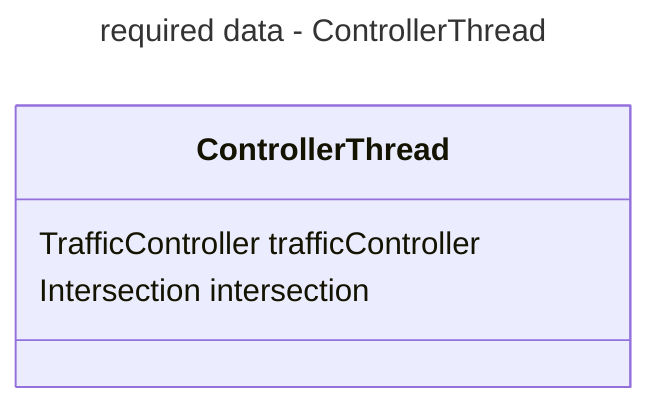

### Required data fields [draft 01] : `LightThread`

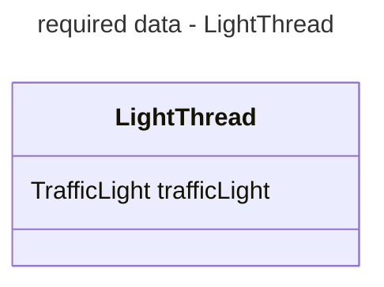

### Required data fields [draft 01] : `CarThread`

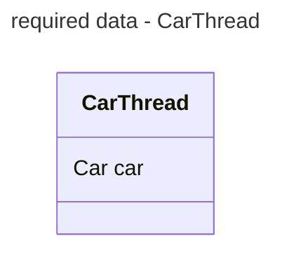

### Required data fields [draft 01] : `App`

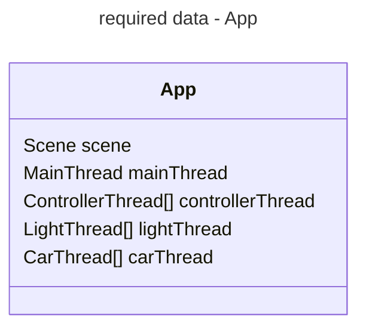

### Required data fields [draft 01] : `Scene`

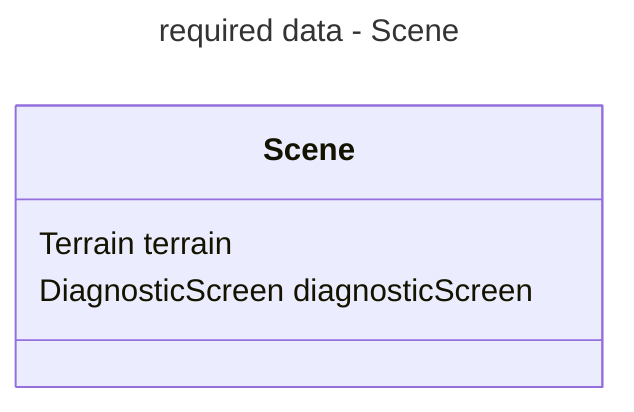

### Required data fields [draft 01] : `Skybox`

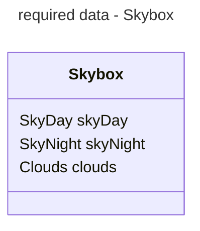

### Required data fields [draft 01] : `Lane`

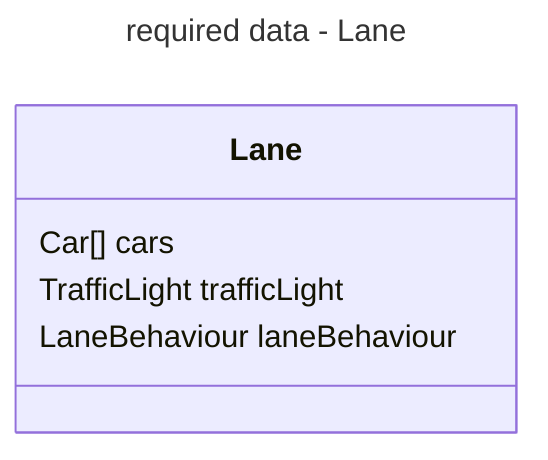

### Required data fields [draft 01] : `SkyDay`

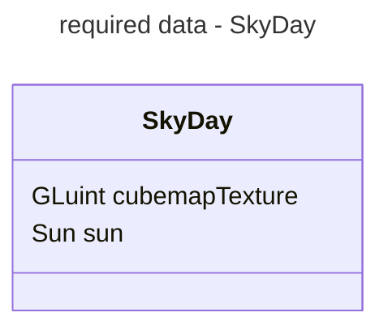

### Required data fields [draft 01] : `SkyNight`

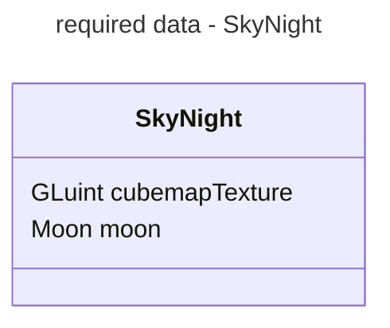

### Required data fields [draft 01] : `Terrain`

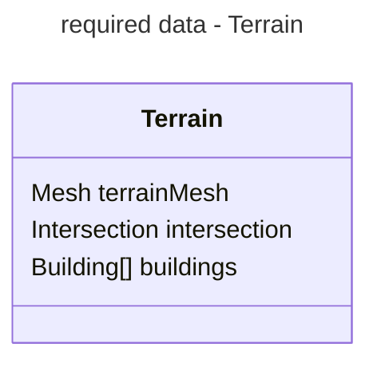

### Required data fields [draft 01] : `Intersection`

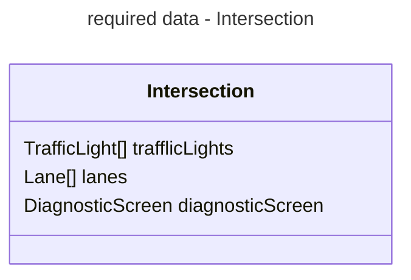

### Required data fields [draft 01] : `DiagnosticScreen`

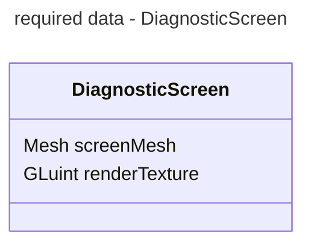

### Required data fields [draft 01] : `Car`

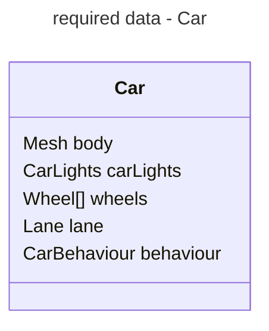


### Required data fields [draft 01] : `Clouds`

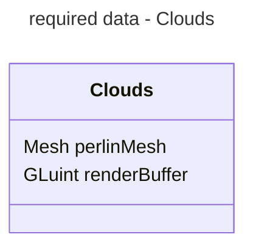

### Required data fields [draft 01] : `Sun`

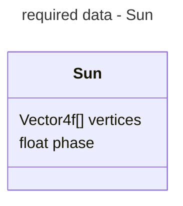

### Required data fields [draft 01] : `Moon`

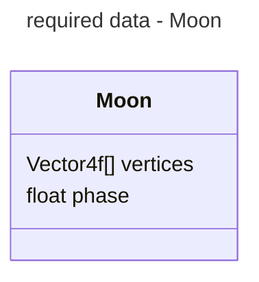

### Required data fields [draft 01] : `Building`

```mermaid
---
title: required data - Building
---
classDiagram
    class Building {
        Mesh mesh
    }
```

### Required data fields [draft 01] : `TrafficLight`

```mermaid
---
title: required data - TrafficLight
---
classDiagram
    class TrafficLight {
        Mesh mesh
        TLstate state
    }
```

### Required data fields [draft 01] : `Wheel`

```mermaid
---
title: required data - Wheel
---
classDiagram
    class Wheel {
        Mesh mesh
        Vector3f rotation
    }
```

### Required data fields [draft 01] : `CarLights`

```mermaid
---
title: required data - CarLights
---
classDiagram
    class CarLights {
        %% ..
    }
```

### Required data fields [draft 01] : `Mesh`

```mermaid
---
title: required data - Mesh
---
classDiagram
    class Mesh {
        Vector4f[] vertices
        Vector4f[] normals
        Vector2f[] uvMapping
        int[] bindings
        GLuint vertexBuffer
        GLuint normalBuffer
        GLuint uvBuffer
        GLuint bindingBuffer
    }
```

---

## Requirement mapping

### Requirement mapping [draft 01]

[***[back to Contents]***](#contents)

```mermaid
---
title: basic requirement mapping - draft 01
---
flowchart TD
    %% ================================================================
    %% ================================================================
    subgraph Nonfunctional requirements - develement environment
    NFR_DE_01{{NFR_DE_0<br><i>macOS env</i>}}
    NFR_DE_02{{NFR_DE_02<br><i>vscode env</i>}}
    NFR_DE_03{{NFR_DE_03<br><i>Lib: OpenGL</i>}}
    NFR_DE_04[NFR_DE_04<br><i>Lang: C++</i>]
    NFR_DE_05[NFR_DE_05<br><i>Lib: GLAD</i>]
    NFR_DE_06[NFR_DE_06<br><i>Lib: GLFW</i>]
    NFR_DE_07[NFR_DE_07<br><i>Lib: GLM</i>]
    NFR_DE_08[NFR_DE_08<br><i>Tmplt: opengl_project_structurings</i>]

    NFR_DE_03 --> NFR_DE_05
    NFR_DE_03 --> NFR_DE_06
    NFR_DE_03 --> NFR_DE_07

    NFR_DE_04 ---> NFR_DE_08
    NFR_DE_02 ----> NFR_DE_08
    NFR_DE_05 --> NFR_DE_08
    NFR_DE_06 --> NFR_DE_08
    NFR_DE_07 --> NFR_DE_08
    end
    %% ================================================================
    %% ================================================================
    subgraph Nonfunctional requirements - Miscellaneous
    NFR_M_01{{NFR_M_01<br><i>left hand traffic</i>}}
    NFR_M_02{{NFR_M_02<br><i>concurrency</i>}}
    NFR_M_03[NFR_M_03<br><i>diagnostic display</i>]
    NFR_M_04{{NFR_M_04<br><i>day night cycles</i>}}
    NFR_M_05{{NFR_M_05<br><i>moon phases</i>}}

    NFR_DE_04 ----> NFR_M_02
    NFR_M_02 --> NFR_M_03
    end
    %% ================================================================
    %% ================================================================
    subgraph Nonfunctional requirements - Procedural gen
    NFR_PG_01[NFR_PG_01<br><i>gen: cars</i>]
    NFR_PG_02[NFR_PG_02<br><i>gen: clouds</i>]
    NFR_PG_03[NFR_PG_03<br><i>gen: stars</i>]
    NFR_PG_04[NFR_PG_04<br><i>gen: buildings</i>]
    NFR_PG_05[NFR_PG_05<br><i>gen: terrain</i>]

    NFR_DE_07 ------> NFR_PG_01
    NFR_DE_07 ------> NFR_PG_02
    NFR_DE_07 ------> NFR_PG_03
    NFR_DE_07 ------> NFR_PG_04
    NFR_DE_07 ------> NFR_PG_05
    end
    %% ================================================================
    %% ================================================================
    subgraph Functional requirements
    FR_01[FR_01<br><i>green light travel</i>]
    FR_02[FR_02<br><i>red light wait</i>]
    FR_03[FR_03<br><i>lane queueing</i>]
    FR_04[FR_04<br><i>move when leading<br>car does</i>]
    NFR_M_02 ----> FR_01
    NFR_M_02 ----> FR_02
    NFR_M_02 ----> FR_03
    NFR_M_01 ----> FR_04
    NFR_M_02 ----> FR_04
    NFR_DE_08 ---> NFR_M_03
    end
    %% ================================================================
    %% ================================================================
```

### Documentation requirement mapping [draft 01]

[***[back to Contents]***](#contents)

```mermaid
---
title: documentation requirement mappings
---
flowchart LR
    %% ================================================================
    %% ================================================================
    subgraph PDDR_GROUP[Pre-Design Document Requirements]
    PDDR_01[PDDR_01<br><i>required fields</i>]
    PDDR_02[PDDR_02<br><i>design pattern<br>suggestions</i>]
    PDDR_03[PDDR_03<br><i>deadlock mitigation<br>suggestions</i>]
    PDDR_04[PDDR_04<br><i>simple architectural<br>diagrams</i>]
    PDDR_05[PDDR_05<br><i>reorganised documentation</i>]
    PDDR_06[PDDR_06<br><i>requirement dependencies<br>mapping</i>]
    PDDR_07[PDDR_07<br><i>requirement importance</i>]
    PDDR_08[PDDR_08<br><i>risk mapping</i>]
    PDDR_09[PDDR_09<br><i>pre-design<br>requirement checklist</i>]
    PDDR_10[PDDR_10<br><i>model concept<br>diagrams</i>]
    PDDR_05 --> PDDR_09
    PDDR_05 ---> PDDR_10
    PDDR_05 --> PDDR_06
    PDDR_01 --> PDDR_02
    PDDR_06 --> PDDR_07
    PDDR_07 ----> PDDR_08
    PDDR_07 --> PDDR_03
    PDDR_03 --> PDDR_08
    PDDR_02 --> PDDR_04
    PDDR_04 --> PDDR_03
    end
    %% ================================================================
    %% ================================================================
    subgraph DDR_GROUP[Pre-Development document requirements]
    DDR_01[DDR_01<br><i>C++ linking<br>graph</i>]
    DDR_02[DDR_02<br><i>OpenGL<br>render pipeline</i>]
    DDR_03[DDR_03<br><i>Library pipeline</i>]
    DDR_04[DDR_04<br><i>template<br>control flow</i>]
    DDR_05[DDR_05<br><i>development<br>pathway</i>]
    DDR_06[DDR_06<br><i>model diagrams</i>]
    DDR_07[DDR_07<br><i>actor and object<br>field and method<br>diagrams</i>]
    DDR_08[DDR_08<br><i>detailed iteration<br>diagrams</i>]
    DDR_09[DDR_09<br><i>detailed deadlock<br>avoidance</i>]
    DDR_10[DDR_10<br><i>detailed final<br>UML</i>]
    DDR_11[DDR_11<br><i>shader behaviour<br>diagrams</i>]
    DDR_01 --> DDR_04
    DDR_02 --> DDR_03
    DDR_02 --> DDR_04
    DDR_05 --> DDR_08
    DDR_11 --> DDR_06
    DDR_07 --> DDR_10
    DDR_03 ---> DDR_10
    DDR_04 ---> DDR_10
    DDR_07 ---> DDR_09
    DDR_09 --> DDR_10
    DDR_10 ---> DDR_05
    DDR_11 ---> DDR_05
    DDR_06 --> DDR_05
    end
    %% ================================================================
    %% ================================================================
    DESIGNDOCUMENT[[Design document]]
    DEVELOPMENTDOCUMENT[[Development document]]
    PDDR_GROUP ==> DESIGNDOCUMENT
    DESIGNDOCUMENT ==> DDR_GROUP ==> DEVELOPMENTDOCUMENT
    %% ================================================================
    %% ================================================================
```

---

## Requirements importance mapping

### Requirements importance [draft 01]

#### Requirement - requirement types

```mermaid
---
title: requirement types
---
flowchart LR
    subgraph ENV
    ENVSYS[ENV-SYS]
    ENVARCHITECTURAL[ENV-ARCHITECTURAL]
    end
    subgraph DOCS
    DOCSORGANISATION[DOCS-ORGANISATION]
    DOCSREFERENCE[DOCS-REFERENCE]
    end
    subgraph DESIGN
    DESIGNFLAVOUR[DESIGN-FLAVOUR]
    DESIGNARCHITECTURAL[DESIGN-ARCHITECTURAL]
    DESIGNMECHANICAL[DESIGN-MECHANICAL]
    DESIGNBEHAVIOUR[DESIGN-BEHAVIOUR]
    DESIGNREFERENCE[DESIGN-REFERENCE]
    end
    subgraph PROCEDURAL
    PROCEDURALFLAVOUR[PROCEDURAL-FLAVOUR]
    end
    subgraph DEV
    DEVPLAN[DEV-PLAN]
    DEVREFERENCE[DEV-REFERENCE]
    end
```

#### Requirement - workload types - mapping

```mermaid
---
title: requirement workload
---
flowchart
    %% ==================================================
    %% ==================================================
    subgraph PASSIVEWORKLOAD[Passive Work Load - <b>PWL</b>]
    %% --------------------------------------------
    subgraph PWL_NON[<b>PWL</b>Non-applicable]
    %% PWL00 - doesnt add any work
    PWL00[PWL 0<br><i>No workload</i>]
    end
    %% --------------------------------------------
    subgraph PWL_DEV[<b>PWL</b> Development]
    %% PWL01 - docs / tutorials
    PWL01[PWL 1<br><i>Dev. resource</i>]
    %% PWL02 - programs / editors / build environment
    PWL02[PWL 2<br><i>Dev. tools</i>]
    %% PWL03 - packages / modules / libraries
    PWL03[PWL 3<br><i>Dev. package</i>]
    %% PWL04 - pre-made template code
    PWL04[PWL 4<br><i>Dev. template</i>]
    end
    %% --------------------------------------------
    end
    %% ==================================================
    %% ==================================================
    subgraph ACTIVEWORKLOAD[Active Work Load - <b>AWL</b>]
    %% --------------------------------------------
    subgraph AWL_LOWER[<b>AWL</b> Lower]
    AWL01{{AWL 1<br><i>Minimal</i>}}
    AWL02{{AWL 2<br><i>Miniscule</i>}}
    AWL03{{AWL 3<br><i>Meager</i>}}
    AWL04{{AWL 4<br><i>Minor</i>}}
    end
    %% --------------------------------------------
    subgraph AWL_MID[<b>AWL</b> Mid]
    AWL05{{AWL 5<br><i>Mild</i>}}
    AWL06{{AWL 6<br><i>Medium</i>}}
    AWL07{{AWL 7<br><i>Modest</i>}}
    AWL08{{AWL 8<br><i>Moderate</i>}}
    end
    %% --------------------------------------------
    subgraph AWL_UPPER[<b>AWL</b> Upper]
    AWL09{{AWL 9<br><i>Major</i>}}
    AWL10{{AWL 10<br><i>Massive</i>}}
    AWL11{{AWL 11<br><i>Monstrous</i>}}
    AWL12{{AWL 12<br><i>Maximum</i>}}
    end
    %% --------------------------------------------
    end
    %% ==================================================
    %% ==================================================
    PWL_NON ==> PWL_DEV
    PWL01 --> PWL02 --> PWL03 --> PWL04
    %% ==================================================
    PASSIVEWORKLOAD ==> ACTIVEWORKLOAD
    %% ==================================================
    AWL_LOWER ==> AWL_MID ==> AWL_UPPER
    AWL01 --> AWL02 --> AWL03 --> AWL04
    AWL05 --> AWL06 --> AWL07 --> AWL08
    AWL09 --> AWL10 --> AWL11 --> AWL12
    %% ==================================================
    %% ==================================================
```

#### Requirement - workload types - documentation
 
```mermaid
---
title: DOCUMENTATION - workload types
---
classDiagram
    class AWL01["Minimal"] {
        <<AWL01>>
        couple lines
        and or
        couple values
    }
    class AWL02["Miniscule"] {
        <<AWL02>>
        few lines
        and or
        few values
    }
    class AWL03["Meager"] {
        <<AWL03>>
        several lines
        and or
        several values
    }
    class AWL04["Minor"] {
        <<AWL04>>
        couple modules
    }
    class AWL05["Mild"] {
        <<AWL05>>
        few modules
    }
    class AWL06["Medium"] {
        <<AWL06>>
        several modules
    }
    class AWL07["Modest"] {
        <<AWL07>>
        many modules
        and or
        minimal research
    }
    class AWL08["Moderate"] {
        <<AWL08>>
        moderate documenting
        and or
        moderate research
    }
    class AWL09["Major"] {
        <<AWL09>>
        major documenting
        and or
        major research
    }
    class AWL10["Massive"] {
        <<AWL10>>
        massive doc changes
        and or
        minor re-engineering
    }
    class AWL11["Monstrous"] {
        <<AWL11>>
        complexity demon henchmen
        and or
        major re-engineering
    }
    class AWL12["Maximum"] {
        <<AWL12>>
        documentation deus vult
        and or
        BBEG complexity demon
    }
```

#### Requirement - workload types - development

```mermaid
---
title: DEVELOPMENT - workload types
---
classDiagram
    class AWL01["Minimal"] {
        <<AWL01>>
        couple lines
        and or
        couple values
    }
    class AWL02["Miniscule"] {
        <<AWL02>>
        few lines
        and or
        few values
    }
    class AWL03["Meager"] {
        <<AWL03>>
        couple functions
        and or
        couple fields
    }
    class AWL04["Minor"] {
        <<AWL04>>
        few functions
        and or
        few fields
    }
    class AWL05["Mild"] {
        <<AWL05>>
        couple classes
        and or
        couple files
    }
    class AWL06["Medium"] {
        <<AWL06>>
        few classes
        and or
        few files
    }
    class AWL07["Modest"] {
        <<AWL07>>
        minimal redesign
        and or
        minimal research
    }
    class AWL08["Moderate"] {
        <<AWL08>>
        minor redesign
        and or
        minor research
    }
    class AWL09["Major"] {
        <<AWL09>>
        medium redesign
        and or
        medium research
    }
    class AWL10["Massive"] {
        <<AWL10>>
        minor re-engineering
    }
    class AWL11["Monstrous"] {
        <<AWL11>>
        major re-engineering
        and or
        complexity demon henchmen
    }
    class AWL12["Maximum"] {
        <<AWL12>>
        BBEG complexity demon
        and or
        documentation deus vult
    }
```

#### Requirement importance - mapping table

| Req.<br>ID | Req.<br>Brief | Req.<br>type | Req.<br>workload<br>mapping | Req.<br>workload<br>label | ... |
| ------- | ---------- | --------- | ----- | --- | --- |
| NFR_DE_01 | MacOS | ENV-SYS | PWL00 |  |  |
| NFR_DE_02 | VSCode | ENV-SYS | PWL02 |  |  |
| NFR_DE_03 | OpenGL | ENV-ARCHITECTURAL | PWL03 | Minimal |  |
| NFR_DE_04 | C++ | ENV-ARCHITECTURAL | PWL02 | Minimal |  |
| NFR_DE_05 | GLAD | ENV-ARCHITECTURAL | PWL03 | N/A |  |
| NFR_DE_06 | GLFW | ENV-ARCHITECTURAL | PWL03 | N/A |  |
| NFR_DE_07 | GLM | ENV-ARCHITECTURAL | PWL03 | N/A |  |
| NFR_DE_08 | opengl_project_structurings <br>template | DESIGN-ARCHITECTURAL | PWL04 | Minimal |  |
| NFR_M_01 | LHS traffic | DESIGN-FLAVOUR | AWL02 | Miniscule |  |
| NFR_M_02 | Concurrency | DESIGN-ARCHITECTURAL | AWL07 | Modest |  |
| NFR_M_03 | Diagnostics screen | DESIGN-MECHANICAL | AWL08 | Moderate |  |
| NFR_M_04 | Day night cycles | DESIGN-MECHANICAL | AWL06 | Medium |  |
| NFR_M_05 | Moon phases | DESIGN-FLAVOUR | AWL04 | Minor |  |
| NFR_PG_01 | procedural cars | PROCEDURAL-FLAVOUR | AWL08 | Moderate |  |
| NFR_PG_02 | procedural clouds | PROCEDURAL-FLAVOUR | AWL07 | Modest |  |
| NFR_PG_03 | procedural stars | PROCEDURAL-FLAVOUR | AWL06 | Medium |  |
| NFR_PG_04 | procedural buildings | PROCEDURAL-FLAVOUR | AWL06 | Medium |  |
| NFR_PG_05 | procedural terrain | PROCEDURAL-FLAVOUR | AWL08 | Moderate |  |
| FR_01 | cars travel on<br>green light | DESIGN-BEHAVIOUR | AWL04 | Minor |  |
| FR_02 | cars wait on<br>red light | DESIGN-BEHAVIOUR | AWL04 | Minor |  |
| FR_03 | cars queue in<br>their lane | DESIGN-BEHAVIOUR | AWL04 | Minor |  |
| FR_04 | cars watch next<br>car to move | DESIGN-BEHAVIOUR | AWL04 | Minor |  |
| PDDR_01 | Required fields | DESIGN-REFERENCE | ... |  |  |
| PDDR_02 | suggested design patterns | DESIGN-REFERENCE | ... |  |  |
| PDDR_03 | deadlock avoidance options | DESIGN-REFERENCE | ... |  |  |
| PDDR_04 | architectural diagrams | DESIGN-REFERENCE | ... |  |  |
| PDDR_05 | reorganise documentation | DOCS-ORGANISATION | ... |  |  |
| PDDR_06 | requirement dependency map | DOCS-REFERENCE | ... |  |  |
| PDDR_07 | requirement importance map | DOCS-REFERENCE | ... |  |  |
| PDDR_08 | risk mapping | DOCS-REFERENCE | ... |  |  |
| PDDR_09 | pre-doc req. checklist | DOCS-ORGANISATION | ... |  |  |
| PDDR_10 | model concept diagrams | DESIGN-REFERENCE | ... |  |  |
| DDR_01 | C++ linking flowchart | DEV-REFERENCE | ... |  |  |
| DDR_02 | OpenGL render pipeline | DEV-REFERENCE | ... |  |  |
| DDR_03 | library pipeline | DEV-REFERENCE | ... |  |  |
| DDR_04 | base template control flow | DEV-REFERENCE | ... |  |  |
| DDR_05 | development pathway | DEV-PLAN | ... |  |  |
| DDR_06 | detailed model diagrams | DEV-REFERENCE | ... |  |  |
| DDR_07 | actor/object fields/methods | DEV-REFERENCE | ... |  |  |
| DDR_08 | detailed iteration diagrams | DEV-PLAN | ... |  |  |
| DDR_09 | detailed deadlock avoidance methods | DEV-REFERENCE | ... |  |  |
| DDR_10 | detailed combined UML diagram | DEV-PLAN | ... |  |  |
| DDR_11 | shader behaviour diagrams | DEV-REFERENCE | ... |  |  |

---