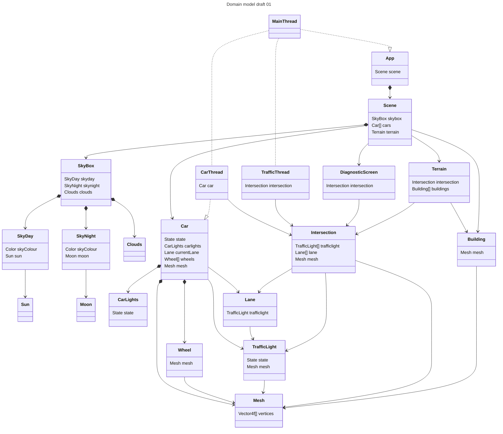
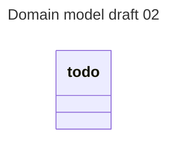

# DOCS 02: requirements etc stuffs

---
---

## About

* [***click here to return to [overview]***](./docs_00_overview.md#docs-02--requirements-building-the-things-and-interactions)

* this is the requirements mappings page and will be for all the what does the huh where??
* also will do the domain model

---

## Contents

* [***[Nonfunctional requirements]***](#nonfunctional-requirements)
* [***[Functional requirements]***](#functional-requirements)
* [***[The requirements that are hard to place]***](#the-requirements-that-are-hard-to-place)
* [***[Domain models]***](#domain-models)
    * [*[Domain model [draft 01]]*](#domain-model-draft-01)
    * [*[Domain model [draft 02]]*](#domain-model-draft-02)

---

## nonfunctional requirements

### nonfunctional  - development environment

[**[Back to Contents]**](#contents)

| requirement ID | requirement | description |
| ---: | :---: | :--- |
| `NFR_DE_01` | developed on `MacOS` | because we are using macOS |
| `NFR_DE_02` | developed with `VSCODE` | we need the keybinds and extensions |
| `NFR_DE_03` | developed using `OpenGL` | because what's the hemkn point otherwise |
| `NFR_DE_04` | `C++` programming language | main language that the project is written in, to use objects and learn |
| `NFR_DE_05` | `GLAD` library | OpenGL function pointer wrapper |
| `NFR_DE_06` | `GLFW` library | window event handle wrapper because we dont want to cry over metals yet |
| `NFR_DE_07` | `GLM` library | maths for vectors/matrices so it's less painful to usue |
| `NFR_DE_08` | `opengl_project_structurings` as template | to reduce starting and initial setup time |

### nonfunctional - miscellaneous 

[**[Back to Contents]**](#contents)

| requirement ID | requirement | description |
| ---: | :---: | :--- |
| `NFR_M_01` | `Left-handed traffic` | because we live in australia, we drive on the left side of the road |
| `NFR_M_02` | uses the `Concurrency` for the lights and cars | concurrency is being used to manage the car positioning and movement and the lights |
| `NFR_M_03` | traffic control system state display | display shows the state of traffic lights for the different lanes |
| `NFR_M_04` | day night cycles  | day night cycles exist in the scene with shaders for both  |
| `NFR_M_05` | moon phases  | the moon displays different phases  |

### nonfunctional - procedural generation

[**[Back to Contents]**](#contents)

| requirement ID | requirement | description |
| ---: | :---: | :--- |
| `NFR_PG_01` | cars are procedurally generated | car models are procedurally generated through settings and from a catalogue of options |
| `NFR_PG_02` | clouds are procedurally generated | procedurally generated clouds exist in the skybox |
| `NFR_PG_03` | stars are procedurally generated | procedurally generated stars exist in the skybox |
| `NFR_PG_04` | buildings are procedurally generated | procedurally generated buildings in the scene exist |
| `NFR_PG_05` | terrain is procedurally generated | procedurally generated terrain including road/intersection generation |

---

## functional requirements

[**[Back to Contents]**](#contents)

| requirement ID | requirement | description |
| ---: | :---: | :--- |
| `FR_01` | cars only travel when their lane's light is green | that the cars check they have a green light to travel |
| `FR_02` | cars wait to travel when their lane has a red light | that the cars wait for their turn when their lane has a red light  |
| `FR_03` | cars queue in a line for their lane | that they dont overlap or try to occupy the same space  |
| `FR_04` | cars move when the car in front moves in lane | that they dont overlap or try to occupy the same space  |

---

## the requirements that are hard to place

[**[Back to Contents]**](#contents)

| requirement ID | requirement | description |
| ---: | :---: | :--- |
| `IDK_01` | ... | ... |

---

## Pre-Design documentation requirements

* things needed in requirements documentation before we can move on to design

| requirement ID | requirement | description |
| ---: | :---: | :--- |
| `PDDR_01` | Required fields | Required data held by our objects |
| `PDDR_02` | suggested design patterns for actors/objects | proposed design patterns |
| `PDDR_03` | listing deadlock avoidance methods | a list of the deadlock avoidance methods that work for our system |
| `PDDR_04` | simple architectural diagrams for our system | to show how the actors/object connect to each other and make sure we're not doing spooky design choices sooner rather than later |
| `PDDR_06` | reorganise documentation | putting things in the correct documentation files |
| `PDDR_07` | requirement dependency map | mapped out requirement dependencies |
| `PDDR_08` | importance of requirements | importance of each requirement |
| `PDDR_09` | risk mapping | risk assessment for work required for a thing to function (and how likely to get it working first try) in relation to importance |
| `PDDR_10` | checklist table for all the requirements | somewhere having a checklist for our requirements so we can tick off what's complete |
| `PDDR_11` | concept diagrams of models in documentation | adding the various model concept diagram drafts to the documentation |
| `PDDR_12` | ... | ... |

---

## Design documentation required components

* things needed in the design documentation to move onto development stage

| requirement ID | requirement | description |
| ---: | :---: | :--- |
| `DDR_01` | C++ Compilation/linking | the process of compiling and linking in C++ |
| `DDR_02` | OpenGL render pipeline | to explain the stages |
| `DDR_03` | *[semi-optional]* Library pipeline | pipeline of the libraries we use. This is more important if we use extra libraries |
| `DDR_04` | Base template control flow | explaination of the base project structure we're using for OpenGL |
| `DDR_05` | Development pathway | the pathway we plan to take for iterations in development *[hopefully with predicted workload/timeframes]* |
| `DDR_06` | Model diagrams | diagrams of proposed models and model generation |
| `DDR_07` | Actor/Object fields and methods diagrams | listing the required data in our Actors/Objects |
| `DDR_08` | Detailed interation diagrams | detailed interation diagrams |
| `DDR_09` | Detailed deadlock avoidance method | details about how we'll avoid deadlock |
| `DDR_10` | detailed combined UML diagram | for reference while we work to make sure we're not making something wonky |
| `DDR_11` | shader behaviour diagrams | diagrams for diffuse/specularity and difference between phong/blinn-phong models |
| `DDR_12` | ... | ... |

## Domain models

### Domain model [draft 01]

[**[Back to Contents]**](#contents)

* lazy draft, half way through we stopped putting the relationships in properly

### Domain model [draft 02]

[**[Back to Contents]**](#contents)

* todo

---

