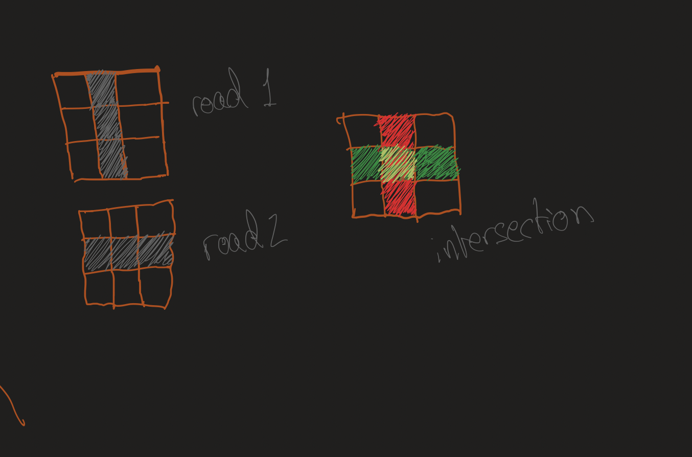
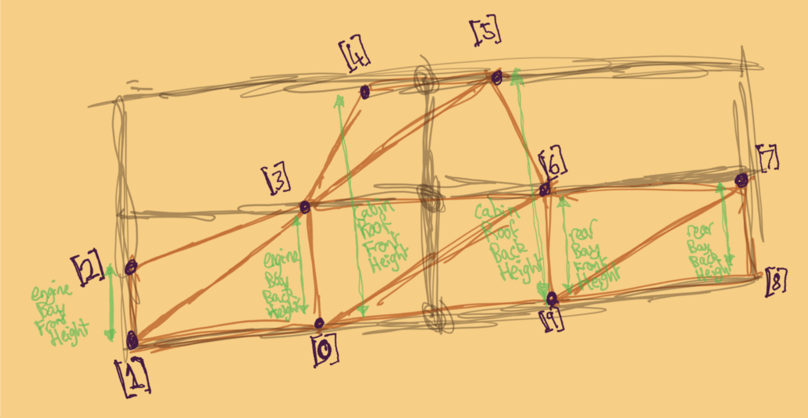
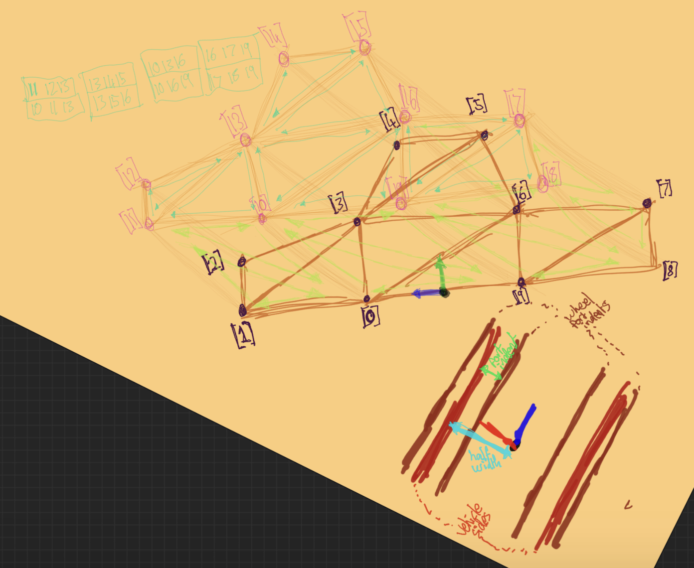

# DOCS 02 : requirements : SUPPLIMENT 01 : DEADLOCKS

---
---

## Doc links

Documentation page links:
* [**[readme]**](./readme.md#doc-links)
* [**[docs 00 : overview]**](./docs_00_overview.md#doc-links)
* [**[docs 01 : conceptual]**](./docs_01_conceptual.md#doc-links)
    * [**[docs 01 : conceptual : old conceptual documentation]**](./docs_01_conceptual_suppliment_01.md#doc-links)
* [**[docs 02 : requirements]**](./docs_02_requirements.md#doc-links)
    * [**[docs 02 : requirements : deadlock suppliment]**](./docs_02_requirements_suppliment_01.md#doc-links)
    * [***[docs 02 : requirements : model design drafts suppliment]***](./docs_02_requirements_suppliment_02.md#doc-links)
* [**[docs 03 : designables]**](./docs_03_designables.md#doc-links)
* [**[docs 04 : developments]**](./docs_04_developments.md#doc-links)

---

## About

* this is for the pre-design document model diagrams

---

## Model design concept diagram drafts

### Model diagram drafts : Traffic Light

<table>
    <tr>
        <td>
            
        </td>
        <td>
        </td>
    </tr>
        <td>
            
        </td>
        <td>
            
        </td>
    </tr>
</table>

### Model diagram drafts : Terrain

<table>
    <tr>
        <td>
            
        </td>
        <td>
        </td>
    </tr>
    <tr>
        <td>
            
        </td>
        <td>
            
        </td>
    </tr>
</table>

### Model diagram drafts : Vehicles

#### Model diagram drafts : Vehicles : 05/06/2024

<table>
    <tr>
        <td>
            
        </td>
        <td>
            
        </td>
    </tr>
    <tr>
        <td>
            
        </td>
        <td>
            
        </td>
    </tr>
    <tr>
        <td>
            
        </td>
        <td>
            
        </td>
    </tr>
    <tr>
        <td>
            
        </td>
        <td>
            
        </td>
    </tr>
</table>

#### Model diagram drafts : Vehicles : 21/06/2024

<table>
    <tr>
        <td>
            
        </td>
        <td>
            
        </td>
    </tr>
    <tr>
        <td>
            
        </td>
        <td>
            
        </td>
    </tr>
</table>

#### Model diagram drafts : Vehicles : 25/06/2024

<table>
    <tr>
        <td>
            
        </td>
        <td>
        </td>
    </tr>
</table>
---