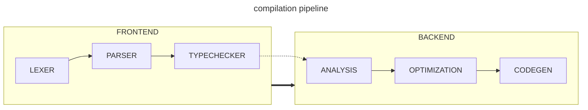
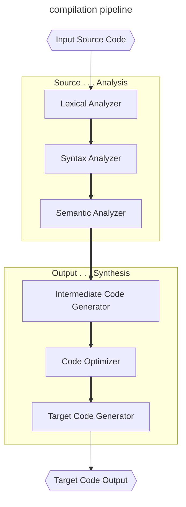
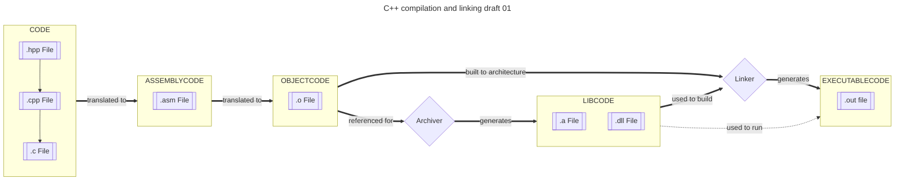
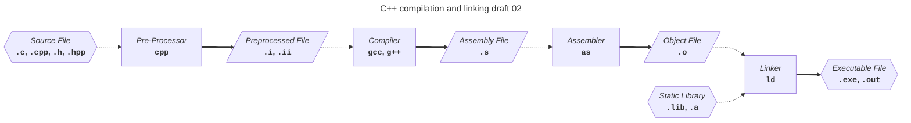
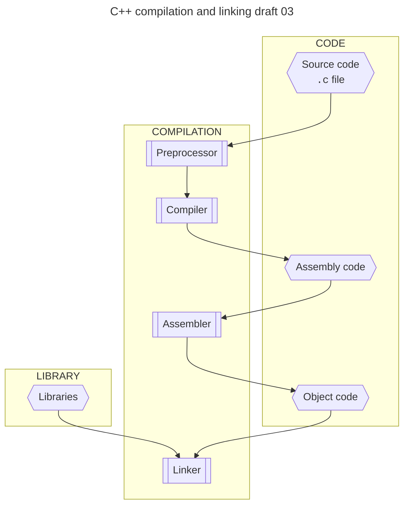
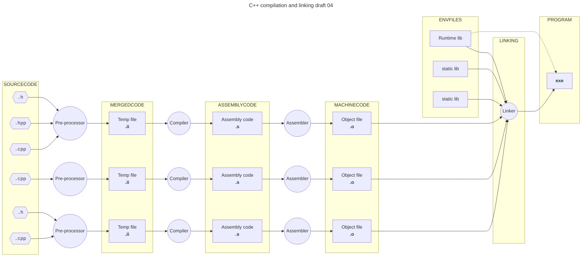
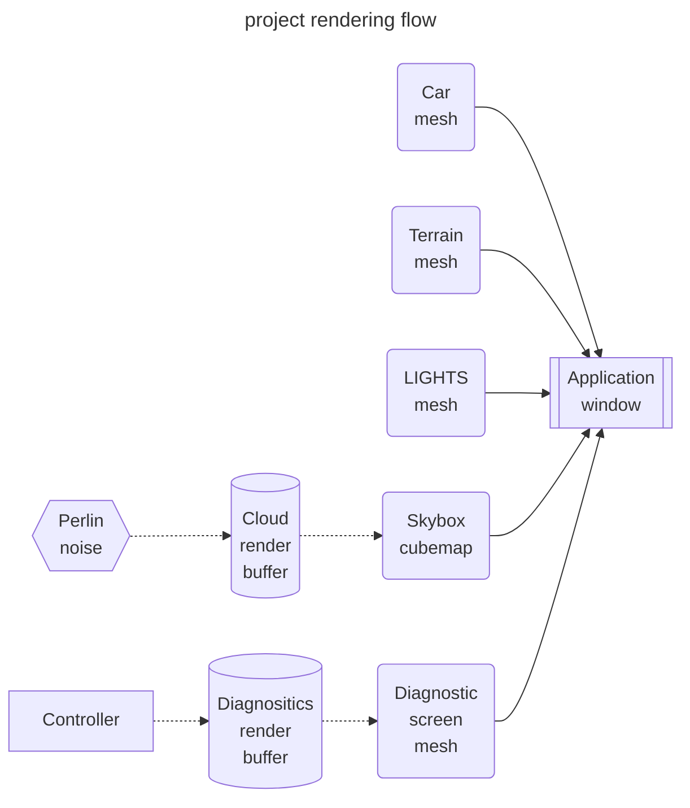
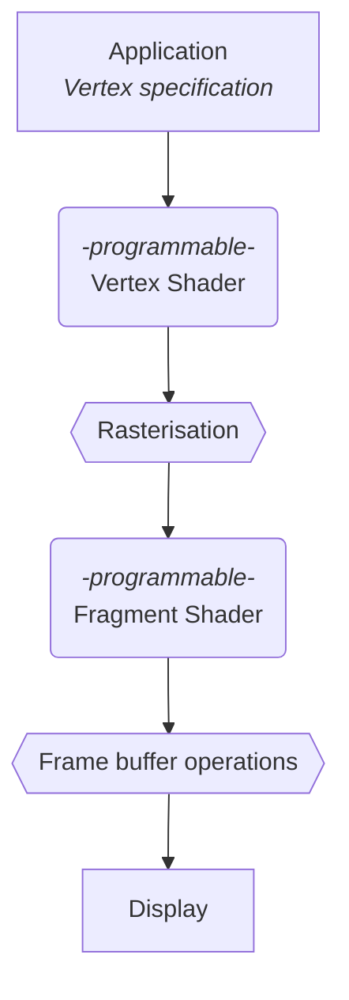
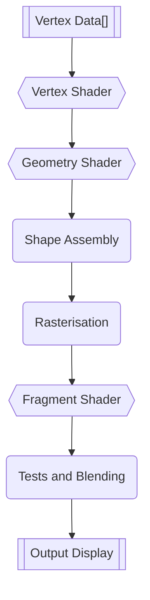
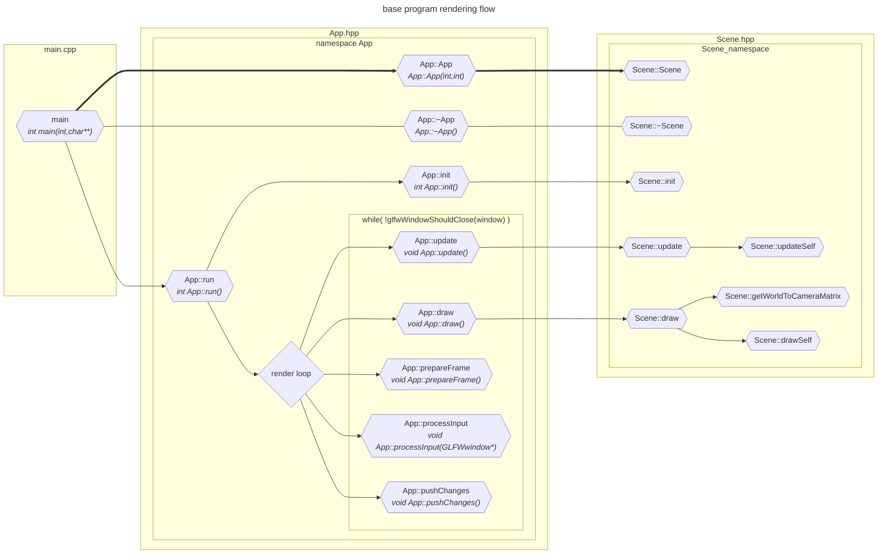

# DOCS 03 : Designables

---
---

## Doc links

Documentation page links:
* [**[readme]**](./readme.md#doc-links)
* [**[docs 00 : overview]**](./docs_00_overview.md#doc-links)
* [**[docs 01 : conceptual]**](./docs_01_conceptual.md#doc-links)
* [**[docs 02 : requirements]**](./docs_02_requirements.md#doc-links)
* [***[docs 03 : designables]***](./docs_03_designables.md#doc-links)
    * [**[docs 03 : designables : experiments 01 : render texture experimenting]**](./docs_03_designables_experiments_01.md#doc-links)
    * [**[docs 03 : designables : suppliments 01 : design pattern diagrams]**](./docs_03_designables_suppliment_01.md#doc-links)
* [**[docs 04 : developments]**](./docs_04_developments.md#doc-links)

---

## About

* much detail will happen
* will include the full uml hopefully

---

## Contents

* [***[Pre-Design stage checklist]***](#pre-design-stage-checklist)
* [***[Compilation pipeline]***](#compilation-pipeline)
* [***[C++ compilation and linking]***](#c-compilation-and-linking)
    * [*[C++ compilation and linking [draft 01]]*](#c-compilation-and-linking-draft-01)
    * [*[C++ compilation and linking [draft 02]]*](#c-compilation-and-linking-draft-02)
    * [*[C++ compilation and linking [draft 03]]*](#c-compilation-and-linking-draft-03)
    * [*[C++ compilation and linking [draft 04]]*](#c-compilation-and-linking-draft-04)
* [***[Project render flow]***](#project-render-flow)
    * [*[Project render flow [draft 01]]*](#project-render-flow-draft-01)
* [***[Model diagrams]***](#model-diagrams)
* [***[OpenGL documentation]***](#opengl-documentation)
    * [*[OpenGL documentation : pipeline [draft 01]]*](#opengl-documentation--pipeline-draft-01)
    * [*[OpenGL documentation : pipeline [draft 02]]*](#opengl-documentation--pipeline-draft-02)
* [***[Library documentation]***](#library-documentation)
    * [*[Library references : Github repos]*](#library-references--github-repos)
    * [*[Library references : GLFW]*](#library-references--glfw)
    * [*[Library references : GLAD]*](#library-references--glad)
    * [*[Library references : GLM]*](#library-references--glm)
    * [*[Library references : template repo structure [draft 01]]*](#library-references--template-repo-structure-draft-01)
* [***[General references]***](#general-references)
    * [*[General references : Markdown badges]*](#general-references--markdown-badges)

---

## Pre-design stage checklist

* [x] - `PDDR_01` - ~~Required fields~~
    * *~~Required data held by our objects~~*
* [x] - `PDDR_02` - ~~suggested design patterns for actors/objects~~
    * *~~proposed design patterns~~*
* [x] - `PDDR_03` - ~~listing deadlock avoidance methods~~
    * *~~a list of the deadlock avoidance methods that work for our system~~*
* [x] - `PDDR_04` - ~~simple architectural diagrams for our system~~
    * *~~to show how the actors/object connect to each other and make sure we're not doing spooky design choices sooner rather than later~~*
* [x] - `PDDR_05` - ~~reorganise documentation~~
    * *~~putting things in the correct documentation files~~*
* [x] - `PDDR_06` - ~~requirement dependency map~~
    * *~~mapped out requirement dependencies~~*
* [x] - `PDDR_07` - ~~importance of requirements~~
    * *~~importance of each requirement~~*
* [x] - `PDDR_08` - ~~risk mapping~~
    * *~~risk assessment for work required for a thing to function (and how likely to get it working first try) in relation to importance~~*
* [x] - `PDDR_09` - ~~checklist table for all the requirements~~
    * *~~somewhere having a checklist for our requirements so we can tick off what's complete~~*
* [x] - `PDDR_10` - ~~concept diagrams of models in documentation~~
    * *~~adding the various model concept diagram drafts to the documentation~~*

---

## Compilation pipeline

[***[back to Contents]***](#contents)

* pipeline for compilation

## C++ compilation and linking

### C++ compilation and linking [draft 01]

[***[back to Contents]***](#contents)

* possibly wrong, may need correcting later

### C++ compilation and linking [draft 02]

[***[back to Contents]***](#contents)

* version 2, idk

### C++ compilation and linking [draft 03]

[***[back to Contents]***](#contents)

* version 3, idk

### C++ compilation and linking [draft 04]

[***[back to Contents]***](#contents)

* version 4, idk

---

## project render flow

### project render flow [draft 01]

[***[back to Contents]***](#contents)

---

## Model diagrams

[***[back to Contents]***](#contents)

* this is where we put the diagrams for building the model

### Model diagrams : Vehicles

* Vehicle diagrams

#### Model diagrams : Vehicles : Notes

* something to note is that they should be made from squishing a sphere and flattening one for the most part

---

## OpenGL documentation

* [openglbook](https://openglbook.com/)
    * lots of graphics and details
* [docs.gl](https://docs.gl/)
* [khronos wiki](https://www.khronos.org/opengl/wiki/Main_Page)
    * [khronos getting started](https://www.khronos.org/opengl/wiki/Getting_Started)
    * [khronos page for the rendering pipeline](https://www.khronos.org/opengl/wiki/Rendering_Pipeline_Overview)
* [this github pages page seems useful](https://kenny-designs.github.io/zim-websites/opengl/Shaders_and_the_Rendering_Pipeline.html)
* something to note is the [opengl pipeline documentation](https://www.opengl.org/img/uploads/pipeline/pipeline_004.pdf)
    * especially page 7 what da henk
* [core specification document ogl4.1](https://registry.khronos.org/OpenGL/specs/gl/glspec41.core.pdf)
    * has block diagram of the data [pg17](https://registry.khronos.org/OpenGL/specs/gl/glspec41.core.pdf#page=34)
    * primitives and vertices [pg20](https://registry.khronos.org/OpenGL/specs/gl/glspec41.core.pdf#page=37)
    * tessellation details [pg112](https://registry.khronos.org/OpenGL/specs/gl/glspec41.core.pdf#page=120)
    * geometry shaders [pg127](https://registry.khronos.org/OpenGL/specs/gl/glspec41.core.pdf#page=144)
    * rasterisation [pg156](https://registry.khronos.org/OpenGL/specs/gl/glspec41.core.pdf#page=173)
    * per fragment operations [pg253](https://registry.khronos.org/OpenGL/specs/gl/glspec41.core.pdf#page=270)
* [GLSL shader language documentation](https://registry.khronos.org/OpenGL/specs/gl/GLSLangSpec.4.10.pdf)
    * preprocessor [pg14](https://registry.khronos.org/OpenGL/specs/gl/GLSLangSpec.4.10.pdf#page=14)
    * literally has the grammar at the end omg
* [opengl reference cards](https://www.khronos.org/files/opengl41-quick-reference-card.pdf)

### OpenGL documentation : pipeline [draft 01]

[***[back to Contents]***](#contents)

* minimalist diagram to illustrate the pipeline process

### OpenGL documentation : pipeline [draft 02]

[***[back to Contents]***](#contents)

---

## Library documentation

### Library references : Github repos

[***[back to Contents]***](#contents)

* 
    * GLAD [doesnt include vulkan?]
* 
    * text heavy documentation in wiki sub section
    * as per the github readme, it's "pretty stable" and suggested to use now

* 
    * has links to extensive documentation with graphics

* 
    * has information on the cmake building
    * documentation is very text / code heavy
    * documentation uses doxygen

### Library references : GLAD

[***[back to Contents]***](#contents)

* [[main documentation for using GLAD with C]](https://github.com/Dav1dde/glad/wiki/C)
* [[documentation for building with CMAKE]](https://github.com/Dav1dde/glad/wiki/C#cmake)

| version | generator link | github repo | wiki / documentation |
| ------- | -------------- | ----------- | -------------------- |
| GLAD 1  | [generator](https://glad.dav1d.de/) | [repo](https://github.com/Dav1dde/glad/tree/master) | [repo readme](https://github.com/Dav1dde/glad/tree/master?tab=readme-ov-file#glad) |
| GLAD 2  | [generator](https://gen.glad.sh/) | [repo](https://github.com/Dav1dde/glad) | [github repo wiki](https://github.com/Dav1dde/glad/wiki/C) |

### Library references : GLFW

[***[back to Contents]***](#contents)

* [notes about `glfwCreateWindow` on MacOS X 10.7 and later](https://www.glfw.org/docs/latest/compat_guide.html#compat_osx)
* [[GLFW quick guide]](https://www.glfw.org/docs/latest/quick_guide.html)
* [[GLFW intro to API]](https://www.glfw.org/docs/latest/intro_guide.html)
    * [[GLFW window guide]](https://www.glfw.org/docs/latest/window_guide.html)
    * [[GLFW context guide]](https://www.glfw.org/docs/latest/context_guide.html)
    * [[GLFW monitor guide]](https://www.glfw.org/docs/latest/monitor_guide.html)
    * [[GLFW input guide]](https://www.glfw.org/docs/latest/input_guide.html)
    * [[GLFW compile guide]](https://www.glfw.org/docs/latest/compile_guide.html)
    * [[GLFW build guide]](https://www.glfw.org/docs/latest/build_guide.html)
        * [cmake building and linking from source](https://www.glfw.org/docs/latest/build_guide.html#build_link_cmake_source)

### Library references : GLM 

[***[back to Contents]***](#contents)

* [[GLM API documentation link]](http://glm.g-truc.net/0.9.9/api/modules.html)
* [[manual link on github]](https://github.com/g-truc/glm/blob/master/manual.md)
    * [depenencies](https://github.com/g-truc/glm/blob/master/manual.md#section1_4)
        * according to the above link, it doesnt depend on anything
    * [finding GLM with CMAKE](https://github.com/g-truc/glm/blob/master/manual.md#section1_5)
* repo readme references:
    * [[cmake building and installing]](https://github.com/g-truc/glm?tab=readme-ov-file#build-and-install)
    * [[cmake using `FetchContent`]](https://github.com/g-truc/glm?tab=readme-ov-file#cmake-using-fetchcontent)

### Library references : template repo structure [draft 01]

[***[back to Contents]***](#contents)

* template will end up not being used very much as we need to remake the shader handling code
* also need to mess with vertex/frame buffer stuff

---

## General references

### General references : Markdown badges

[***[back to Contents]***](#contents)

* [repo with a list of the badge sources](https://github.com/alexandresanlim/Badges4-README.md-Profile)
* [page with details about parameters](https://shields.io/badges/static-badge)
