# DOCS 03 : Designs and details

---
---

## Doc links

Documentation page links:
* [**[readme]**](./readme.md#doc-links)
* [**[docs 00 : overview]**](./docs_00_overview.md#doc-links)
* [**[docs 01 : conceptual]**](./docs_01_conceptual.md#doc-links)
* [**[docs 02 : requirements]**](./docs_02_requirements.md#doc-links)
* [***[docs 03 : designables]***](./docs_03_designables.md#doc-links)
    * [**[docs 03 : designables : render texture experimenting]**](./docs_03_designables_experiments_01.md#doc-links)
* [**[docs 04 : developments]**](./docs_04_developments.md#doc-links)

---

## About

* much detail will happen
* will include the full uml hopefully

---

## Contents

* [***[Pre-Design stage checklist]***](#pre-design-stage-checklist)
* [***[Compilation pipeline]***](#compilation-pipeline)
* [***[C++ compilation and linking]***](#c-compilation-and-linking)
    * [*[C++ compilation and linking [draft 01]]*](#c-compilation-and-linking-draft-01)
    * [*[C++ compilation and linking [draft 02]]*](#c-compilation-and-linking-draft-02)
    * [*[C++ compilation and linking [draft 03]]*](#c-compilation-and-linking-draft-03)
    * [*[C++ compilation and linking [draft 04]]*](#c-compilation-and-linking-draft-04)
* [***[Project render flow]***](#project-render-flow)
    * [*[Project render flow [draft 01]]*](#project-render-flow-draft-01)
* [***[Model diagrams]***](#model-diagrams)
* [***[Library documentation]***](#library-documentation)
    * [*[Library references : Github repos]*](#library-references--github-repos)
    * [*[Library references : GLFW]*](#library-references--glfw)
    * [*[Library references : GLAD]*](#library-references--glad)
    * [*[Library references : GLM]*](#library-references--glm)
    * [*[Library references : OpenGL pipeline [draft 01]]*](#library-references--opengl-pipeline-draft-01)
    * [*[Library references : template repo structure [draft 01]]*](#library-references--template-repo-structure-draft-01)
* [***[General references]***](#general-references)
    * [*[General references : Markdown badges]*](#general-references--markdown-badges)
    * [*[General references : Design patterns]*](#general-references--design-patterns)
        * [[General references : Design patterns : adapter pattern]](#general-references--design-patterns--adapter-pattern)
        * [[General references : Design patterns : command pattern]](#general-references--design-patterns--command-pattern)
        * [[General references : Design patterns : facade pattern]](#general-references--design-patterns--facade-pattern)
        * [[General references : Design patterns : mediator pattern]](#general-references--design-patterns--mediator-pattern)
        * [[General references : Design patterns : observer pattern]](#general-references--design-patterns--observer-pattern)
        * [[General references : Design patterns : singleton pattern]](#general-references--design-patterns--singleton-pattern)
        * [[General references : Design patterns : state pattern]](#general-references--design-patterns--state-pattern)
        * [[General references : Design patterns : strategy pattern]](#general-references--design-patterns--strategy-pattern)

---

## Pre-design stage checklist

* [x] - `PDDR_01` - ~~Required fields~~
    * *~~Required data held by our objects~~*
* [x] - `PDDR_02` - ~~suggested design patterns for actors/objects~~
    * *~~proposed design patterns~~*
* [x] - `PDDR_03` - ~~listing deadlock avoidance methods~~
    * *~~a list of the deadlock avoidance methods that work for our system~~*
* [x] - `PDDR_04` - ~~simple architectural diagrams for our system~~
    * *~~to show how the actors/object connect to each other and make sure we're not doing spooky design choices sooner rather than later~~*
* [x] - `PDDR_05` - ~~reorganise documentation~~
    * *~~putting things in the correct documentation files~~*
* [x] - `PDDR_06` - ~~requirement dependency map~~
    * *~~mapped out requirement dependencies~~*
* [x] - `PDDR_07` - ~~importance of requirements~~
    * *~~importance of each requirement~~*
* [x] - `PDDR_08` - ~~risk mapping~~
    * *~~risk assessment for work required for a thing to function (and how likely to get it working first try) in relation to importance~~*
* [x] - `PDDR_09` - ~~checklist table for all the requirements~~
    * *~~somewhere having a checklist for our requirements so we can tick off what's complete~~*
* [x] - `PDDR_10` - ~~concept diagrams of models in documentation~~
    * *~~adding the various model concept diagram drafts to the documentation~~*

---

## Compilation pipeline

[***[back to Contents]***](#contents)

* pipeline for compilation

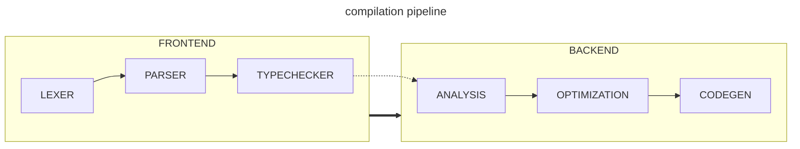
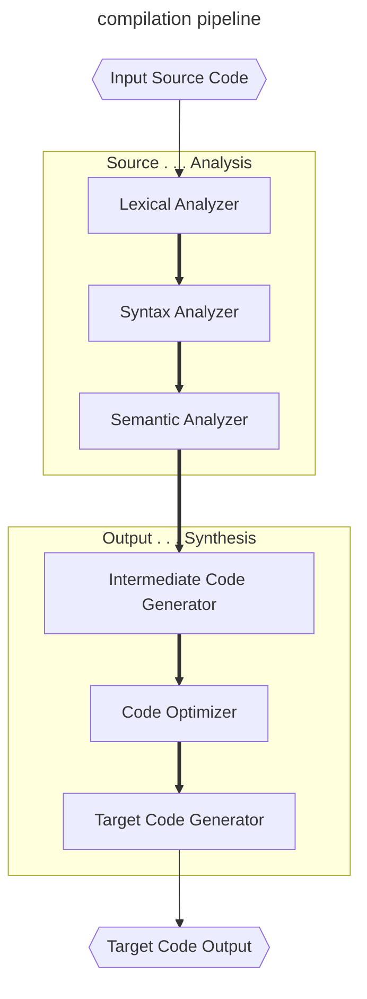

## C++ compilation and linking

### C++ compilation and linking [draft 01]

[***[back to Contents]***](#contents)

* possibly wrong, may need correcting later

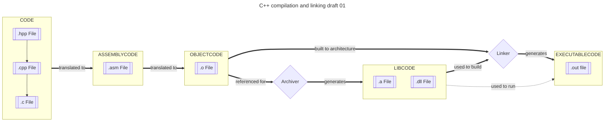

### C++ compilation and linking [draft 02]

[***[back to Contents]***](#contents)

* version 2, idk

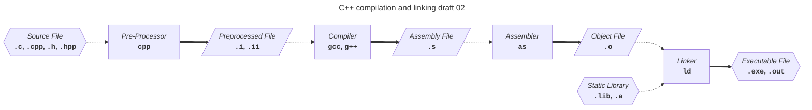

### C++ compilation and linking [draft 03]

[***[back to Contents]***](#contents)

* version 3, idk

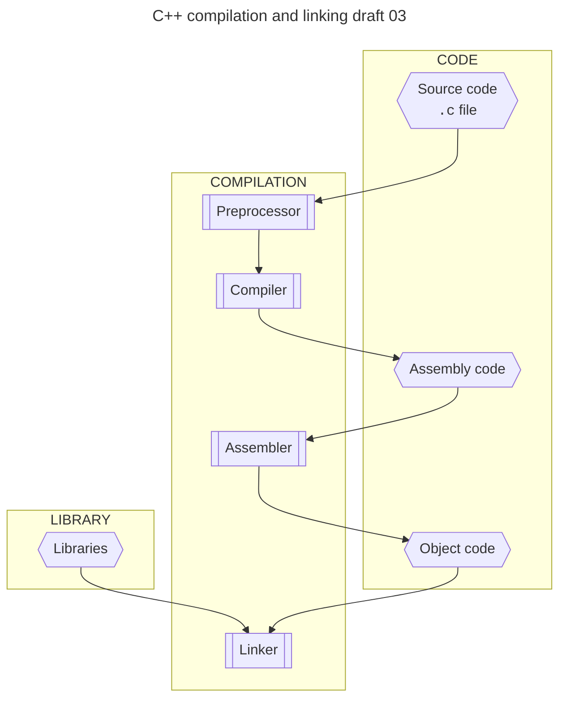

### C++ compilation and linking [draft 04]

[***[back to Contents]***](#contents)

* version 4, idk

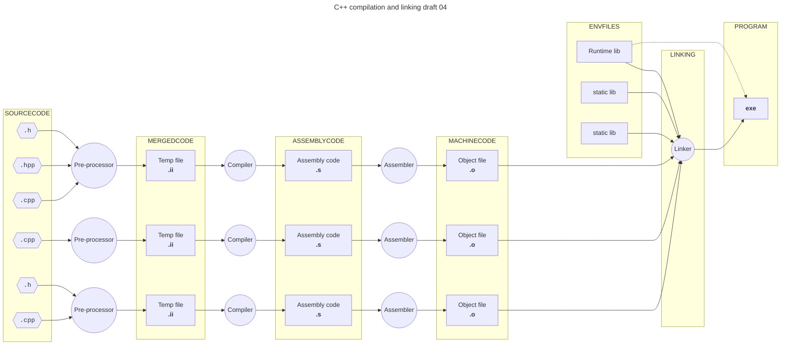

---

## project render flow

### project render flow [draft 01]

[***[back to Contents]***](#contents)

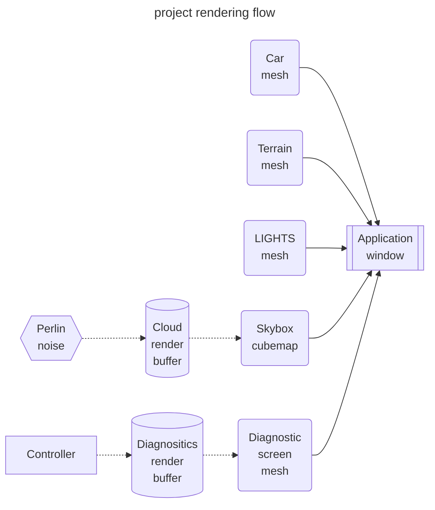

---

## Model diagrams

[***[back to Contents]***](#contents)

* this is where we put the diagrams for building the model

### Model diagrams : Vehicles

* Vehicle diagrams

#### Model diagrams : Vehicles : Notes

* something to note is that they should be made from squishing a sphere and flattening one for the most part

---

## Library documentation

### Library references : Github repos

[***[back to Contents]***](#contents)

* 
    * text heavy documentation in wiki sub section
    * [main documentation page](https://github.com/Dav1dde/glad/wiki/C)
    * [cmake building from source](https://github.com/Dav1dde/glad/wiki/C#cmake)

* 
    * has links to extensive documentation with graphics
    * [notes about `glfwCreateWindow` on MacOS X 10.7 and later](https://www.glfw.org/docs/latest/compat_guide.html#compat_osx)
    * [compiling and building documentation reference](https://www.glfw.org/docs/latest/compile_guide.html)
        * [cmake building and linking from source](https://www.glfw.org/docs/latest/build_guide.html#build_link_cmake_source)

* 
    * has information on the cmake building
    * documentation is very text / code heavy
    * documentation uses doxygen

### Library references : GLFW

[***[back to Contents]***](#contents)

* [[GLFW quick guide]](https://www.glfw.org/docs/latest/quick_guide.html)
* [[GLFW intro to API]](https://www.glfw.org/docs/latest/intro_guide.html)
    * [[GLFW window guide]](https://www.glfw.org/docs/latest/window_guide.html)
    * [[GLFW context guide]](https://www.glfw.org/docs/latest/context_guide.html)
    * [[GLFW monitor guide]](https://www.glfw.org/docs/latest/monitor_guide.html)
    * [[GLFW input guide]](https://www.glfw.org/docs/latest/input_guide.html)
    * [[GLFW compile guide]](https://www.glfw.org/docs/latest/compile_guide.html)
    * [[GLFW build guide]](https://www.glfw.org/docs/latest/build_guide.html)

### Library references : GLAD

[***[back to Contents]***](#contents)

* lorem ipsum

### Library references : GLM 

[***[back to Contents]***](#contents)

* lorem ipsum

### Library references : OpenGL pipeline [draft 01]

[***[back to Contents]***](#contents)

* minimalist diagram to illustrate the pipeline process
* [khronos page for the rendering pipeline](https://www.khronos.org/opengl/wiki/Rendering_Pipeline_Overview)
* [this github pages page seems useful](https://kenny-designs.github.io/zim-websites/opengl/Shaders_and_the_Rendering_Pipeline.html)

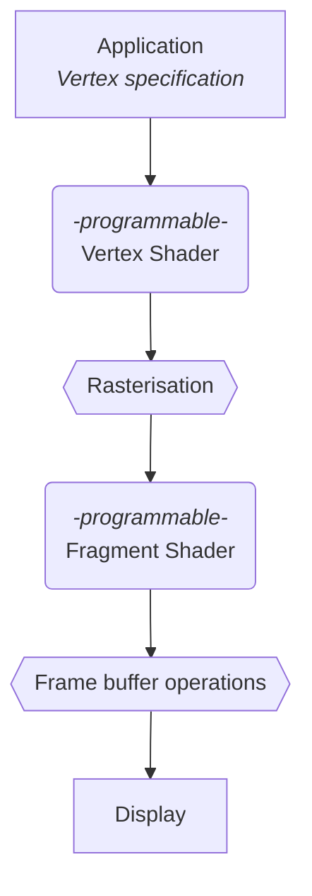

### Library references : template repo structure [draft 01]

[***[back to Contents]***](#contents)

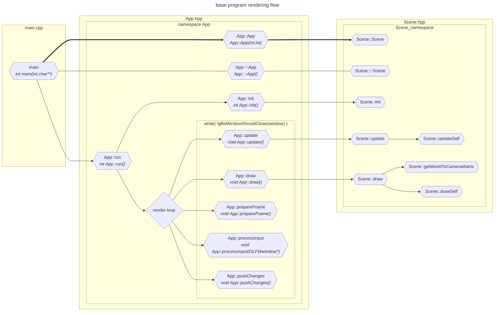

---

## General references

### General references : Markdown badges

[***[back to Contents]***](#contents)

* [repo with a list of the badge sources](https://github.com/alexandresanlim/Badges4-README.md-Profile)
* [page with details about parameters](https://shields.io/badges/static-badge)

### General references : Design patterns

* [Refactoring guru design patterns catalogue](https://refactoring.guru/design-patterns/catalog)
* the design patterns suggested in requirements:
    * [adapter pattern](https://refactoring.guru/design-patterns/adapter)
    * [command pattern](https://refactoring.guru/design-patterns/command)
    * [facade pattern](https://refactoring.guru/design-patterns/facade)
    * [mediator pattern](https://refactoring.guru/design-patterns/mediator)
    * [observer pattern](https://refactoring.guru/design-patterns/observer)
    * [state pattern](https://refactoring.guru/design-patterns/state)
    * [strategy pattern](https://refactoring.guru/design-patterns/strategy)

#### General references : Design patterns : adapter pattern

[***[back to Contents]***](#contents)

<table>
<!-- =================================== -->
<!-- ----------------------------------- -->
<tr>
<th></th>
<th><a href="https://refactoring.guru/design-patterns/adapter">[refactoring.guru] adapter pattern</a></th>
</tr>
<!-- ----------------------------------- -->
<tr>
<td><b>Also known as:</b></td>
<td><i>Wrapper</i></td>
</tr>
<!-- ----------------------------------- -->
<tr>
<td>Intent</td>
<td><b>Adapter</b> is a structural design pattern that allows objects with incompatible interfaces to collaborate
</td>
</tr>
<!-- ----------------------------------- -->
<tr>
<td></td>
<td align="center">
</td>
</tr>
<!-- ----------------------------------- -->
<tr>
<td>Diagram</td>
<td align="center">

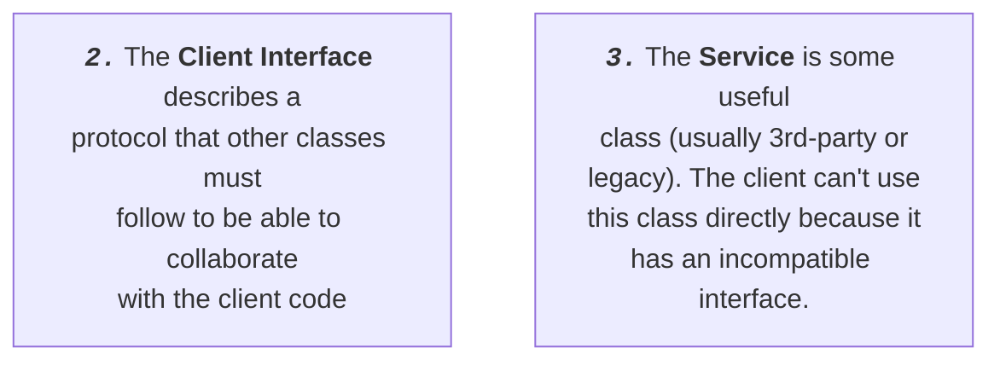
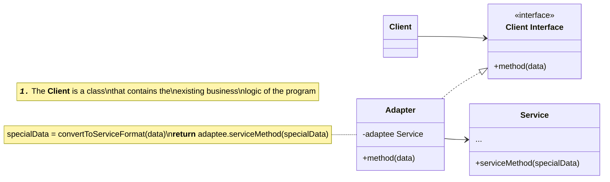
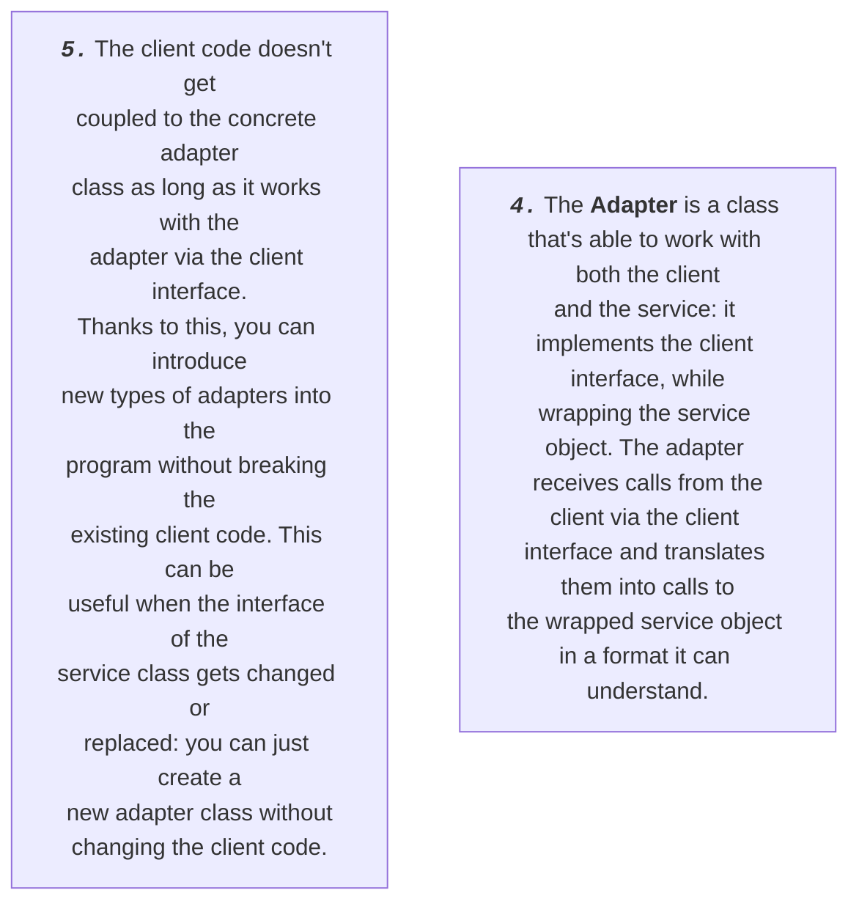
</td>
</tr>
<!-- ----------------------------------- -->
<tr>
<td></td>
<td></td>
</tr>
<!-- ----------------------------------- -->
<!-- =================================== -->
</table>

#### General references : Design patterns : command pattern

[***[back to Contents]***](#contents)

<table>
<!-- =================================== -->
<!-- ----------------------------------- -->
<tr>
<th></th>
<th><a href="https://refactoring.guru/design-patterns/command">[refactoring.guru] command pattern</a></th>
</tr>
<!-- ----------------------------------- -->
<tr>
<td><b>Also known as:</b></td>
<td><i>Action, Transaction</i></td>
</tr>
<!-- ----------------------------------- -->
<tr>
<td>Intent</td>
<td><b>Command</b> is a behavioural design pattern that turns a request into a stand-alone object that contains all information about the request. This transformation lets you pass requests as a method arguments, delay or queue a request's execution and support undoable operations.
</td>
</tr>
<!-- ----------------------------------- -->
<tr>
<td></td>
<td align="center">
</td>
</tr>
<!-- ----------------------------------- -->
<tr>
<td>Diagram</td>
<td align="center">

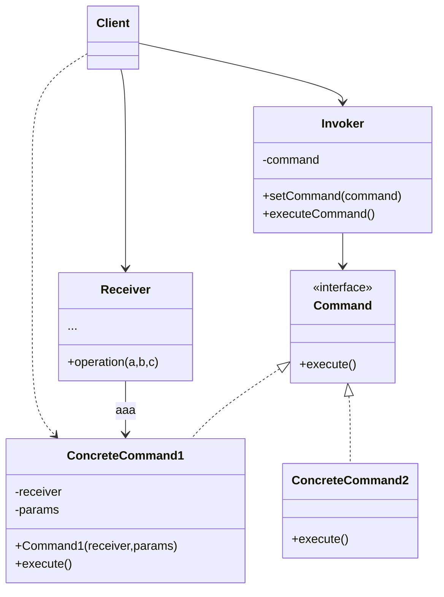
</td>
</tr>
<!-- ----------------------------------- -->
<tr>
<td></td>
<td></td>
</tr>
<!-- ----------------------------------- -->
<!-- =================================== -->
</table>

#### General references : Design patterns : facade pattern

[***[back to Contents]***](#contents)

<table>
<!-- =================================== -->
<!-- ----------------------------------- -->
<tr>
<th></th>
<th><a href="https://refactoring.guru/design-patterns/facade">[refactoring.guru] facade pattern</a></th>
</tr>
<tr>
<td>Intent</td>
<td><b>Facade</b> is a structural design pattern that provides a simplified interface to a library, a framework, or any other complex set of classes
</td>
</tr>
<!-- ----------------------------------- -->
<tr>
<td></td>
<td align="center">
</td>
</tr>
<!-- ----------------------------------- -->
<tr>
<td>Diagram</td>
<td align="center">

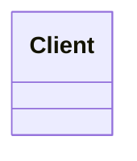
</td>
</tr>
<!-- ----------------------------------- -->
<tr>
<td></td>
<td></td>
</tr>
<!-- ----------------------------------- -->
<!-- =================================== -->
</table>

#### General references : Design patterns : mediator pattern

[***[back to Contents]***](#contents)

<table>
<!-- =================================== -->
<!-- ----------------------------------- -->
<tr>
<th></th>
<th><a href="https://refactoring.guru/design-patterns/mediator">[refactoring.guru] mediator pattern</a></th>
</tr>
<!-- ----------------------------------- -->
<tr>
<td><b>Also known as:</b></td>
<td><i>Intermediary, Controller</i></td>
</tr>
<!-- ----------------------------------- -->
<tr>
<td>Intent</td>
<td><b>Mediator</b> is a behavioral design pattern that lets you reduce chaotic dependencies between objects. The pattern restricts direct communications between the objects and forces them to collaborate only via a mediator object.
</td>
</tr>
<!-- ----------------------------------- -->
<tr>
<td></td>
<td align="center">
</td>
</tr>
<!-- ----------------------------------- -->
<tr>
<td>Diagram</td>
<td align="center">

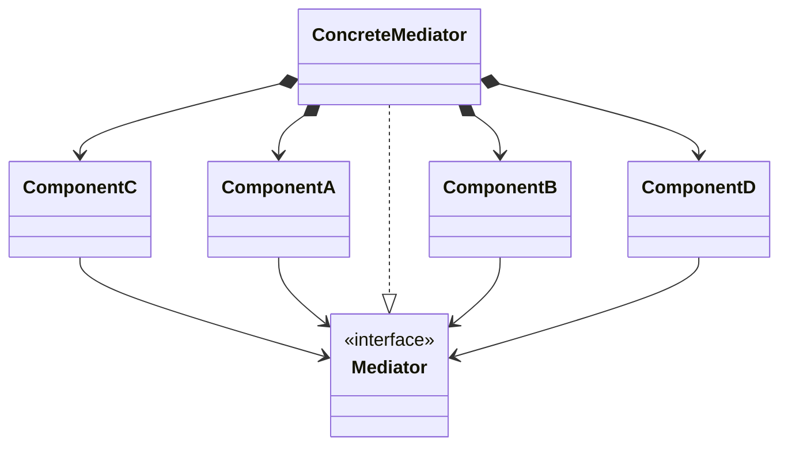
</td>
</tr>
<!-- ----------------------------------- -->
<tr>
<td></td>
<td></td>
</tr>
<!-- ----------------------------------- -->
<!-- =================================== -->
</table>

#### General references : Design patterns : observer pattern

[***[back to Contents]***](#contents)

<table>
<!-- =================================== -->
<!-- ----------------------------------- -->
<tr>
<th></th>
<th><a href="https://refactoring.guru/design-patterns/observer">[refactoring.guru] observer pattern</a></th>
</tr>
<!-- ----------------------------------- -->
<tr>
<td><b>Also known as:</b></td>
<td><i>Event-Subscriber, Listener</i></td>
</tr>
<!-- ----------------------------------- -->
<tr>
<td>Intent</td>
<td><b>Observer</b> is a behavioral design pattern that lets you define a subscription mechanism to notify multiple objects about any events that happen to the object they're observing.
</td>
</tr>
<!-- ----------------------------------- -->
<tr>
<td></td>
<td align="center">
</td>
</tr>
<!-- ----------------------------------- -->
<tr>
<td>Diagram</td>
<td align="center">

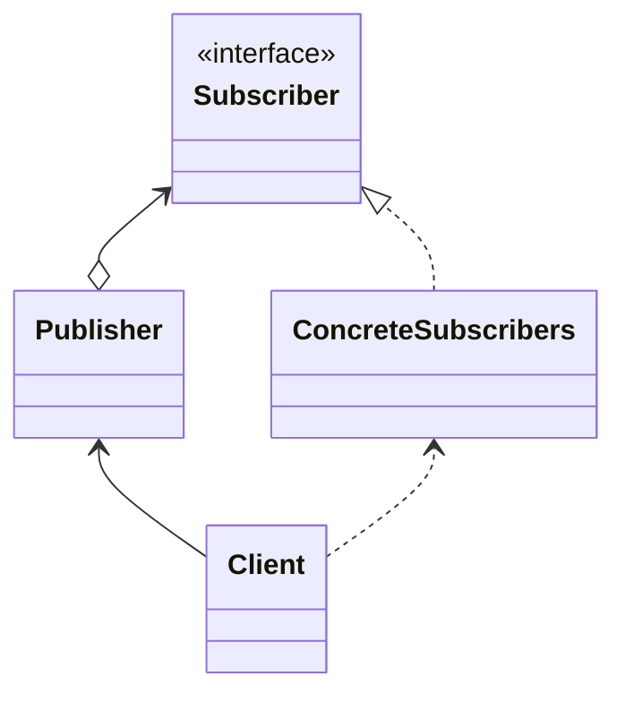
</td>
</tr>
<!-- ----------------------------------- -->
<tr>
<td></td>
<td></td>
</tr>
<!-- ----------------------------------- -->
<!-- =================================== -->
</table>

#### General references : Design patterns : singleton pattern

[***[back to Contents]***](#contents)

<table>
<!-- =================================== -->
<!-- ----------------------------------- -->
<tr>
<th></th>
<th><a href="https://refactoring.guru/design-patterns/singleton">[refactoring.guru] singleton pattern</a></th>
</tr>
<!-- ----------------------------------- -->
<tr>
<td>Intent</td>
<td><b>Singleton</b> is a creational design pattern that lets you ensure that a class has only one instance, while providing a global access point to this instance.
</td>
</tr>
<!-- ----------------------------------- -->
<tr>
<td></td>
<td align="center"></td>
</tr>
<!-- ----------------------------------- -->
<tr>
<td>Diagram</td>
<td align="center">

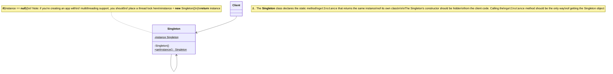
</td>
</tr>
<!-- ----------------------------------- -->
<tr>
<td></td>
<td></td>
</tr>
<!-- ----------------------------------- -->
<!-- =================================== -->
</table>

#### General references : Design patterns : state pattern

[***[back to Contents]***](#contents)

<table>
<!-- =================================== -->
<!-- ----------------------------------- -->
<tr>
<th></th>
<th><a href="https://refactoring.guru/design-patterns/state">[refactoring.guru] state pattern</a></th>
</tr>
<!-- ----------------------------------- -->
<tr>
<td>Intent</td>
<td><b>State</b> is a behavioural design pattern that lets an object alter its behaviour when its internal state changes. it appears as if the object changed its class
</td>
</tr>
<!-- ----------------------------------- -->
<tr>
<td></td>
<td align="center">
</td>
</tr>
<!-- ----------------------------------- -->
<tr>
<td>Diagram</td>
<td align="center">

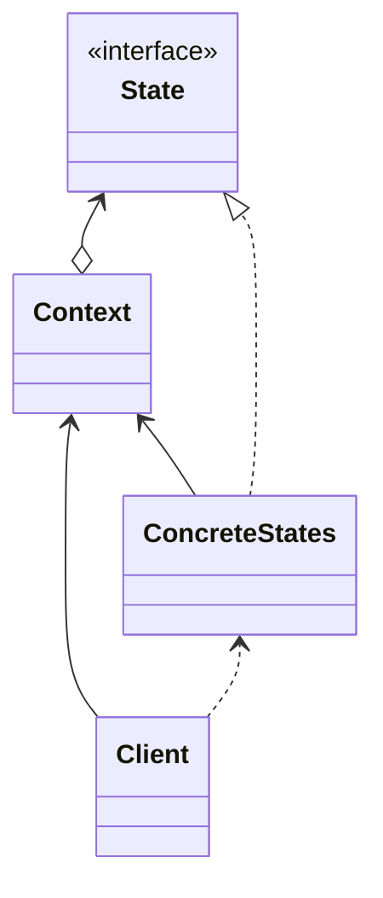
</td>
</tr>
<!-- ----------------------------------- -->
<tr>
<td></td>
<td></td>
</tr>
<!-- ----------------------------------- -->
<!-- =================================== -->
</table>

#### General references : Design patterns : strategy pattern

[***[back to Contents]***](#contents)

<table>
<!-- =================================== -->
<!-- ----------------------------------- -->
<tr>
<th></th>
<th><a href="https://refactoring.guru/design-patterns/stategy">[refactoring.guru] stategy pattern</a></th>
</tr>
<!-- ----------------------------------- -->
<tr>
<td>Intent</td>
<td><b>Stategy</b> is a behavioural design pattern that lets you define a family of algorithms, put each of them into a separate class, and make their objects interchangeable.
</td>
</tr>
<!-- ----------------------------------- -->
<tr>
<td></td>
<td align="center">
</td>
</tr>
<!-- ----------------------------------- -->
<tr>
<td>Diagram</td>
<td align="center">

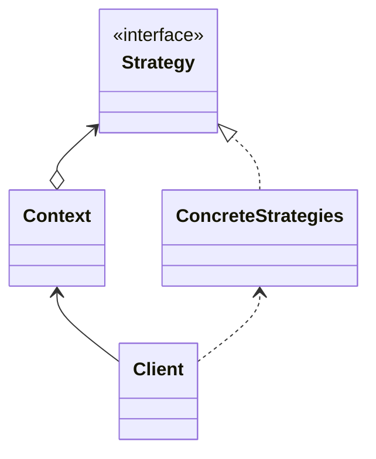
</td>
</tr>
<!-- ----------------------------------- -->
<tr>
<td></td>
<td></td>
</tr>
<!-- ----------------------------------- -->
<!-- =================================== -->
</table>

---

