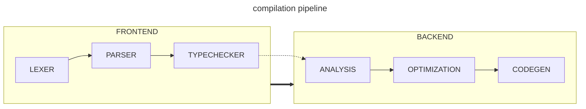
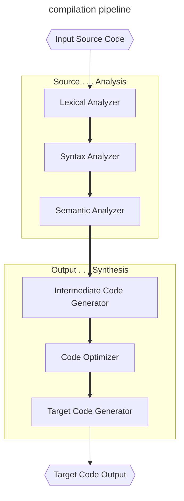
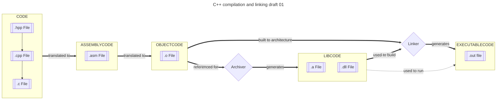
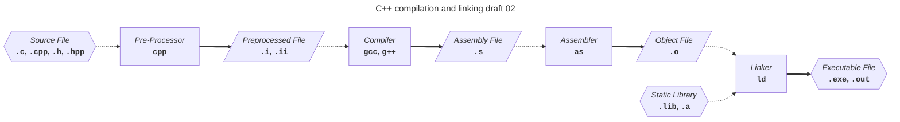
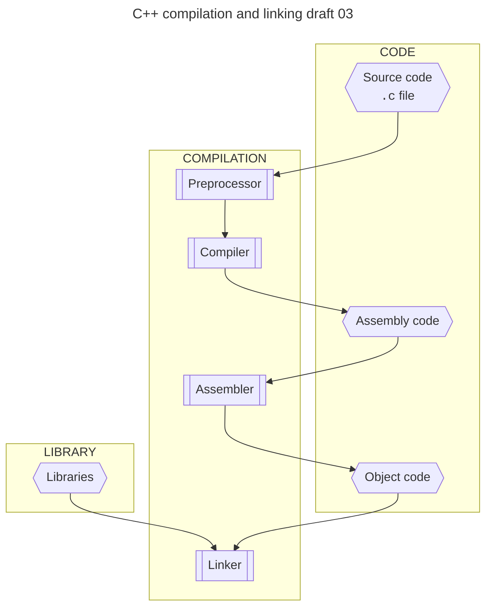
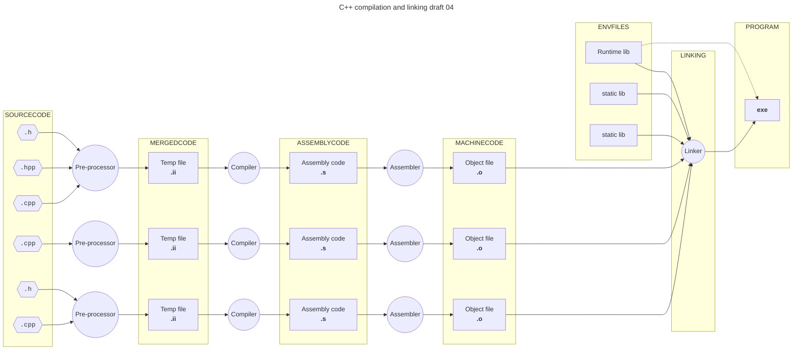
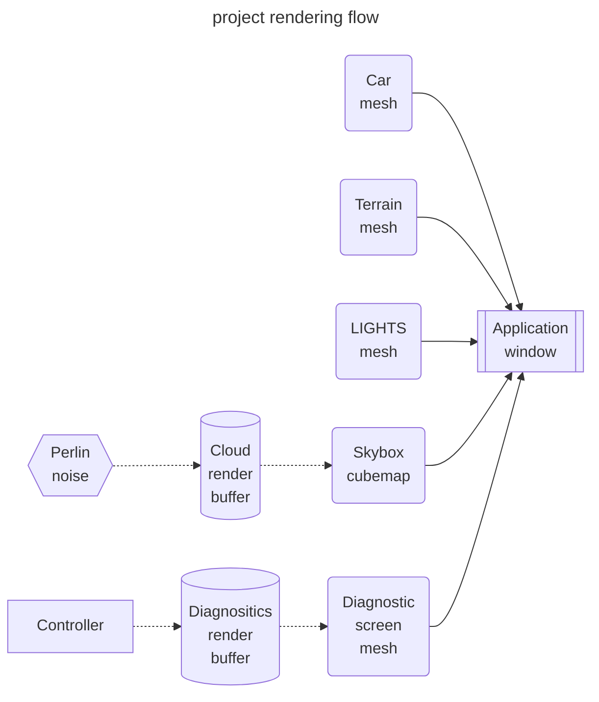
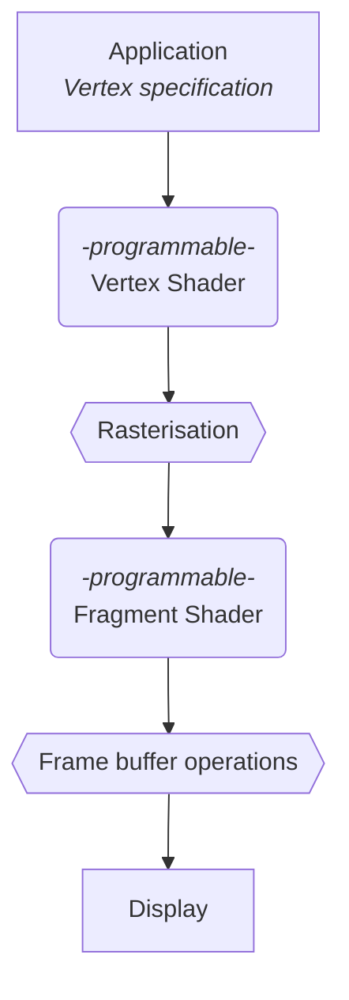
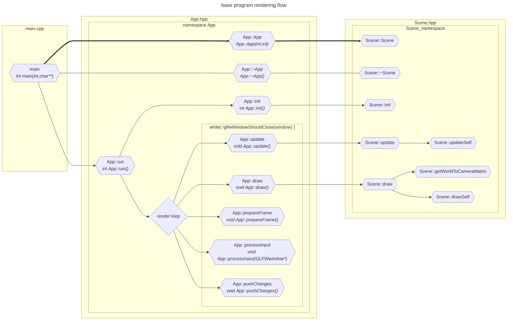

# DOCS 03 : Designs and details

---
---

## Doc links

Documentation page links:
* [**[readme]**](./readme.md#doc-links)
* [**[docs 00 : overview]**](./docs_00_overview.md#doc-links)
* [**[docs 01 : conceptual]**](./docs_01_conceptual.md#doc-links)
    * [**[docs 01 : conceptual : old conceptual documentation]**](./docs_01_conceptual_suppliment_01.md#doc-links)
* [**[docs 02 : requirements]**](./docs_02_requirements.md#doc-links)
    * [**[docs 02 : requirements : deadlock suppliment]**](./docs_02_requirements_suppliment_01.md#doc-links)
    * [**[docs 02 : requirements : model design drafts suppliment]**](./docs_02_requirements_suppliment_02.md#doc-links)
* [***[docs 03 : designables]***](./docs_03_designables.md#doc-links)
* [**[docs 04 : developments]**](./docs_04_developments.md#doc-links)

---

## About

* much detail will happen
* will include the full uml hopefully

---

## Contents

* [***[Pre-Design stage checklist]***]()
* [***[Project render flow]***](#project-render-flow)
    * [*[Project render flow [draft 01]]*](#project-render-flow-draft-01)
* [***[Model diagrams]***](#model-diagrams)
* [***[Library documentation]***](#library-documentation)
    * [*[Graphics pipeline [draft 01]]*](#graphics-pipeline-draft-01)
    * [*[Base code flow [draft 01]]*](#base-code-flow-draft-01)
* [***[References]***](#references)

---

## Pre-design stage checklist

* [x] - `PDDR_01` - ~~Required fields~~
    * *~~Required data held by our objects~~*
* [x] - `PDDR_02` - ~~suggested design patterns for actors/objects~~
    * *~~proposed design patterns~~*
* [x] - `PDDR_03` - ~~listing deadlock avoidance methods~~
    * *~~a list of the deadlock avoidance methods that work for our system~~*
* [x] - `PDDR_04` - ~~simple architectural diagrams for our system~~
    * *~~to show how the actors/object connect to each other and make sure we're not doing spooky design choices sooner rather than later~~*
* [x] - `PDDR_05` - ~~reorganise documentation~~
    * *~~putting things in the correct documentation files~~*
* [x] - `PDDR_06` - ~~requirement dependency map~~
    * *~~mapped out requirement dependencies~~*
* [x] - `PDDR_07` - ~~importance of requirements~~
    * *~~importance of each requirement~~*
* [x] - `PDDR_08` - ~~risk mapping~~
    * *~~risk assessment for work required for a thing to function (and how likely to get it working first try) in relation to importance~~*
* [x] - `PDDR_09` - ~~checklist table for all the requirements~~
    * *~~somewhere having a checklist for our requirements so we can tick off what's complete~~*
* [x] - `PDDR_10` - ~~concept diagrams of models in documentation~~
    * *~~adding the various model concept diagram drafts to the documentation~~*

---

## Compilation pipeline

[***[back to Contents]***](#contents)

* pipeline for compilation

## C++ compilation and linking

### C++ compilation and linking [draft 01]

[***[back to Contents]***](#contents)

* possibly wrong, may need correcting later

### C++ compilation and linking [draft 02]

[***[back to Contents]***](#contents)

* version 2, idk

### C++ compilation and linking [draft 03]

[***[back to Contents]***](#contents)

* version 3, idk

### C++ compilation and linking [draft 04]

[***[back to Contents]***](#contents)

* version 4, idk

---

## project render flow

### project render flow [draft 01]

[***[back to Contents]***](#contents)

---

## Model diagrams

[***[back to Contents]***](#contents)

* this is where we put the diagrams for building the model

---

## Library documentation

### Graphics pipeline [draft 01]

[***[back to Contents]***](#contents)

* minimalist diagram to illustrate the pipeline process

### base code flow [draft 01]

[***[back to Contents]***](#contents)

---

## references

### Design patterns

[***[back to Contents]***](#contents)

* [Refactoring guru design patterns catalogue](https://refactoring.guru/design-patterns/catalog)

### Graphics pipeline stuffs

[***[back to Contents]***](#contents)

* [khronos page for the rendering pipeline](https://www.khronos.org/opengl/wiki/Rendering_Pipeline_Overview)
* [this github pages page seems useful](https://kenny-designs.github.io/zim-websites/opengl/Shaders_and_the_Rendering_Pipeline.html)