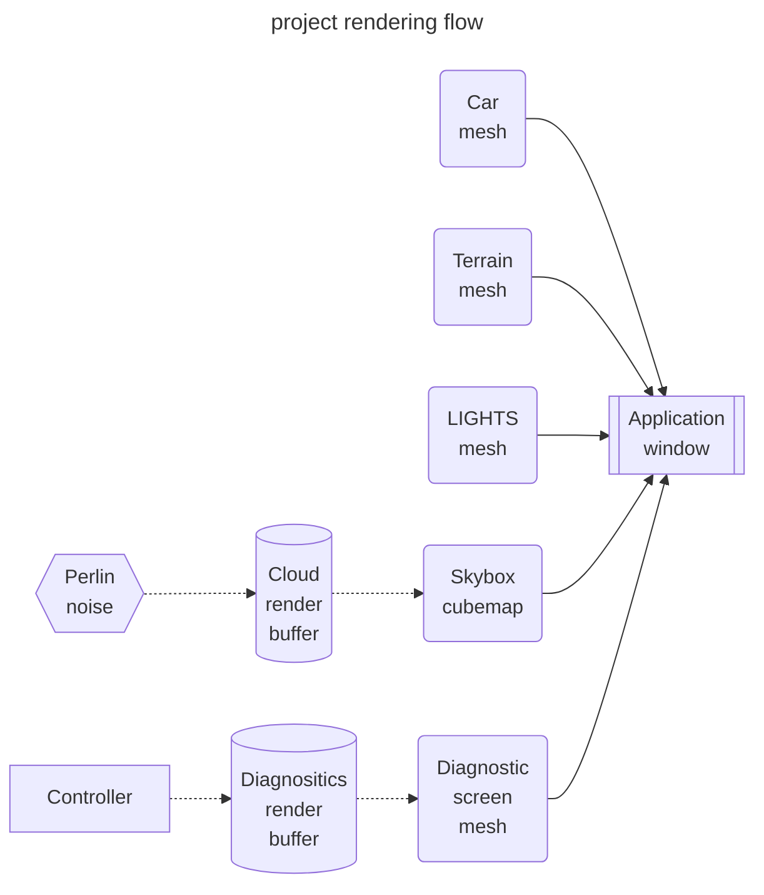
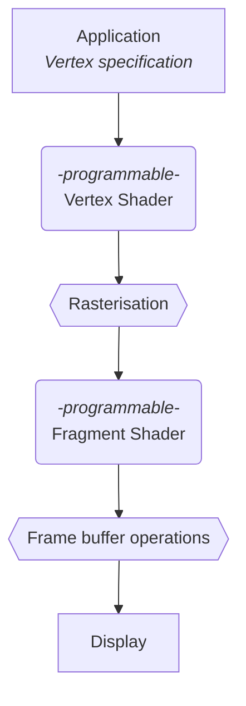
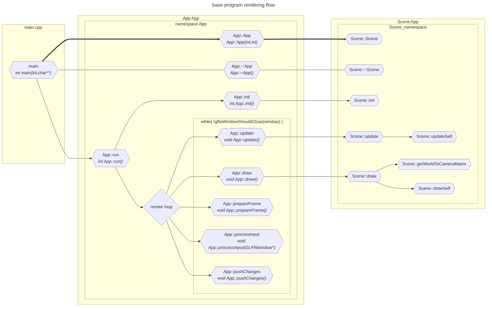

# DOCS 03 : Designs and details

---
---

## About

* [***click here to return to [overview]***](./docs_00_overview.md#docs-03--detailed-designs-etc)

* much detail will happen
* will include the full uml hopefully

---

## Contents

* [***[Project render flow]***](#project-render-flow)
    * [*[Project render flow [draft 01]]*](#project-render-flow-draft-01)
* [***[Model diagrams]***](#model-diagrams)
* [***[Library documentation]***](#library-documentation)
    * [*[Graphics pipeline [draft 01]]*](#graphics-pipeline-draft-01)
    * [*[Base code flow [draft 01]]*](#base-code-flow-draft-01)
* [***[References]***](#references)

---

## project render flow

### project render flow [draft 01]

[***[back to Contents]***](#contents)

---

## Model diagrams

[***[back to Contents]***](#contents)

* this is where we put the diagrams for building the model

---

## Library documentation

### Graphics pipeline [draft 01]

[***[back to Contents]***](#contents)

* minimalist diagram to illustrate the pipeline process

### base code flow [draft 01]

[***[back to Contents]***](#contents)

---

## references

### Design patterns

[***[back to Contents]***](#contents)

* [Refactoring guru design patterns catalogue](https://refactoring.guru/design-patterns/catalog)

### Graphics pipeline stuffs

[***[back to Contents]***](#contents)

* [khronos page for the rendering pipeline](https://www.khronos.org/opengl/wiki/Rendering_Pipeline_Overview)
* [this github pages page seems useful](https://kenny-designs.github.io/zim-websites/opengl/Shaders_and_the_Rendering_Pipeline.html)