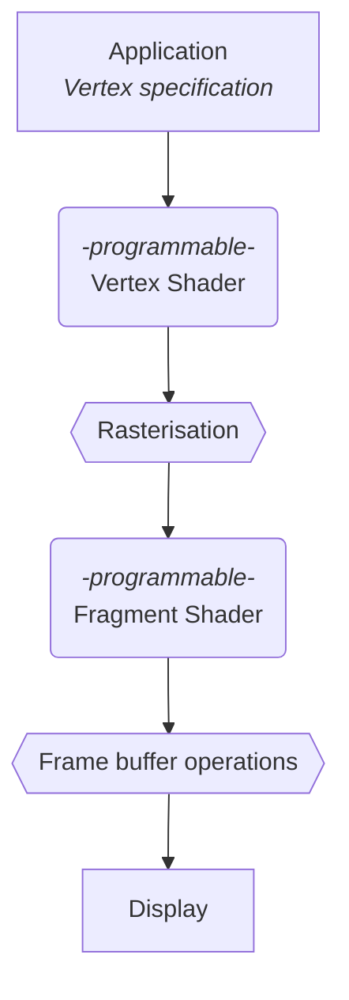
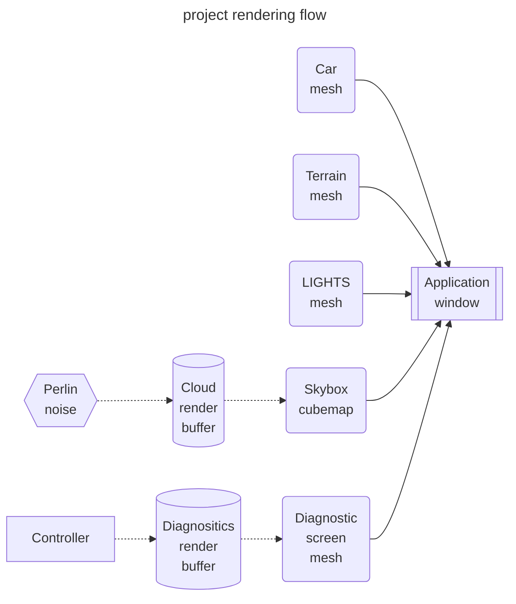
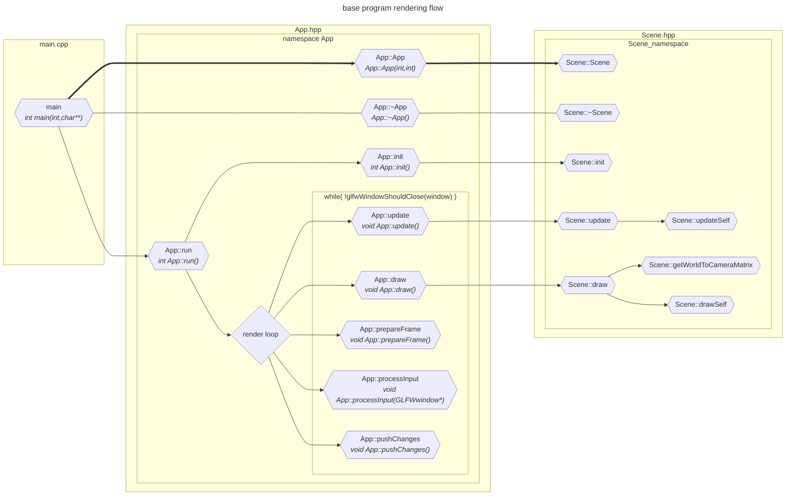

# DOCS 03 : Designs and details

---
---

## About

* [***click here to return to [overview]***](./docs_00_overview.md#docs-03--detailed-designs-etc)

* much detail will happen
* will include the full uml hopefully

---

## Contents

* [***[The Graphics Pipeline]***](#the-graphics-pipeline)
    * [*[Graphics pipeline [draft 01]]*](#graphics-pipeline-draft-01)
* [***[Project render flow]***](#project-render-flow)
    * [*[Project render flow [draft 01]]*](#project-render-flow-draft-01)
* [***[Base code flow]***](#base-code-flow)
    * [*[Base code flow [draft 01]]*](#base-code-flow-draft-01)
* [***[Design pattern ideas for Concepts]***](#design-pattern-ideas-for-concepts)
    * [Design pattern ideas : Shaders](#design-pattern-ideas--shaders)
    * [Design pattern ideas : Mesh](#design-pattern-ideas--mesh)
    * [Design pattern ideas : Traffic controller](#design-pattern-ideas--traffic-controller)
    * [Design pattern ideas : Cars](#design-pattern-ideas--cars)
    * [Design pattern ideas : Traffic light](#design-pattern-ideas--traffic-light)
* [***[Experimentation details]***](#experimentation-details)
* [***[References]***](#references)

---

## Notes on design path

* prone to change in order depending on how the requirements mapping goes
    * that is if we map that
* doesnt specify when non procedural textures happen, likely with [***[sixth-iteration : improved modes]***](#design-pathway-notes--sixth-iteration--improved-models)

* [***[initial-prototype]***](#design-pathway-notes--initial-prototype)
* [***[first-iteration : diagnostic-system]***](#design-pathway-notes--first-iteration--diagnostic-system)
* [***[second-iteration : concurrency-system]***](#design-pathway-notes--second-iteration--concurrency-system)
* [***[third-iteration : debugging-draw-modes-part-1]***](#design-pathway-notes--third-iteration--debugging-draw-modes-part-1)
* [***[fourth-iteration : simple-static-models]***](#design-pathway-notes--fourth-iteration--simple-static-models)
* [***[fifth-iteration : debugging-draw-modes-part-2]***](#design-pathway-notes--fifth-iteration--debugging-draw-modes-part-2)
* [***[sixth-iteration : improved-models]***](#design-pathway-notes--sixth-iteration--improved-models)
* [***[seventh-iteration : directional-sunlight]***](#design-pathway-notes--seventh-iteration--directional-sunlight)
* [***[eighth-iteration : simple-diffuse--specular-lighting]***](#design-pathway-notes--eighth-iteration--simple-diffuse--specular-lighting)
* [***[ninth-iteration : simple-buildings]***](#design-pathway-notes--ninth-iteration--simple-buildings)
* [***[tenth-iteration : cube-map-sky]***](#design-pathway-notes--tenth-iteration--cube-map-sky)
* [***[eleventh-iteration : perlin-noise-generation]***](#design-pathway-notes--eleventh-iteration--perlin-noise-generation)
* [***[twelfth-iteration : procedural-cars]***](#design-pathway-notes--twelfth-iteration--procedural-cars)
* [***[thirteenth-iteration : procedural-traffic-lights]***](#design-pathway-notes--thirteenth-iteration--procedural-traffic-lights)
* [***[fourteenth-iteration : light-cones]***](#design-pathway-notes--fourteenth-iteration--light-cones)
* [***[fifteenth-iteration : procedural-light-cones]***](#design-pathway-notes--fifteenth-iteration--procedural-light-cones)
* [***[sixteenth-iteration : procedural-buildings]***](#design-pathway-notes--sixteenth-iteration--procedural-buildings)
* [***[seventeenth-iteration : procedural-intersections]***](#design-pathway-notes--seventeenth-iteration--procedural-intersections)

### Design pathway notes : Initial prototype

* will mostly be iteratively building proof of concepts for each sub system as a rough draft, then merging into a semi-functional prototype
* likely using a lot of hard coding which will be refactored afterwards

### Design pathway notes : First iteration : Diagnostic system

* will be the focus on getting the diagnostic system working at minimum using a second view port
* once working, it'll be with a very simple model for the render texture

### Design pathway notes : Second iteration : Concurrency system

* once diagnostic system is working, it'll be a focus on concurrency

### Design pathway notes : Third iteration : Debugging draw modes part 1

* after the concurrency, we'll make the debugging draw modes so that we can start working on the models
* keeping them as simple as possible, wire/point

### Design pathway notes : Fourth iteration : simple static models

* simple static models for everything, ignoring procedural generation, traffic lights can be multiple draw calls each
* fixed height terrain

### Design pathway notes : Fifth iteration : Debugging draw modes part 2

* normal / uv mapping
    * can be per mesh shader to start with and always refactor later
* optional binding mapping, but this may not be a simple option. do not spend too much time on this, move on if it's spooky

### Design pathway notes : Sixth iteration : improved models

* some really basic, but medium tier models so we can start working on shaders
    * no buildings yet, only: { cars, flat terrain, lights, diagnostic screen, sun, moon }
* cars have very simple "lights", which do not light up their surroundings

### Design pathway notes : Seventh iteration : directional sunlight

* implementing the sun for light shaders
* can also do the billboard, and the moon as well
* hard transition between night and day

### Design pathway notes : Eighth iteration : simple diffuse / specular lighting

* as this is necessary before we can make models with anymore detail
* using phong specularity
    * can improve with blinn-phong if the regular phong isnt making sense
* gamma correction is part of this step as well shhhh sneaky sneaky

### Design pathway notes : Ninth iteration : simple buildings

* simple building generation, can just be random floor count for now, all the same kind of building

### Design pathway notes : Tenth iteration : Cube map sky

* can just be fixed sky cubemap
* may complete this earlier if we do textures earlier than this stage. depends if they make sense a lot earlier or not

### Design pathway notes : Eleventh iteration : perlin noise generation

* adding in perlin noise generation
* and using it for clouds

### Design pathway notes : Twelfth iteration : procedural cars

* procedural cars

### Design pathway notes : Thirteenth iteration : procedural traffic lights

* procedural traffic lights

### Design pathway notes : Fourteenth iteration : light cones

* light cones, very simple, all fixed

### Design pathway notes : fifteenth iteration : procedural light cones

* light cones are generated based on car model and randomness
* xenon etc

### Design pathway notes : Sixteenth iteration : procedural buildings

* procedural buildings buildings

### Design pathway notes : Seventeenth iteration : procedural intersections

* heightmap for terrain, procedural roads, building the intersection mesh, and the buildings

---

## The Graphics Pipeline

### Graphics pipeline [draft 01]

[***[back to Contents]***](#contents)

* minimalist diagram to illustrate the pipeline process

---

## project render flow

### project render flow [draft 01]

[***[back to Contents]***](#contents)

---

## Base code flow

### base code flow [draft 01]

[***[back to Contents]***](#contents)

---

## Design pattern ideas for concepts

### Design pattern ideas : Shaders

[***[back to Contents]***](#contents)

* [facade pattern](https://refactoring.guru/design-patterns/facade)

### Design pattern ideas : Mesh

[***[back to Contents]***](#contents)

* [facade pattern](https://refactoring.guru/design-patterns/facade) possibly

### Design pattern ideas : Traffic controller

[***[back to Contents]***](#contents)

* almost certainly [mediator pattern](https://refactoring.guru/design-patterns/mediator)

### Design pattern ideas : Cars

[***[back to Contents]***](#contents)

* [strategy pattern](https://refactoring.guru/design-patterns/strategy) for behaviour and travel desire
* [adapter pattern](https://refactoring.guru/design-patterns/adapter) for the different cars?
* [observer pattern](https://refactoring.guru/design-patterns/observer) for looking at the light from car or next car

### Design pattern ideas : Traffic light

[***[back to Contents]***](#contents)

* likely also [mediator pattern](https://refactoring.guru/design-patterns/mediator) with lanes
* [state pattern](https://refactoring.guru/design-patterns/state) for the state of the lights
* [command pattern](https://refactoring.guru/design-patterns/command) for handling the changes from controllers?
* [adapter pattern](https://refactoring.guru/design-patterns/adapter) for between the command/state and the multi/single light array itself?
* [observer pattern](https://refactoring.guru/design-patterns/observer) for looking at the light from car

---

## Experimentation details

### Misc

[***[back to Contents]***](#contents)

* `20/06/2024` - another project reminded us of the power of getting things to work with 1 instance before moving onto working with multiple.

### Render textures

[***[back to Contents]***](#contents)

* `19/06/2024` - managed to get render buffers to work in another repo, but still need to experiment more with vertex attributes

---

## Model diagrams

[***[back to Contents]***](#contents)

* this is where we put the diagrams for building the model

---

## references

### Design patterns

[***[back to Contents]***](#contents)

* [Refactoring guru design patterns catalogue](https://refactoring.guru/design-patterns/catalog)

### Graphics pipeline stuffs

[***[back to Contents]***](#contents)

* [khronos page for the rendering pipeline](https://www.khronos.org/opengl/wiki/Rendering_Pipeline_Overview)
* [this github pages page seems useful](https://kenny-designs.github.io/zim-websites/opengl/Shaders_and_the_Rendering_Pipeline.html)