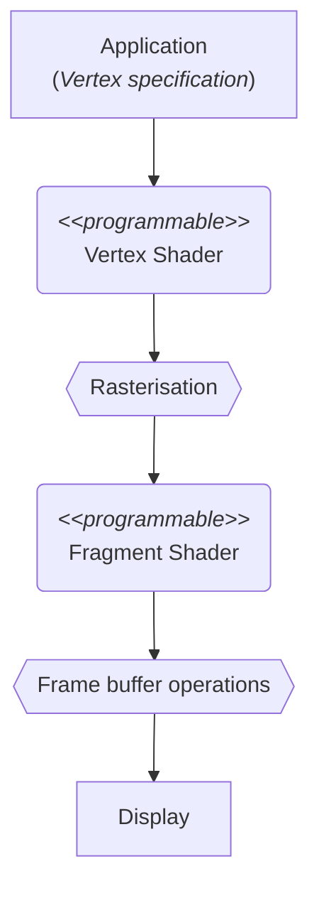

# DOCS 03 : Designs and details

---
---

## About

* [***click here to return to [overview]***](./docs_00_overview.md#docs-03--detailed-designs-etc)

* much detail will happen
* will include the full uml hopefully

---

## The Graphics Pipeline

### Graphics pipeline [draft 01]

* minimalist diagram to illustrate the pipeline process

---

## Design pattern ideas for concepts

### Design pattern ideas : Shaders

* [facade pattern](https://refactoring.guru/design-patterns/facade)

### Design pattern ideas : Mesh

* [facade pattern](https://refactoring.guru/design-patterns/facade) possibly

### Design pattern ideas : Traffic controller

* almost certainly [mediator pattern](https://refactoring.guru/design-patterns/mediator)

### Design pattern ideas : Cars

* [strategy pattern](https://refactoring.guru/design-patterns/strategy) for behaviour and travel desire
* [adapter pattern](https://refactoring.guru/design-patterns/adapter) for the different cars?
* [observer pattern](https://refactoring.guru/design-patterns/observer) for looking at the light from car or next car

### Design pattern ideas : Traffic light

* likely also [mediator pattern](https://refactoring.guru/design-patterns/mediator) with lanes
* [state pattern](https://refactoring.guru/design-patterns/state) for the state of the lights
* [command pattern](https://refactoring.guru/design-patterns/command) for handling the changes from controllers?
* [adapter pattern](https://refactoring.guru/design-patterns/adapter) for between the command/state and the multi/single light array itself?
* [observer pattern](https://refactoring.guru/design-patterns/observer) for looking at the light from car

---

## references

### Design patterns

* [Refactoring guru design patterns catalogue](https://refactoring.guru/design-patterns/catalog)

### Graphics pipeline stuffs

* [khronos page for the rendering pipeline](https://www.khronos.org/opengl/wiki/Rendering_Pipeline_Overview)
* [this github pages page seems useful](https://kenny-designs.github.io/zim-websites/opengl/Shaders_and_the_Rendering_Pipeline.html)