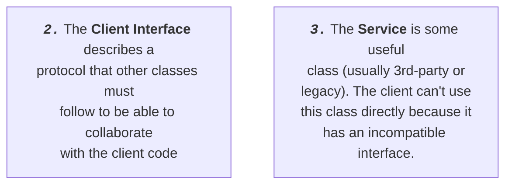
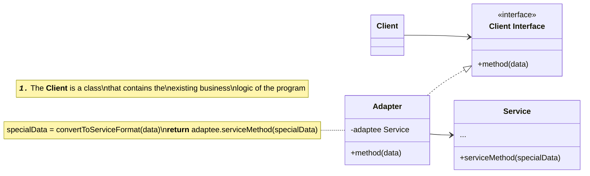
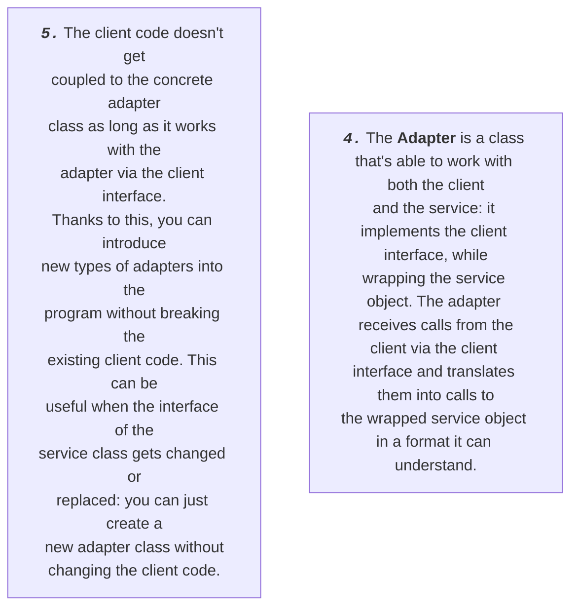
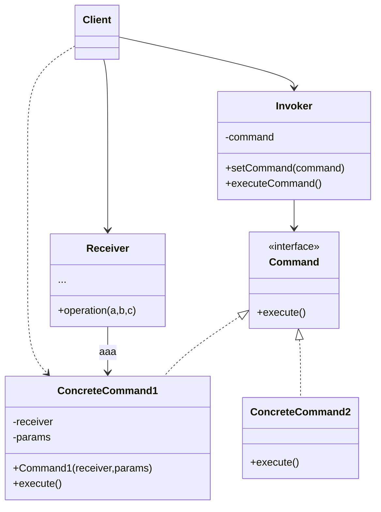
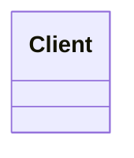
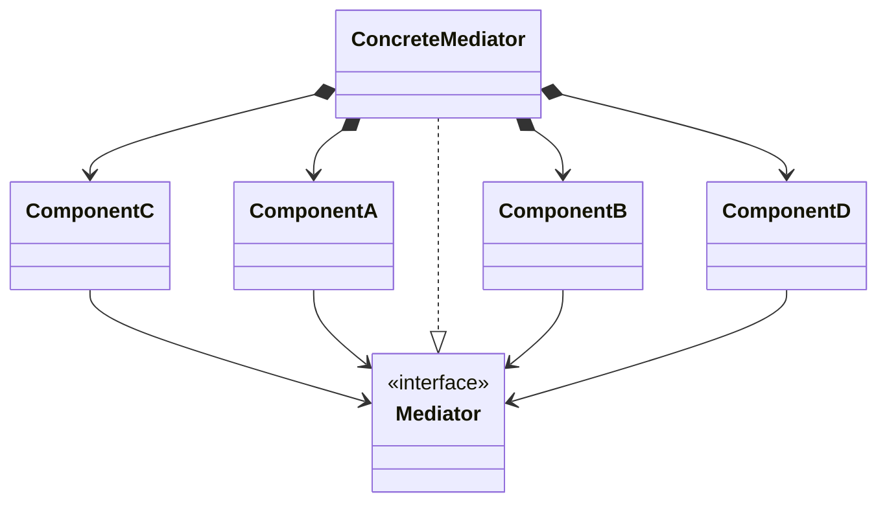
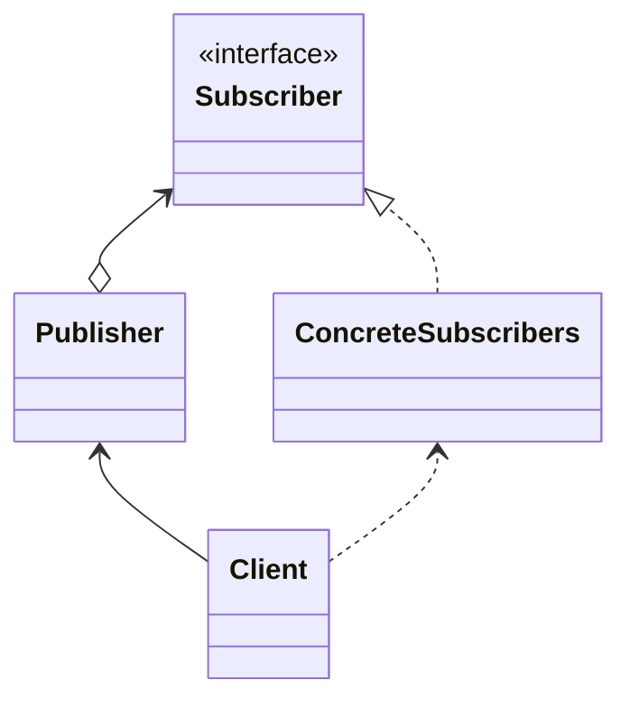
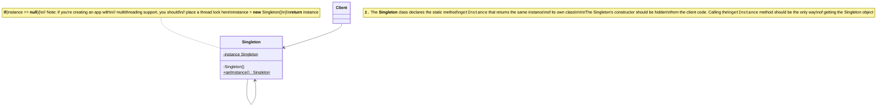
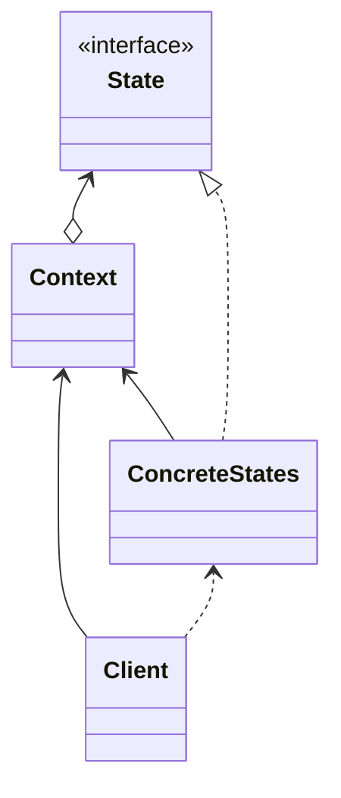
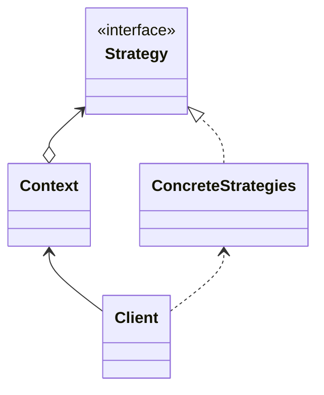

# DOCS 03 : Designables : suppliments 01 : design pattern diagrams

---
---

## Doc links

Documentation page links:
* [**[readme]**](./readme.md#doc-links)
* [**[docs 00 : overview]**](./docs_00_overview.md#doc-links)
* [**[docs 01 : conceptual]**](./docs_01_conceptual.md#doc-links)
* [**[docs 02 : requirements]**](./docs_02_requirements.md#doc-links)
* [**[docs 03 : designables]**](./docs_03_designables.md#doc-links)
    * [**[docs 03 : designables : experiments 01 : render texture experimenting]**](./docs_03_designables_experiments_01.md#doc-links)
    * [**[docs 03 : designables : suppliments 01 : design pattern diagrams]**](./docs_03_designables_suppliment_01.md#doc-links)
* [**[docs 04 : developments]**](./docs_04_developments.md#doc-links)

---

## About

* this is for the details about the design patterns we suggested

---

## Contents

* [[Design patterns : adapter pattern]](#design-patterns--adapter-pattern)
* [[Design patterns : command pattern]](#design-patterns--command-pattern)
* [[Design patterns : facade pattern]](#design-patterns--facade-pattern)
* [[Design patterns : mediator pattern]](#design-patterns--mediator-pattern)
* [[Design patterns : observer pattern]](#design-patterns--observer-pattern)
* [[Design patterns : singleton pattern]](#design-patterns--singleton-pattern)
* [[Design patterns : state pattern]](#design-patterns--state-pattern)
* [[Design patterns : strategy pattern]](#design-patterns--strategy-pattern)

---

## Design patterns

[[Refactoring guru design patterns catalogue]](https://refactoring.guru/design-patterns/catalog)

### Design patterns : adapter pattern

[***[back to Contents]***](#contents)

<table>
<!-- =================================== -->
<!-- ----------------------------------- -->
<tr>
<th></th>
<th><a href="https://refactoring.guru/design-patterns/adapter">[refactoring.guru] adapter pattern</a></th>
</tr>
<!-- ----------------------------------- -->
<tr>
<td><b>Also known as:</b></td>
<td><i>Wrapper</i></td>
</tr>
<!-- ----------------------------------- -->
<tr>
<td>Intent</td>
<td><b>Adapter</b> is a structural design pattern that allows objects with incompatible interfaces to collaborate
</td>
</tr>
<!-- ----------------------------------- -->
<tr>
<td></td>
<td align="center">
</td>
</tr>
<!-- ----------------------------------- -->
<tr>
<td>Diagram</td>
<td align="center">

</td>
</tr>
<!-- ----------------------------------- -->
<tr>
<td></td>
<td></td>
</tr>
<!-- ----------------------------------- -->
<!-- =================================== -->
</table>

### Design patterns : command pattern

[***[back to Contents]***](#contents)

<table>
<!-- =================================== -->
<!-- ----------------------------------- -->
<tr>
<th></th>
<th><a href="https://refactoring.guru/design-patterns/command">[refactoring.guru] command pattern</a></th>
</tr>
<!-- ----------------------------------- -->
<tr>
<td><b>Also known as:</b></td>
<td><i>Action, Transaction</i></td>
</tr>
<!-- ----------------------------------- -->
<tr>
<td>Intent</td>
<td><b>Command</b> is a behavioural design pattern that turns a request into a stand-alone object that contains all information about the request. This transformation lets you pass requests as a method arguments, delay or queue a request's execution and support undoable operations.
</td>
</tr>
<!-- ----------------------------------- -->
<tr>
<td></td>
<td align="center">
</td>
</tr>
<!-- ----------------------------------- -->
<tr>
<td>Diagram</td>
<td align="center">

</td>
</tr>
<!-- ----------------------------------- -->
<tr>
<td></td>
<td></td>
</tr>
<!-- ----------------------------------- -->
<!-- =================================== -->
</table>

### Design patterns : facade pattern

[***[back to Contents]***](#contents)

<table>
<!-- =================================== -->
<!-- ----------------------------------- -->
<tr>
<th></th>
<th><a href="https://refactoring.guru/design-patterns/facade">[refactoring.guru] facade pattern</a></th>
</tr>
<tr>
<td>Intent</td>
<td><b>Facade</b> is a structural design pattern that provides a simplified interface to a library, a framework, or any other complex set of classes
</td>
</tr>
<!-- ----------------------------------- -->
<tr>
<td></td>
<td align="center">
</td>
</tr>
<!-- ----------------------------------- -->
<tr>
<td>Diagram</td>
<td align="center">

</td>
</tr>
<!-- ----------------------------------- -->
<tr>
<td></td>
<td></td>
</tr>
<!-- ----------------------------------- -->
<!-- =================================== -->
</table>

### Design patterns : mediator pattern

[***[back to Contents]***](#contents)

<table>
<!-- =================================== -->
<!-- ----------------------------------- -->
<tr>
<th></th>
<th><a href="https://refactoring.guru/design-patterns/mediator">[refactoring.guru] mediator pattern</a></th>
</tr>
<!-- ----------------------------------- -->
<tr>
<td><b>Also known as:</b></td>
<td><i>Intermediary, Controller</i></td>
</tr>
<!-- ----------------------------------- -->
<tr>
<td>Intent</td>
<td><b>Mediator</b> is a behavioral design pattern that lets you reduce chaotic dependencies between objects. The pattern restricts direct communications between the objects and forces them to collaborate only via a mediator object.
</td>
</tr>
<!-- ----------------------------------- -->
<tr>
<td></td>
<td align="center">
</td>
</tr>
<!-- ----------------------------------- -->
<tr>
<td>Diagram</td>
<td align="center">

</td>
</tr>
<!-- ----------------------------------- -->
<tr>
<td></td>
<td></td>
</tr>
<!-- ----------------------------------- -->
<!-- =================================== -->
</table>

### Design patterns : observer pattern

[***[back to Contents]***](#contents)

<table>
<!-- =================================== -->
<!-- ----------------------------------- -->
<tr>
<th></th>
<th><a href="https://refactoring.guru/design-patterns/observer">[refactoring.guru] observer pattern</a></th>
</tr>
<!-- ----------------------------------- -->
<tr>
<td><b>Also known as:</b></td>
<td><i>Event-Subscriber, Listener</i></td>
</tr>
<!-- ----------------------------------- -->
<tr>
<td>Intent</td>
<td><b>Observer</b> is a behavioral design pattern that lets you define a subscription mechanism to notify multiple objects about any events that happen to the object they're observing.
</td>
</tr>
<!-- ----------------------------------- -->
<tr>
<td></td>
<td align="center">
</td>
</tr>
<!-- ----------------------------------- -->
<tr>
<td>Diagram</td>
<td align="center">

</td>
</tr>
<!-- ----------------------------------- -->
<tr>
<td></td>
<td></td>
</tr>
<!-- ----------------------------------- -->
<!-- =================================== -->
</table>

### Design patterns : singleton pattern

[***[back to Contents]***](#contents)

<table>
<!-- =================================== -->
<!-- ----------------------------------- -->
<tr>
<th></th>
<th><a href="https://refactoring.guru/design-patterns/singleton">[refactoring.guru] singleton pattern</a></th>
</tr>
<!-- ----------------------------------- -->
<tr>
<td>Intent</td>
<td><b>Singleton</b> is a creational design pattern that lets you ensure that a class has only one instance, while providing a global access point to this instance.
</td>
</tr>
<!-- ----------------------------------- -->
<tr>
<td></td>
<td align="center"></td>
</tr>
<!-- ----------------------------------- -->
<tr>
<td>Diagram</td>
<td align="center">

</td>
</tr>
<!-- ----------------------------------- -->
<tr>
<td></td>
<td></td>
</tr>
<!-- ----------------------------------- -->
<!-- =================================== -->
</table>

### Design patterns : state pattern

[***[back to Contents]***](#contents)

<table>
<!-- =================================== -->
<!-- ----------------------------------- -->
<tr>
<th></th>
<th><a href="https://refactoring.guru/design-patterns/state">[refactoring.guru] state pattern</a></th>
</tr>
<!-- ----------------------------------- -->
<tr>
<td>Intent</td>
<td><b>State</b> is a behavioural design pattern that lets an object alter its behaviour when its internal state changes. it appears as if the object changed its class
</td>
</tr>
<!-- ----------------------------------- -->
<tr>
<td></td>
<td align="center">
</td>
</tr>
<!-- ----------------------------------- -->
<tr>
<td>Diagram</td>
<td align="center">

</td>
</tr>
<!-- ----------------------------------- -->
<tr>
<td></td>
<td></td>
</tr>
<!-- ----------------------------------- -->
<!-- =================================== -->
</table>

### Design patterns : strategy pattern

[***[back to Contents]***](#contents)

<table>
<!-- =================================== -->
<!-- ----------------------------------- -->
<tr>
<th></th>
<th><a href="https://refactoring.guru/design-patterns/stategy">[refactoring.guru] stategy pattern</a></th>
</tr>
<!-- ----------------------------------- -->
<tr>
<td>Intent</td>
<td><b>Stategy</b> is a behavioural design pattern that lets you define a family of algorithms, put each of them into a separate class, and make their objects interchangeable.
</td>
</tr>
<!-- ----------------------------------- -->
<tr>
<td></td>
<td align="center">
</td>
</tr>
<!-- ----------------------------------- -->
<tr>
<td>Diagram</td>
<td align="center">

</td>
</tr>
<!-- ----------------------------------- -->
<tr>
<td></td>
<td></td>
</tr>
<!-- ----------------------------------- -->
<!-- =================================== -->
</table>

---

